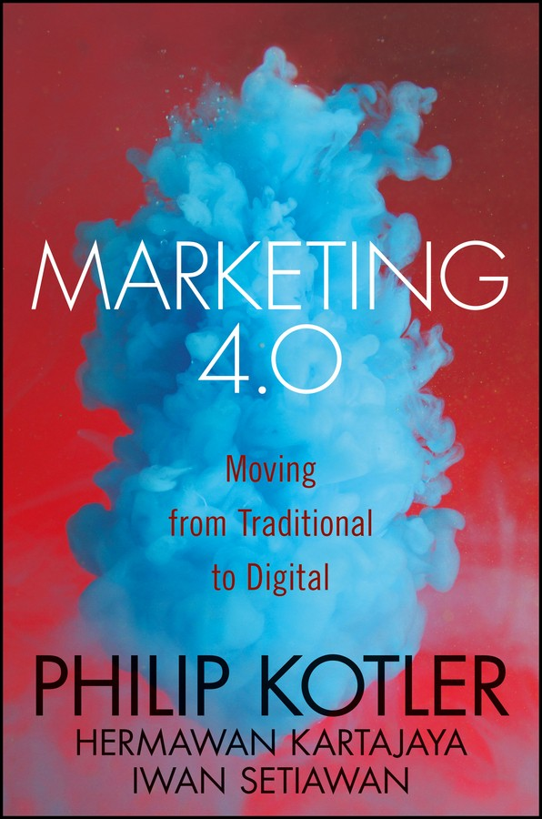
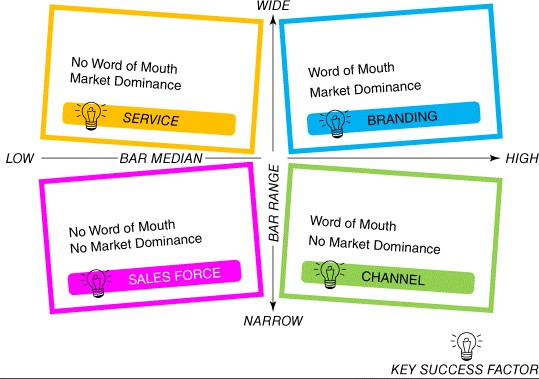

# CONTENTS

> [Cover](file://localhost/C:/temp/calibre_x7xlnbbu/7k63bb4__pdf_out/OPS/cover.xhtml#coverstart)
> [Series Page](#_bookmark0) [Title Page](#_bookmark1)
> [Copyright](#_bookmark2) [Dedication](#_bookmark3)
>
> [Acknowledgments](#acknowledgments)
>
> [Prologue: From Marketing 3.0 to Marketing 4.0](#prologue) [About the
> Authors](#about-the-authors)
>
> [Part I: Fundamental Trends Shaping Marketing](#part-i)
>
> [Chapter 1: Power Shifts to the Connected Customers](#_bookmark8)
> [From Exclusive to Inclusive](#from-exclusive-to-inclusive)
>
> [From Vertical to Horizontal](#from-vertical-to-horizontal) [From
> Individual to Social](#from-individual-to-social)
>
> [Summary: Horizontal, Inclusive, and
> Social](#summary-horizontal-inclusive-and-social)
>
> [Chapter 2: The Paradoxes of Marketing to Connected
> Customers](#_bookmark13)
>
> [Breaking the Myths of
> Connectivity](#breaking-the-myths-of-connectivity) [Summary: Marketing
> Amid Paradoxes](#summary-marketing-amid-paradoxes)
>
> [Chapter 3: The Influential Digital Subcultures](#_bookmark16) [Youth:
> Acquiring the Mind Share](#youth-acquiring-the-mind-share) [Women:
> Growing the Market Share](#women-growing-the-market-share) [Netizens:
> Expanding the Heart Share](#netizens-expanding-the-heart-share)
> [Summary: Youth, Women, and
> Netizens](#summary-youth-women-and-netizens)
>
> [Chapter 4: Marketing 4.0 in the Digital Economy](#_bookmark21)
> [Moving from Traditional to Digital
> Marketing](#moving-from-traditional-to-digital-marketing) [Integrating
> Traditional and Digital
> Marketing](#integrating-traditional-and-digital-marketing)
>
> [Summary: Redefining Marketing in the Digital
> Economy](#summary-redefining-marketing-in-the-digital-economy) [Part
> II: New Frameworks for Marketing in the Digital Economy](#part-ii)
>
> [Chapter 5: The New Customer Path](#_bookmark28)
>
> [Understanding How People Buy: From Four A's to Five
> A's](#understanding-how-people-buy-from-four-as-to-five-as) [Driving
> from Awareness to Advocacy: The O Zone
> (O3)](#driving-from-awareness-to-advocacy-the-o-zone-o3)
> [Summary: Aware, Appeal, Ask, Act, and
> Advocate](#summary-aware-appeal-ask-act-and-advocate)
>
> [Chapter 6: Marketing Productivity Metrics](#_bookmark40) [Introducing
> PAR and BAR](#introducing-par-and-bar) [Decomposing PAR and
> BAR](#decomposing-par-and-bar)
>
> [Driving Up Productivity](#driving-up-productivity)
>
> [Summary: Purchase Action Ratio and Brand Advocacy
> Ratio](#summary-purchase-action-ratio-and-brand-advocacy-ratio)
>
> [Chapter 7: Industry Archetypes and Best Practices](#_bookmark55)
> [Four Major Industry Archetypes](#four-major-industry-archetypes)
>
> [Four Marketing Best Practices](#four-marketing-best-practices)
>
> [Summary: Learning from Different
> Industries](#summary-learning-from-di-ferent-industries)
>
> [Part III: Tactical Marketing Applications in the Digital
> Economy](#part-iii) [Chapter 8: Human-Centric Marketing for Brand
> Attraction](#_bookmark68)
>
> [Understanding Humans Using Digital
> Anthropology](#understanding-humans-using-digital-anthropology)
> [Building the Six Attributes of Human-Centric
> Brands](#building-the-six-attributes-of-human-centric-brands)
> [Summary: When Brands Become
> Humans](#summary-when-brands-become-humans)
>
> [Chapter 9: Content Marketing for Brand Curiosity](#_bookmark72)
> [Content Is the New Ad, \#Hashtag Is the New
> Tagline](#content-is-the-new-ad-hashtag-is-the-new-tagline)
> [Step-by-Step Content Marketing](#step-by-step-content-marketing)
>
> [Summary: Creating Conversations with
> Content](#summary-creating-conversations-with-content) [Chapter 10:
> Omnichannel Marketing for Brand Commitment](#_bookmark78)
>
> [The Rise of Omnichannel
> Marketing](#the-rise-of-omnichannel-marketing) [Step-by-Step
> Omnichannel Marketing](#step-by-step-omnichannel-marketing)
>
> [Summary: Integrating the Best of Online and Offline
> Channels](#summary-integrating-the-best-of-online-and-o-fline-channels)
>
> [Chapter 11: Engagement Marketing for Brand Affinity](#_bookmark86)
> [Enhancing Digital Experiences with Mobile
> Apps](#enhancing-digital-experiences-with-mobile-apps) [Providing
> Solutions with Social CRM](#providing-solutions-with-social-crm)
>
> [Driving Desired Behavior with
> Gamification](#driving-desired-behavior-with-gamification)
>
> [Summary: Mobile Apps, Social CRM, and
> Gamification](#summary-mobile-apps-social-crm-and-gamification)
> [Epilogue: Getting to WOW!](#epilogue-getting-to-wow)
>
> [What Is a “WOW”?](#what-is-a-wow)
>
> [Enjoy, Experience, Engage: WOW!](#enjoy-experience-engage-wow) [Are
> You Ready to WOW?](#are-you-ready-to-wow)
>
> [Index](#index)
>
> [End User License Agreement](#wiley-end-user-license-agreement)
>
> **List of Illustrations**
>
> [Figure
> 4.1](#figure-4.1-the-interchanging-roles-of-traditional-and-digital-marketing)
> [Figure
> 5.1](#figure-5.1-the-shifting-customer-path-in-a-connected-world)
> [Figure
> 5.2](#figure-5.2-mapping-the-customer-path-throughout-the-five-as)
> [Figure
> 5.3](#figure-5.3-the-o-zone-of-driving-customers-from-awareness-to-advocacy)
> [Figure 5.4](#figure-5.4-the-o-zone-across-the-customer-path) [Figure
> 6.1](#figure-6.1-new-productivity-metrics-par-and-bar) [Figure
> 6.2](#figure-6.2-purchase-action-ratio-par) [Figure
> 6.3](#figure-6.3-what-par-really-means) [Figure
> 6.4](#figure-6.4-what-bar-really-means) [Figure 6.5](#_bookmark52)
> [Figure 7.1](#_bookmark58) [Figure
> 7.2](#figure-7.2-the-ideal-bow-tie-pattern)
>
> [Figure 7.3](#_bookmark62) [Figure
> 7.4](#figure-7.4-learning-from-four-industry-best-practices) [Figure
> 9.1](#_bookmark76) [Figure
> 10.1](#figure-10.1-mapping-touchpoints-and-channels-across-the-customer-path)
> [Figure 10.2](#_bookmark84)

“The technology world moves
so quickly today that each change accelerates the next. It's critical in
such an environment to have a baseline and point of reference to help
marketers find their way forward. *Marketing 4.0* puts a new scholarship
stake in the ground and will be the starting point and an invaluable
resource for everyone trying to invent and understand the digital and
mobile future.”

> —**Howard Tullman**, CEO, Chicagoland Entrepreneurial Center/1871

“The Internet and IT radically change marketing. This book is the eye-
opener for marketing in the new era.”

—**Hermann Simon**, Founder and Chairman, Simon-Kucher &

Partners

“No one has a finger on the pulse of marketing like Phil Kotler. His
ability to identify and interpret new marketing trends and developments
is truly astounding. Once again, with *Marketing 4.0*, Kotler and his
co-authors help to blaze a new trail to marketing success. This is
definitely the one marketing book you HAVE to read this year.”

—**Kevin Lane Keller**, E.B. Osborn Professor of Marketing, Tuck

School of Business

“Kotler and his associates have beautifully synthesized today's digital,
interactive marketplace and marketing's new role.”

> —**Don Schultz**, Professor (Emeritus-in-Service) of Integrated
> Marketing Communications, Medill School at Northwestern University

“No one is more qualified than Philip Kotler, the father of marketing,
to document the enormous changes taking place in the field today. The
future of marketing is digital and this book is your guide.”

> —**Al Ries**, Author of *Positioning: The Battle for Your Mind*

“As the world of marketing increasingly grapples with digital
transformation, *Marketing 4.0* offers an exciting framework along with

examples for practitioners.”

> —**Nirmalya Kumar**, Professor of Marketing, London Business School

“A terrific guide to the transformations that are already coming over
the horizon to challenge marketing practice. Perplexed marketers will
learn how to navigate the power shifts and possibilities of digital
connectivity and turn them into advantages.”

—**George S. Day**, Geoffrey T. Boisi Professor Emeritus, Wharton

School of the University of Pennsylvania

“I am often overwhelmed by the variety and the speed of change, in spite
of being in marketing consulting for forty years. I am therefore happy
that the ‘guru’ Philip Kotler, who began with *Marketing 1.0* over four
decades ago, is still with us to make another significant contribution
with *Marketing 4.0*—guidelines to deal with changes today, especially
those brought about by the IT revolution and changing consumer
profiles.”

> —**Walter Vieira**, Marketing Consultant, Author, Visiting Professor,
> Past Chairman of International Council of Management Consulting

Institutes

Marketing 4.0

> **Moving from Traditional to Digital**

#### Philip Kotler Hermawan Kartajaya Iwan Setiawan

> Cover image: ©Stanislaw
> Pytel/Getty Images Cover design: Wiley
>
> This book is printed on acid-free paper.
>
> Copyright © 2017 by Philip Kotler, Hermawan Kartajaya, and Iwan
> Setiawan. All rights reserved.
>
> Published by John Wiley & Sons, Inc., Hoboken, New Jersey Published
> simultaneously in Canada
>
> No part of this publication may be reproduced, stored in a retrieval
> system, or transmitted in any form or by any means, electronic,
> mechanical, photocopying, recording, scanning, or otherwise, except as
> permitted under Section 107 or 108 of the 1976 United States Copyright
> Act, without either the prior written permission of the Publisher, or
> authorization through payment of the appropriate per-copy fee to the
> Copyright Clearance Center, 222 Rosewood Drive, Danvers, MA 01923,
> (978) 750-8400, fax (978) 646-8600, or on the web at
> [<u>www.co</u>p<u>yright.com</u>](http://www.copyright.com/). Requests
> to the Publisher for permission should be addressed to the Permissions
> Department, John Wiley & Sons, Inc., 111 River Street, Hoboken, NJ
> 07030,
>
> \(201\) 748-6011, fax (201) 748-6008, or online at
> [<u>www.wile</u>y<u>.com/go/permissions</u>](http://www.wiley.com/go/permissions).
>
> Limit of Liability/Disclaimer of Warranty: While the publisher and
> author have used their best efforts in preparing this book, they make
> no representations or warranties with the respect to the accuracy or
> completeness of the contents of this book and specifically disclaim
> any implied warranties of merchantability or fitness for a particular
> purpose. No warranty may be created or extended by sales
> representatives or written sales materials. The advice and strategies
> contained herein may not be suitable for your situation. You should
> consult with a professional where appropriate. Neither the publisher
> nor the author shall be liable for damages arising therefrom.
>
> For general information about our other products and services, please
> contact our Customer Care Department within the United States at (800)
> 762-2974, outside the United States at
>
> \(317\) 572-3993 or fax (317) 572-4002.
>
> Wiley publishes in a variety of print and electronic formats and by
> print-on-demand. Some material included with standard print versions
> of this book may not be included in e-books or in print-on-demand. If
> this book refers to media such as a CD or DVD that is not included in
> the version you purchased, you may download this material at
> [<u>htt</u>p<u>://booksupport.wiley.com</u>](http://booksupport.wiley.com/).
> For more information about Wiley products, visit
> [<u>www.wile</u>y<u>.com</u>](http://www.wiley.com/).
>
> ISBN 978-1-119-34120-8 (cloth)
>
> ISBN 978-1-119-34106-2 (ePDF)
>
> ISBN 978-1-119-34114-7 (ePub)
>
> *To the next generation of
> marketers and behavioral economists, who will enhance the economic,
> social, and environmental contributions that marketing makes to the
> welfare of people and the planet*

#### —Philip Kotler

> *To President Joko Widodo, Marketeer of the Year Indonesia– Government
> 2010–2012 and A New Hope (Time magazine, October 27, 2014)*

#### —Hermawan Kartajaya

> *To my family and friends and everyone else around me who has become
> my f–factor and made me a better human*
>
> **—Iwan Setiawan**

# ACKNOWLEDGMENTS

*Marketing 4.0* was six years in the making. Over this period, a number
of people have contributed to the completion of the book. The authors
would like to thank the WOW team at MarkPlus, Inc., who conducted the
research and spent countless hours brainstorming with the authors:
Yosanova Savitry, Vendy Chandra, Cecilia Hermanto, Kevin Leonard, Quincy
Wongso, Edwin Hardi, Adrian Hudiono, Evita Tania, Shabrina Annisarasyiq,
Andre Anggada, and Fachriza Prathama.

We would also like to thank the leaders at MarkPlus, Inc.—The
Council—who have invested their thoughts and energy in the book: Michael
Hermawan, Jacky Mussry, Taufik, Hendra Warsita, Vivie Jericho, Stephanie
Hermawan, and Ence.

Last but not least, we would like to thank the team at Wiley—Richard
Narramore, Tiffany Colon, and Jocelyn Kwiatkowski—who made it possible
for us to share *Marketing 3.0* and *Marketing 4.0* with the world.

# PROLOGUE

> FROM *MARKETING 3.0* TO *MARKETING 4.0*

For the past six years, marketers whom we met around the world have been
asking for a sequel to *Marketing 3.0*. Considering the dynamics of
marketing, many would expect *Marketing 4.0* to be in the pipeline.

In *Marketing 3.0*, we talked about the major shift from product-driven
marketing (1.0) to customer-centric marketing (2.0), and ultimately to
human-centric marketing (3.0). In *Marketing 3.0*, we observed customers
transforming into whole human beings with minds, hearts, and spirits.
Therefore, we argued that the future of marketing lies in creating
products, services, and company cultures that embrace and reflect human
values. Since the book was published in 2010, many marketers have been
adopting the principles of *Marketing 3.0*. The book was so universally
accepted that it has been translated into 24 languages besides English
globally.

A year after the book was published, we built the Museum of Marketing
3.0 in Ubud, Bali. The museum was built with the kind support of the
three princes of Ubud: Tjokorda Gde Putra Sukawati, Tjokorda Gde Oka
Sukawati, and Tjokorda Gde Raka Sukawati.

Ubud, with its aura of spirituality, is indeed the perfect place for the
first marketing museum of its kind. In the museum, we have been curating
inspiring cases of marketers, companies, and marketing campaigns that
embrace the human spirit. The contents are organized in a modern
multiscreen setup. In recent years, the museum has been upgraded with
advanced technologies such as augmented reality and virtual reality.

Indeed, a lot has happened since we wrote *Marketing 3.0*, especially in
terms of technological advancements. The technologies we are seeing
today are not new. But they have been converging in recent years, and
the collective impact of that convergence has greatly

affected marketing practices around the world. New trends are emerging
from this: the “sharing” economy, the “now” economy, omnichannel
integration, content marketing, social CRM, and many other things.

We believe that the technology convergence will ultimately lead to the
convergence between digital marketing and traditional marketing. In a
high-tech world, people long for high touch. The more social we are, the
more we want things that are made just for us. Backed by big- data
analytics, products become more personalized and services become more
personal. In the digital economy, the key is to leverage these
paradoxes.

In this transitional era, a new marketing approach is required. Thus, we
introduce *Marketing 4.0* as the natural outgrowth of *Marketing*

*3.0*. The major premise of this book is that marketing should adapt to
the changing nature of customer paths in the digital economy. The role
of marketers is to guide customers throughout their journey from
awareness and ultimately to advocacy.

The first part of the book is the result of our observation of the world
we are living in. We start by embracing the three power shifts that are
shaping our world. We move further by exploring how connectivity has
fundamentally changed human lives. Moreover, we take a deeper look into
the major digital subcultures of youth, women, and netizens that will
serve as foundations for a completely new breed of customer.

The second and core part of the book discusses how marketers can boost
productivity by understanding customer paths in the digital era. It
introduces a new set of marketing metrics and a whole new way of looking
at our marketing practices. We will also dive deep into several key
industries and learn how to implement the ideas of *Marketing 4.0* in
those industries.

Finally, the third part describes in detail the major tactics of
*Marketing*

*4.0*. We start with human-centric marketing, which aims to humanize
brands with humanlike attributes. We then explore content marketing

in greater detail in order to create customer conversations. Moreover,
we also describe how marketers can implement omnichannel marketing for
higher sales. Finally, we dig into the concept of customer engagement in
the digital era.

In essence, *Marketing 4.0* describes a deepening and a broadening of
human-centric marketing to cover every aspect of the customer's journey.
We are hopeful that you will find insights and inspirations from this
book and join us in redefining marketing in the years to come.

# ABOUT THE AUTHORS

**Philip Kotler,** the S.C. Johnson & Son Distinguished Professor of
International Marketing at the Kellogg School of Management,
Northwestern University, is widely regarded as the Father of Modern
Marketing. He is ranked by the *Wall Street Journal* as one of the top
six most influential business thinkers. The recipient of numerous awards
and honorary degrees from schools all over the world, he holds an MA
from the University of Chicago and a PhD from the Massachusetts
Institute of Technology (MIT), both in economics.

Philip has an incredible international presence—his books have been

translated into approximately 25 languages, and he regularly speaks on
the international circuit.

**Hermawan Kartajaya** is the founder and Executive Chairman of
MarkPlus, Inc., and is one of the “50 Gurus Who Have Shaped the Future
of Marketing,” according to the Chartered Institute of Marketing, United
Kingdom. Hermawan is also a recipient of the Distinguished Global
Leadership Award from Pan-Pacific Business Association at the University
of Nebraska-Lincoln. He is the current President of the Asia Council for
Small Business—a regional council of affiliates and chapters of the
International Council for Small Business—and a co-founder of the Asia
Marketing Federation.

**Iwan Setiawan** serves as the Chief Operating Officer of MarkPlus,
Inc. ([www.markplusinc.com](http://www.markplusinc.com/)), where he
helps businesses design their marketing strategies. A frequent writer
and speaker, Iwan is also the Editor-in-Chief of Marketeers
([www.marketeers.com](http://www.marketeers.com/)). Iwan holds an MBA
from the Kellogg School of Management at Northwestern University and a
BEng from the University of Indonesia.

# PART I

> FUNDAMENTAL TRENDS SHAPING MARKETING
>
> 1

# POWER SHIFTS TO THE CONNECTED CUSTOMERS

> *From Vertical, Exclusive, and Individual to Horizontal, Inclusive,
> and Social*

Charlie Frost was a conspiracy theorist who strongly believed that 2012
would bring the end of civilization. A couple of geologists in 2009
found that Frost's belief might be true. They discovered that the
earth's core was about to explode and bring catastrophe to the world.
And so the world's leaders gathered to find a solution and decided to
build giant ships resembling Noah's Ark to save select groups of the
world's population. The survivors on the ships would be expected to
start a new civilization.

This story is completely fictional and is taken from the movie *2012*.
But many of the scenes in the movie symbolize the change we are
experiencing today. The movie shows how the old standards of
civilization—political, economic, socio-cultural, and religious
standards

—were being destroyed and being replaced by a more horizontal and
inclusive set of social standards. It shows how leaders of the Western
superpower countries were forced to drop their egos and collaborate.
They even had to rely on China to build the giant ships.

The ships also functioned as the symbols of a new world in which diverse
people were connected with one another without any geographical and
demographical boundaries.

Today, we are living in a whole new world. The power structure we have
come to know is experiencing drastic changes. The internet, which
brought connectivity and transparency to our lives, has been largely
responsible for these power shifts.

We witness how exclusive powers surrender to the power of inclusivity.
The G7, which is an exclusive group of powerful nations,

could not solve the global financial crisis by themselves. They had to
involve the G20 nations, which include China, India, and Indonesia.

The economic power is now more inclusively dispersed. Large corporations
also found it difficult to nurture innovation within their exclusive
organizations. Companies such as Microsoft and Amazon eventually needed
to acquire smaller yet more innovative companies such as Skype and
Zappos. Even millionaires Bill Gates and Mark Zuckerberg were aware of
the need for economic inclusivity. They donated their wealth to help the
poor through the Bill and Melinda Gates Foundation and the
Startup:Education (now part of the Chan Zuckerberg Initiative)
organizations, respectively.

We are also seeing how a vertical power structure has been diluted by a
more horizontal force. Take, for example, how at the top of the world's
most populous countries is the “United States of Facebook” with its
population of 1.65 billion people. We also see how people now go to
Twitter for breaking news from citizen journalists whereas in the past,
a large TV network like CNN would be the go-to channel. Even YouTube has
taken Hollywood by storm. A survey commissioned by *Variety* magazine
revealed that for 13- to 18-year- olds, YouTube celebrities are more
popular than Hollywood stars. The entertainment giant Sony collaborated
with YouTube to show that horizontal forces could not be hindered by
vertical ones. Sony's North Korea–themed comedy movie *The Interview*
was commercially released first via YouTube in response to an alleged
cyberattack from North Korea.

The power shift also influences people. Now, the power lies not with
individuals but with social groups. Dictators were overthrown by people
led by unknown leaders. Wall Street financiers were shaken by the Occupy
Wall Street protest movement. Ebola fighters were chosen as *Time*
magazine's 2014 Person of the Year rather than U.S. President Barack
Obama or Indian Prime Minister Narendra Modi.

These shifts have radically changed our world. In a world where the
horizontal, inclusive, and social forces trump the vertical, exclusive,
and individual forces, customer communities have become ever more

powerful. They are now more vocal. They are not afraid of big companies
and big brands. They love to share stories, good and bad, about brands.

Random conversations about brands are now more credible than targeted
advertising campaigns. Social circles have become the main source of
influence, overtaking external marketing communications and even
personal preference. Customers tend to follow the lead of their peers
when deciding which brand to choose. It is as if customers were
protecting themselves from false brand claims and campaign trickeries by
using their social circles to build a fortress.

## From Exclusive to Inclusive

Gone are the days when being exclusive was the goal. Inclusivity has
become the new name of the game. At the macro level, the world is moving
from a hegemony to a multilateral power structure. The superpowers,
mainly the European Union and the United States, realize that some
economic powers are shifting to the rest of the world, most notably to
Asia, which has experienced steady growth in recent years. It is
important to note that the Western superpowers will still be powerful;
it's just that other nations are gaining more power over time. Economic
powers are no longer concentrated but are more evenly distributed.

This economic shift is often attributed to the demographic profile of
the emerging market populations: younger, more productive, and growing
in terms of income level. It has created strong demand for products and
services, which in turn drives economic growth. Recent data, however,
suggest that the reason might not just be demographic.

From the innovation perspective, emerging markets are also heading in a
better direction. Recent data collected by Robert Litan suggests that
innovation in the United States has been declining. The number of
start-ups accounted for only 8 percent of total companies in the

country, whereas 30 years ago, it was nearly 15 percent. In Litan's
data, the number of bankruptcies exceeded the number of start-ups.

The trajectory for Asia is quite the opposite. According to the
Organization for Economic Cooperation and Development, China will
overtake the European Union and the United States in innovation- related
spending by 2019. In 2012, South Korea became the most advanced country
for innovation, spending over 4 percent of its GDP on research and
development.

The political influence of the Western world is also declining,
following the drop in its economic influence. Military powers that used
to provide effective influence are slowly being replaced by the soft
approach of economic support and diplomacy. China, for example,
maintains a strong influence in Africa due to its support for developing
better governance and a more sustainable development.

Business itself is moving toward inclusivity. Technology enables both
automation and miniaturization, which bring down product costs and allow
companies to serve the new emerging markets. The disruptive innovations
across business sectors have brought cheaper and simpler products to the
poor, formerly considered a “non-market.” Products and services once
considered exclusive are now available to mass markets all over the
world. Examples include Tata Nano's

\$2,000 car and Aravind Eye Care System's \$16 cataract surgery.

This also works the other way around. With reverse innovation, new
products can be developed and introduced in the emerging markets before
being sold elsewhere. The frugality and cost-consciousness shown in
developing products are becoming the new sources of differentiation. A
well-known example of this is GE's Mac 400, a portable battery-operated
electrocardiogram machine, which was designed to serve rural villagers
in India. It was marketed elsewhere with portability as its core
differentiation.

The transparency brought by the internet also enables entrepreneurs from
emerging countries to draw inspiration from their counterparts in
developed countries. They are building clone businesses marked by

local twists in the execution. There are, for example, Amazon-inspired
[Flipkart.com](http://flipkart.com/) from India, Groupon-inspired Disdus
from Indonesia, PayPal-inspired Alipay in China, and Uber-inspired Grab
in Malaysia. Customers in these countries experience the services
without having to wait for American companies to establish their
footprints there.

The walls between industries are also blurring. The convergence and
integration of two or more industries are trending. Industries have the
choice to either compete or synergize to reach the same customers. In
most cases, they synergize.

Many medical centers are now integrated with tourism facilities so that
the costs of health care and holiday can be optimized. United
Kingdom—based Patients Beyond Borders estimated serving around 11
million medical tourists in 2013. Popular medical treatments and
destinations include dental work in Costa Rica, heart operations in
Malaysia, and cosmetic surgery in Brazil.

In some emerging markets where prepaid cellular phone usage is immense,
the telecommunications sector is collaborating with financial services
to provide payment channels for goods and services. A well- known
example is the M-Pesa, a mobile-based money transfer firm in Kenya.

Within an established industry, the sub-sectors will also be difficult
to distinguish. In the financial-services industry, the lines that now
separate banking, financing, insurance, fund management, and other
industry sub-sectors will fade away, making it imperative for financial
institutions to find new ways to differentiate themselves. Vertical
integration in one industry will create business entities that engage in
comprehensive roles from material supply to production to distribution,
making it difficult to define in which business a company is active.

At a more micro level, humans are embracing social inclusivity. Being
inclusive is not about being similar; it is about living harmoniously
despite differences. In the online world, social media has redefined the
way people interact with one another, enabling people to build

relationships without geographic and demographic barriers. The impact of
social media does not stop there. It also facilitates global
collaborations in innovation. Consider Wikipedia, which was built by a
countless number of people, or InnoCentive, which broadcasts research
and development challenges and asks for the best solutions. In fact, all
social media that take a crowd-sourcing approach are good examples of
social inclusivity. Social media drives social inclusivity and gives
people the sense of belonging to their communities.

Social inclusivity is happening not only online but offline as well. The
concept of *inclusive cities*—cities that welcome the diversity of their
inhabitants—are often dubbed as a good model for sustainable cities.
Similar to the concept of social media, the concept of inclusive cities
argues that when cities welcome minorities who are often left behind and
give them a sense of acceptance, that will only benefit the cities.
Social inclusivity can also appear in the form of fair trade, employment
diversity, and empowerment of women. These practices embrace human
differences across gender, race, and economic status. Brands like the
Body Shop are building a strong commitment to social inclusivity with
values such as “support community trade” and programs such as “stop
violence in the home.”

## From Vertical to Horizontal

Globalization creates a level playing field. The competitiveness of
companies will no longer be determined by their size, country of origin,
or past advantage. Smaller, younger, and locally based companies will
have a chance to compete against bigger, older, and global companies.
Eventually, there will be no company that overly dominates the others.
Instead, a company can be more competitive if it can connect with
communities of customers and partners for co- creation and with
competitors for co-opetition.

The flow of innovation that was once vertical (from companies to the
market) has become horizontal. In the past, companies believed that

innovation should come from within; thus, they built a strong research
and development infrastructure. Eventually, they realized that the rate
of internal innovation was never fast enough for them to be competitive
in the ever-changing market. Procter & Gamble (P&G), for example,
learned this early in 2000, when its sales from new products flattened.
It later transformed its research-and-develop model into a
connect-and-develop model. The more horizontal model relies on outside
sources for ideas that in turn will be commercialized using internal P&G
capabilities. Its rival Unilever has been moving in the same direction
by capitalizing on its vast external innovation ecosystem. Today,
innovation is horizontal; the market supplies the ideas, and companies
commercialize the ideas.

Similarly, the concept of competition is changing from vertical to
horizontal. Technology is the main cause. Chris Anderson's long tail
hypothesis could not be truer today. The market is shifting away from
high-volume mainstream brands into low-volume niche ones. With the
internet, physical logistical constraints no longer exist for smaller
companies and brands.

This inclusivity now enables companies to enter industries that they
would not otherwise have entered in the past. This provides
opportunities for companies to grow but poses significant competitive
threats. Because distinctions between industries are blurring, it will
be highly challenging for companies to keep track of their competitors.

Competitors in the future will come from the same industry as well as
from other relevant and connected industries. A few years ago, taxi
companies and hotel chains would not imagine competing for passengers
and guests with technology start-ups such as Uber and Airbnb, which
provide private transportation and lodging. To spot latent competitors,
companies should start with the customers' objectives and consider
potential alternatives that customers might accept to achieve their
objectives.

Companies should also track competitors from outside their home markets.
These competitors are not necessarily multinational corporations. In
recent years, we have observed the rise of great

companies from emerging markets such as Xiaomi and Oppo. These companies
innovate out of necessity and were created in challenging home markets.
They match the quality of major brands but with significantly lower
prices. This is made possible by the online go-to- market option. Highly
innovative and resilient, these companies have all the necessary
ingredients to expand their markets globally.

The concept of customer trust is no longer vertical; it is now
horizontal. Customers in the past were easily influenced by marketing
campaigns. They also sought for and listened to authority and expertise.
But recent research across industries show that most customers believe
more in the f-factor (friends, families, Facebook fans, Twitter
followers) than in marketing communications. Most ask strangers on
social media for advice and trust them more than they do advertising and
expert opinions. In recent years, the trend has spurred the growth of
communal rating systems such as TripAdvisor and Yelp.

In such a context, a brand should no longer view customers as mere
targets. In the past, it was common for companies to broadcast their
message through various advertisement media. Some companies even
invented a not-so-authentic differentiation to be able to stand out from
the crowd and support their brand image. Consequently, the brand is
often treated as outer-shell packaging, which allows for a fake
representation of its true value. This approach will no longer be
effective because with the help of their communities, customers guard
themselves against bad brands that target them.

A relationship between brands and customers should no longer be vertical
but instead it should be horizontal. Customers should be considered
peers and friends of the brand. The brand should reveal its authentic
character and be honest of its true value. Only then will the brand be
trustworthy.

## From Individual to Social

When making purchase decisions, customers have typically been driven by
individual preference as well as by a desire for social conformity. The
level of importance for each of these two factors varies from one person
to another. It also varies across industries and categories.

Given the connectivity we live in today, the weight of social conformity
is increasing across the board. Customers care more and more about the
opinions of others. They also share their opinions and compile massive
pools of reviews. Together, customers paint their own picture of
companies and brands, which is often very different from the image that
companies and brands intend to project. The internet, especially social
media, has facilitated this major shift by providing the platform and
tools.

This trend will continue. Virtually everyone on earth will be connected
very soon. It turns out that the solution for the internet laggards was
not cheap laptops but rather cheap smartphones. In fact, it is projected
by the UMTS Forum that mobile data traffic will jump by a factor of 33
from 2010 to 2020. With such vast connectivity, market behavior will
become significantly different. For example, in many countries in-store
research using mobile phones to compare prices and check reviews is
trending. Mobile connectivity allows customers to access the wisdom of
the crowd and to make better purchase decisions.

In such an environment, customers conform more to social opinions. In
fact, most personal purchase decisions will essentially be social
decisions. Customers communicate with one another and converse about
brands and companies. From a marketing communications point of view,
customers are no longer passive targets but are becoming active media of
communications. A beauty products brand

—Sephora —has been exploring communities as a new form of media assets.
Sephora has built a social media community in which all
community-generated content is incorporated into the Beauty Talk
platform. It has become a trusted medium for customers who are trying to
consult with other members of the community.

Embracing this trend is not easy. Companies used to have control over
marketing communications, and they used to handle customer complaints
individually. With community-generated content, companies have no
control over the conversation. Censoring content will weaken
credibility. They must also be prepared for massive social backlash when
something goes wrong.

That being said, companies and brands that have strong reputations and
honest claims about their products should have nothing to worry about.
But those who make false claims and have poor products will not survive.
It is practically impossible to hide flaws or isolate customer
complaints in a transparent, digital world.

## Summary: Horizontal, Inclusive, and Social

Marketers need to embrace the shift to a more horizontal, inclusive, and
social business landscape. The market is becoming more inclusive. Social
media eliminate geographic and demographic barriers, enabling people to
connect and communicate and companies to innovate through collaboration.
Customers are becoming more horizontally oriented. They are becoming
increasingly wary of marketing communications from brands and are
relying instead on the f-factor (friends, families, fans, and
followers). Finally, the customer buying process is becoming more social
than it has been previously. Customers are paying more attention to
their social circle in making decisions. They seek advice and reviews,
both online and offline.

> 2

# THE PARADOXES OF MARKETING TO CONNECTED CUSTOMERS

> *Online vs. Offline Interaction, Informed vs. Distracted Customer, and
> Negative vs. Positive Advocacy*

We have always believed that the word *marketing* should be written as
*market-ing*. Writing it that way reminds us that marketing is about
dealing with the ever-changing market, and that to understand cutting-
edge marketing, we should understand how the market has been evolving in
recent years.

The clues and trends are there for us to see. A new breed of customer,
the one that will be the majority in the near future, is emerging
globally—young, urban, middle-class with strong mobility and
connectivity. While the mature markets are dealing with an aging
population, the emerging market is enjoying the demographic dividend of
a younger, more productive population. They are not only young, they are
also rapidly migrating to urban areas and embracing a big- city
lifestyle. The majority of them are in the middle class or above and
thus have a sizable income to spend. Moving up from a lower
socio-economic status, they aspire to accomplish greater goals,
experience finer things, and emulate behaviors of people in higher
classes. These traits make them a compelling market for marketers to
pursue.

But what distinguishes this new type of customer from other markets we
have seen before is their tendency to be mobile. They move around a lot,
often commute, and live life at a faster pace. Everything should be
instant and time-efficient. When they are interested in things they see
on television, they search for them on their mobile devices. When they
are deciding whether to buy something in-store,

they research price and quality online. Being digital natives, they can
make purchase decisions anywhere and anytime, involving a wide range of
devices. Despite their internet savvy, they love to experience things
physically. They value high-touch engagement when interacting with
brands. They are also very social; they communicate with and trust one
another. In fact, they trust their network of friends and family more
than they trust corporations and brands. In short, they are highly
connected.

## Breaking the Myths of Connectivity

Connectivity is arguably the most important game changer in the history
of marketing. Granted, it can no longer be considered a new buzzword,
but it has been changing many facets of marketing and is not showing
signs of slowing down.

Connectivity has made us question many mainstream theories and major
assumptions that we have learned about customer, product, and brand
management. Connectivity significantly reduces the costs of interaction
among companies, employees, channel partners, customers, and other
relevant parties. This in turn lowers the barriers to entering new
markets, enables concurrent product development, and shortens the time
frame for brand building.

There have been various cases of how connectivity quickly disrupted
long-established industries with seemingly high entry barriers.

Amazon has disrupted the brick-and-mortar bookstores and later the
publishing industry. Likewise, Netflix has disturbed the brick-and-
mortar video rental stores and, along with the likes of Hulu, has shaken
up the satellite and cable TV services. In a similar fashion, Spotify
and Apple Music have changed the way music distribution works.

Connectivity also changes the way we see the competition and customers.
Today, collaboration with the competitors and co-creation with customers
are central. Competition is no longer a zero-sum game. Customers are no
longer the passive receivers of a company's

segmentation, targeting, and positioning moves. Connectivity accelerates
market dynamics to the point where it is virtually impossible for a
company to stand alone and rely on internal resources to win. A company
must face the reality that to win it must collaborate with external
parties and even involve customer participation.

The success of Procter and Gamble's (P&G's) Connect + Develop program
exemplifies this. Instead of protecting the brand equity of Febreze as
its own competitive advantage, P&G licenses the trademark for new
categories. Partner companies such as Kaz and Bissell launched Honeywell
scented fans and odor-removing vacuum bag filters that carry the Febreze
brand.

Despite the obvious influence, connectivity is often underrated as a
mere application of technology that marketers need to deal with.

Seeing connectivity from a technological viewpoint alone would often be
misleading. In the context of strategy, many marketers view connectivity
simply as an enabling platform and infrastructure that support the
overall direction. A bigger-picture view of connectivity allows
marketers to avoid this trap. While it is true that connectivity has
been driven by technology—namely “screen technology and the
internet”—its importance is far more strategic.

A survey by Google reveals that 90 percent of our interactions with
media are now facilitated by screens: smartphone, tablet, laptop, and
television screens. Screens are becoming so important in our lives that
we spend more than four hours of our leisure time daily to use multiple
screens sequentially and simultaneously. And behind these screen-based
interactions, the internet has been the backbone.

Global internet traffic has grown by a factor of 30 from 2000 to 2014,
connecting four out of ten people in the world. According to a Cisco
forecast, we will see another ten-fold jump of global internet traffic
by 2019, powered by more than 11 billion connected mobile devices.

With such a massive reach, connectivity transforms the way customers
behave. When shopping in-store, most customers would search for price
comparison and product reviews. Google research

shows that eight out of ten smartphone users in the United States do
mobile research in-store. Even when watching television advertising,
more than half of the TV audience in Indonesia conducts mobile search.
This is a trend affecting customers globally.

Derivative products of the internet also enable transparency. Social
media such as Twitter and Instagram enable customers to show and share
their customer experience, which further inspires other customers from
the same or a lower class to emulate and pursue a similar experience.
Communal rating sites such as TripAdvisor and Yelp empower customers to
make informed choices based on the wisdom of the crowd.

Thus, to fully embrace connectivity we need to view it holistically.
While *mobile connectivity*—through mobile devices—is important, it is
the most basic level of connectivity, in which the internet serves only
as a communications infrastructure. The next level is *experiential
connectivity*, in which the internet is used to deliver a superior
customer experience in touchpoints between customers and brands.

In this stage, we are no longer concerned only about the width but also
about the depth of the connectivity. The ultimate level is *social
connectivity*, which is about the strength of connection in communities
of customers.

Since connectivity is closely related to the youth segment, it is also
often considered relevant only for the younger generation of customers.
As a result, many marketers implement “connected” marketing as a
separate youth strategy without fully understanding how it fits with the
overall marketing strategy. It is true that being digital natives,
younger customers are the first to adopt connectivity, but they inspire
their seniors to adopt connectivity as well. Moreover, as the world
population ages over time, digital natives will become the majority and
connectivity eventually will become the new normal.

The importance of connectivity will transcend technology and demographic
segment. Connectivity changes the key foundation of marketing: the
market itself.

### Paradox No. 1: Online Interaction Versus Offline Interaction

The impact of connectivity with regard to online and offline businesses
is not clear cut. While online businesses have taken up a significant
portion of the market in recent years, we do not believe that they will
completely replace offline businesses. Similarly, we do not believe that
the online “new wave” marketing will ultimately replace the offline
“legacy” marketing. In fact, we believe that they need to coexist to
deliver the best customer experience.

Here is why: in an increasingly high-tech world, high-touch interaction
is becoming the new differentiation. Birchbox, an online-first beauty
product retailer, opened its brick-and-mortar store to complement its
existing e-commerce business. The retailer provides iPads to make
personalized recommendations, mimicking its online personalization
scheme. Zappos, an online shoe and clothing retailer, relies heavily on
very personal call-center interactions as a winning formula. Buying
shoes online can be a daunting task for many customers, but a touch of
personal consultation from the call-center agents reduces the
psychological barrier. Another example is Bank of America's Express
Financial Centers. When making transactions on ATMs in these centers,
customers can video-chat with a personal teller for assistance. The
service combines ATM convenience with a personalized human touch. Even
Amazon needed to create a “physical channel” with its Dash Button, which
allows shoppers to automatically replenish household products such as
coffee and detergent with a push of a doorbell-sized button. It is
Amazon's early “internet of things” attempt to connect otherwise offline
devices such as a coffee maker and a washing machine.

On the other hand, a high-tech interface can also enhance a
predominantly high-touch interaction, making it more compelling. Macy's
shopBeacon project is an example of this. With Apple's iBeacon
transmitters installed in various locations within a Macy's store,
customers will be alerted with highly targeted offerings throughout
their journey in-store. When walking past a certain department,
customers might be reminded of their shopping list,

receive discount notifications, and get gift recommendations through an
iPhone app. As transaction data accumulate over time, the offerings will
become more personalized to each shopper profile.

Another example is John Lewis's sofa studio, which allows customers to
select a sofa model from 3-D-printed miniatures. By placing a miniature
alongside a selection of fabric in front of a computer screen, customers
can see what their sofa will look like on the screen. It gives a very
playful customer experience when choosing sofa model and fabric.

As it turns out, the online and offline world will eventually coexist
and converge. Technology touches both the online world and the offline
physical space, making it possible for the ultimate online–offline
convergence. Sensor technologies, such as near field communication (NFC)
and location-based iBeacon, provide a far more compelling customer
experience. In the engine room, big-data analytics enables the
personalization that new customers are longing for. All of these
complement the traditional human interface that was the backbone of
marketing before the rise of the internet.

Traditional and contemporary media for marketing communications such as
television and social media will also complement each other. Many people
go to Twitter for breaking news but eventually return to television and
watch CNN for more credible and deeper news coverage. On the other hand,
watching television is often a trigger for people to pursue online
activities on their smartphones. For example, a movie showing on
television might trigger an online review search. A television
commercial can also be a call to action for people to buy products
online.

The characters of the new customers prompt us to realize that the future
of marketing will be a seamless blend of online and offline experiences
across customer paths. In the beginning, brand awareness and appeal will
come from a mix of analytics-powered marketing communications, past
customer experiences, and recommendations from friends and family, both
online and offline. Customers will then follow up through series of
further research,

utilizing the reviews from other customers—again online and offline. If
customers decide to make a purchase, they will experience a personalized
touch from both the machine and the human interface.

Experienced customers will in turn become advocates for inexperienced
customers. Entire experiences are recorded, which further improves the
accuracy of the analytics engine.

In a highly connected world, a key challenge for brands and companies is
to integrate online and offline elements into the total customer
experience.

### Paradox No. 2: Informed Customer Versus Distracted Customer

We all think that today's customers are the most powerful. It is valid
to say that most of them actively search for information on brands. They
make more informed purchase decisions. But despite their higher level of
curiosity and knowledge, they are not in control of what they want to
buy.

In making purchase decisions, customers are essentially influenced by
three factors. First, they are influenced by marketing communications in
various media such as television ads, print ads, and public relations.
Second, they are persuaded by the opinions of their friends and family.
Third, they also have personal knowledge and an attitude about certain
brands based on past experiences.

The truth is that today's customers have become highly dependent on the
opinions of others. In many cases, others' words have even outweighed
both personal preference and marketing communications. The reason for
this is none other than the connectivity itself.

On the bright side, connectivity brings a lot of protection and
confidence. In the customers' minds, their inner circle of friends and
family provides protection against bad brands and companies. But
connectivity, along with the presence of multiple devices and screens,
also brings distractions. It hampers the customers' ability to focus and
often limits their ability to decide. Thus, many customers make

their decisions by following the wisdom of the crowd. This is further
fueled by the low level of trust that customers put in advertising and
the limited time they have to compare qualities and prices. Further,
because it is very convenient to receive advice from others, the
importance of word of mouth is growing in the final purchase decision.

This is the portrait of the future customers—connected yet distracted. A
survey by the National Center for Biotechnological Information shows
that the average human attention span has dropped from 12 seconds in
2000 to 8 seconds in 2013. This can be attributed to the massive and
overwhelming volume of messages that constantly bombard our connected
mobile devices and demand instant attention.

The challenge for marketers going forward is twofold. First, marketers
need to win customer attention. It would be hard for a brand manager to
get a customer to sit through a 30-second advertisement and for a
salesperson to engage a customer using a 30-second elevator pitch. In
the future, it will be more difficult to get a brand message across.
Customer attention will be scarce; thus, only brands with WOW! factors
will be worthwhile for them listen to and to advocate. Second, marketers
need to create brand conversations in customer communities despite not
having much control over the outcome. Marketers need to make sure that
when customers ask others about a brand, there will be loyal advocates
who sway the decision in the brand's favor.

### Paradox No. 3: Negative Advocacy Versus Positive Advocacy

Connectivity allows customers to express opinions that others may listen
to. It changes the mindset of customers to admit that advice from
strangers might be more credible than a recommendation from celebrity
brand endorsers. Thus, connectivity creates a perfect environment for
customer advocacy of brands.

Advocacy itself is not a new concept in marketing. Also known as “word
of mouth,” it has become the new definition of “loyalty” during the past
decade. Customers who are considered loyal to a brand

have the willingness to endorse and recommend the brand to their friends
and family.

The most famous measurement of brand advocacy is arguably the Net
Promoter Score designed by Frederick Reichheld. He argues that there are
three broad categories of customers with regard to their attitude toward
a brand: *promoters*, who recommend the brand; *passives*, who are
neutral; and *detractors*, who are unlikely to recommend the brand. The
Net Promoter Score is measured by the percentage of promoters subtracted
from the percentage of detractors. The key argument is that the ill
effect of negative word of mouth reduces the good effect of positive
word of mouth.

While the concept has proven to be useful for tracking loyalty, the
simple subtraction might leave behind some important insights. When a
brand stays true to its DNA and consistently pursues its target segment,
the brand polarizes the market. Some become lovers and others become
haters of the brand. But in the context of connectivity, a negative
advocacy might not necessarily be a bad thing. In reality, sometimes a
brand needs negative advocacy to trigger positive advocacy from others.
We argue that in many cases, without negative advocacy, positive
advocacy might remain dormant.

Like brand awareness, brand advocacy can be spontaneous or it can
prompted. Spontaneous brand advocacy happens when a customer, without
being prompted or asked, actively recommends a particular brand. In
truth, this type of advocacy is rare. One needs to be a die- hard fan to
be an active advocate. Another form of advocacy is the prompted
advocacy—a brand recommendation that results from a trigger by others.
This type of advocacy, while very common, is dormant. When a brand has
strong prompted advocacy, it needs to be activated by either customer
enquiries or negative advocacy.

It is true that the balance between lovers and haters must be managed.
Still, great brands do not necessarily have significantly more lovers
than haters. In fact, YouGov BrandIndex reveals an interesting fact.
McDonald's, for example, has 33 percent lovers and 29 percent haters, a
near balanced polarization. Starbucks has a

similar profile: 30 percent lovers and 23 percent haters. From the Net
Promoter Score point of view, two of the biggest brands in the food and
beverage industry would have very low scores because they have too many
haters. But from an alternative viewpoint, the group of haters is a
necessary evil that activates the group of lovers to defend McDonald's
and Starbucks against criticisms. Without both positive and negative
advocacy, the brand conversations would be dull and less engaging.

Any brand that has strong characters and DNA would likely be unpopular
with a certain market segment. But what these brands should aim to have
is the ultimate sales force: an army of lovers who are willing to guard
the brand in the digital world.

## Summary: Marketing Amid Paradoxes

The changing landscape creates a set of paradoxes for marketers to deal
with, one of which is online versus offline interaction. Both are meant
to coexist and be complementary, with a common aim of delivering
superior customer experience. Furthermore, there is a paradox of the
informed versus the distracted customer. Even as connectivity empowers
customers with abundant information, customers have also become overly
dependent on others' opinions, which often outweigh personal
preferences. Finally, with connectivity come enormous opportunities for
brands to earn positive advocacies. Still, they are also prone to
attracting negative advocacies. That may not necessarily be bad because
negative advocacies often activate positive advocacies.

> 3

# THE INFLUENTIAL DIGITAL SUBCULTURES

> *Youth for Mind Share,*
>
> *Women for Market Share, and Netizens for Heart Share*

When it comes to brand advocacy in the digital world, not all customers
are created equal. Some segments rely on their own personal preferences
and what they hear from advertising; thus advocacy does not matter to
them. Moreover, they do not share their experience with everyone else.
Other segments have a greater tendency to ask for and give
recommendations on brands. They are the ones who are more likely to be
loyal brand advocates.

For increased probability of getting advocacy, marketers should place
their bets on youth, women, and netizens (YWN). Many topics related to
these three major segments have been researched and explored separately.
In terms of size, each of these is a very lucrative segment. Thus, the
marketing approach has been tailored specifically to cater to them. But
here is the bigger picture. There is a common thread that connects them:
YWN are the most influential segments in the digital era.

It is perhaps not surprising that most subcultures—groups that have sets
of norms and beliefs outside of the mainstream culture (e.g.,
cosplayers, homeschoolers, and hackers)—come predominantly from either
youth, women, or netizens. They were, in many parts of the world,
considered minorities and on the periphery of society. In the past,
authority and power indeed belonged to seniors, men, and citizens. This
was due to the traditionally higher level of income and purchasing power
that seniors, men, and citizens have had. But over time, the importance
and influence of YWN has increased significantly. In fact, the
subcultures that YWN represent have begun

to influence the mainstream culture. Their relatively larger networks of
communities, friends, and family empower them to do this.

Youth, for example, set the trends for their seniors, especially when it
comes to pop culture fields such as music, movies, sports, food,
fashion, and technology. Seniors often do not have the time and agility
to fully explore the fast-changing pop culture; they simply follow and
rely on the recommendations of youth. Younger-generation consumers often
become the first to try new products, thus often becoming the primary
target market for marketers. When youth accept new products, those
products usually reach the mainstream market successfully.

In many countries the women in the household act as the chief financial
officer of the family. In selecting which brand to buy in many product
and service categories, women's voices often trump men's. This is
because most women have the patience and interest to go through a
comprehensive process of researching for the best choice, something that
most men consider useless or even painful. Thus, women play a
significant role in becoming the gatekeeper of any products and services
that marketers offer to families.

Netizens—or citizens of the internet—are also highly influential. As
digital natives, they are very savvy in connecting with others online
while sharing information. While not all their shared information is
valuable and not all their activities are productive, they are clearly
the epitome of smarter customers. Representing what they see as a true
model of boundaryless democracy, they freely express their opinions and
feelings about brands, often anonymously. They create ratings, post
comments, and even create content that other citizens pay attention to.

Because of their characteristics, YWN are not easy to impress. But when
we impress them, they will be the most loyal advocates of our brands.
Brand advocacy from quality segments such as YWN is more valuable than
from others. Because YWN have a strong influence on the mainstream
market, brands will reap huge benefits by engaging them.

## Youth: Acquiring the Mind Share

For marketers, it makes sense to target youth. According to a report by
the United Nations Population Fund (UNPFA), in 2014 there were

1.8 billion young people between the ages of 10 and 24, the highest
number in human history, and their number will continue to grow.
Interestingly, approximately 90 percent of them are living in less-
developed countries. They are facing all sorts of life challenges to
realize their full potential in education and career while managing
social dynamics among their peers. Marketers are identifying and solving
these challenges. The goal is to be relevant to young people's lives and
therefore to gain access to their growing wallets.

Even marketers whose products and services do not primarily aim at young
customers pursue this lucrative market. The objective is to influence
their minds early in their lives, even if it is still not profitable to
do so currently. Today's young people, in the near future, will be the
primary and probably the most profitable customers.

Moreover, targeting youth is the most exciting thing that marketers do.
Marketing to them always involves either cool advertisements, trendy
digital content, celebrity endorsements, or innovative brand
activations. Unlike older segments, youth are so dynamic that it is
rarely unproductive to engage them. And since the demographic size is
huge, companies are often willing to spend heavily on this interesting
marketing segment.

The role of youth in influencing the rest of the market is immense.
First, they are *early adopters.* Youth are often accused of being
rebellious and anti-establishment—that is, they love what adults hate.
Although some youth are behaving as accused, most of them are not. The
truth is that youth are just not afraid of experimentation. They try new
products and experience new services that older segments deem too risky.

Marketers with newly developed and launched products need them. A
youth-first strategy often has the highest likelihood of success. When
the iPod was first introduced in 2001, the youth-oriented tonality of
its

advertising helped create rapid early adoption and eventually mainstream
market success. Similarly, when Netflix offered its streaming-only
service in 2010, its early adopters were tech-savvy youth.

Secondly, youth are *trendsetters.* Youth are the Now Generation
customers who demand instant everything. When it comes to trends, they
are very agile. They follow trends so fast that marketers often fail to
keep up. But the upside is that this allows marketers to quickly
pinpoint trends that will influence the market in the near future.

Their tribal nature means that youth are also very fragmented. Thus,
trends that youth follow are equally fragmented. Certain sports, music,
and fashion trends might have cult following among some youth tribes but
might not be relevant for others. Perhaps the only trend that most youth
follow is the movement toward a digital lifestyle.

While many youth-endorsed trends turn out to be short-lived fads due to
this fragmentation, some evolving trends do manage to hit the
mainstream. The rise of Justin Bieber, who initially gained fame as a
trending YouTube artist followed by millions of youth, is an example.

The entire universe of social media, such as Facebook and Twitter, also
started out as a trend among youth. Similarly, music-streaming services
such as Spotify, Apple Music, and Joox were brought to the mainstream
market by young customers.

Finally, youth are *game changers.* They are often associated with
irresponsible and selfish behaviors. But recent trends show that they
are maturing much earlier. This is because young people respond more
quickly to changes happening in the world, such as globalization and
technological advances. Now, they are concerned about what is happening
around them. In fact, they are one of the primary drivers of change in
the world.

We can see this from the growing youth empowerment movements. RockCorps,
for instance, is a platform that allows youth to volunteer for four
hours to transform communities and earn one ticket to an

exclusive concert. Another example is [WE.org](http://we.org/), which
invites young people to participate in world-changing events such as a
series of inspiring “WE Day” live concerts, as well as to purchase “ME
to WE” products that have social impact. Indonesia Mengajar offers a
similar empowerment platform through education. It rigorously selects
the country's top graduates, asking them to forgo potentially
high-paying jobs in favor of teaching in remote village schools for one
year. These movements make volunteering look cool. More importantly,
this program raises the awareness of older generations about the
importance of activism and social impact.

These roles—early adopters, trend setters, and game changers—all lead to
the conclusion that youth are the key to *mind-share.* If brands want to
influence the minds of mainstream customers, convincing youth is the
important first step.

## Women: Growing the Market Share

The female market is also a logical one for marketers to pursue. Not
only is its size enormous, the segment profile is also distinctive.

Highlighting the psychological differences, John Gray metaphorically
argues that “men are from Mars, women are from Venus.”

The inherent differences between men and women have been a subject for
both psychology and marketing. Many experts have put forth their views
about marketing to women. Many products, services, and marketing
campaigns have been developed specifically for women.

The influence that women have on others is defined by what they do. Rena
Bartos, in her book *Marketing to Women Around the World,* describes the
segmentation of the female market: stay-at-home housewife, plan-to-work
housewife, working woman with a job, or career woman. To put it simply,
the world of women revolves around family and work. The dilemma they
often face is either to choose one alternative or to balance between
family and career. But being more suited to multitasking, women are
inherently better managers when it

comes to complex, multifaceted assignments, at home, at work, or both.

In general, there are three roles that women play. First of all, women
are *information collectors.* According to Martha Barletta, a woman's
decision-making process differs from a man's. Whereas a man's
path-to-purchase is short and straightforward, a woman's resembles

a spiral, often going back to previous steps to collect new information
and to reassess whether moving to the next step is the right choice.

Women typically spend hours in stores reviewing quality and comparing
prices as well as hours researching online, while men typically limit
their search and go after what they want as quickly as possible.

Not only do women research more, they also converse more about brands.
They seek out the opinions of their friends and family, and they are
open to receiving assistance from others. While men just want to get
things done, women want to find the perfect product, the perfect
service, or the perfect solution.

For marketers, the information-collecting nature of women has its
benefits. It means that all marketing communications and customer
education efforts are not a waste. Women actually pay attention to all
the information, and they will eventually summarize it for others.

In relation to that, women are *holistic shoppers.* The fact that they
experience more touchpoints in their spiral path-to-purchase means that
they are exposed to more factors for consideration. They are more likely
to consider everything—functional benefits, emotional benefits, prices,
and the like—before determining the true value of products and services.
For certain household categories, women consider products' value not
only to themselves but to the entire family.

Women also consider and browse for more brands, including less popular
brands that they believe might have more value. Because of this, women
are more confident about their choice when they finally

buy. Thus, they are more loyal and more inclined to recommend their
choice to their community.

Because of these aforementioned qualities, women are de facto *household
managers.* They deserve the titles of chief financial officer,
purchasing manager, and asset manager of the family. Not only are they
the gatekeepers for most household products, including big- ticket
items, women are also the influencers for other products such as
investment and financial services.

A Pew Research Center report in 2008 revealed that in 41 percent of

U.S. households, women were the ones calling the shots whereas in only
26 percent of the households, men were more dominant (in the remainder
of the households, they equally split decision making). In Indonesia,
the picture is even more striking. Based on a survey by MarkPlus Insight
in 2015, about 74 percent of Indonesian women managed all the family
finances—controlling even the income of their spouses—although only 51
percent of them were working.

It turns out that the role that women play at home is spreading to the
workplace. In 2013, the U.S. Bureau of Labor Statistics reported that
women account for 41 percent of the employees who have the authority to
make purchasing decisions for their employers in the United States.

The influence of women at home and at work is growing. As information
collectors, holistic shoppers, and household managers, women are the key
to win *market share* in the digital economy. To access even bigger
markets, brands will need to get past women's comprehensive
decision-making process.

## Netizens: Expanding the Heart Share

Michael Hauben, who coined the word in the early 1990s, defines
*netizens* as the people across geographical boundaries who care about
and actively work toward developing the internet for the benefit of the
larger world.

Netizens are considered to be the true citizens of democracy because
they want to be involved in the development of the internet. They see
the world horizontally, not vertically. The content on the internet is
created and shared by the people and for the people. But they believe in
total democracy and not so much in governance. They embrace openness and
sharing with others with no geographical boundaries.

There are 3.4 billion internet users—45 percent of the world's
population, according to United Nations estimates. Not all of them can
be considered netizens or citizens of the Internet. Forrester's Social
Technographics segmentation can help explain why not all internet users
deserve to be called netizens. According to the segmentation, there is a
hierarchy of internet users, including inactives, spectators (people who
watch and read online content), joiners (people who join and visit
social media), collectors (people who add tags to webpages and use RSS
feeds), critics (people who post ratings and comments online), and
creators (people who create and publish online content). The collectors,
critics, and creators best characterize the netizens— people who
actively contribute to the internet and do not just consume on the
internet.

Their role in influencing others is related to their desire to always be
connected and to contribute. Netizens are *social connectors.* We know
that netizens love to connect. They talk to one another, and information
flows as they converse. Under anonymity, they have fewer risks and
therefore are more confident when interacting with others and
participating in online conversations. On the internet, their usernames
and avatars are their identities.

There are many ways to socially connect on the internet. The most
popular are social networking services and instant messaging apps such
as Facebook, WhatsApp, QQ, Tumblr, Instagram, and LinkedIn. A
relationship on those platforms usually starts as a one-to-one
connection between two individuals who know and trust each other.

This initial connection will lead to a link between the two individuals'
separate networks, creating a many-to-many connection. From the

outside, online communities look like webs of strangers, but on the
inside, they are webs of trusting friends. Since it is a many-to-many
network built on one-to-one relationships, an internet community usually
grows exponentially and becomes one of the strongest forms of community.

Netizens are also *expressive evangelists.* Not revealing their true
identities, internet users can be very aggressive in expressing their
opinions. The negative side of this is the emergence of cyberbullies,
trolls, and haters on the internet. The positive side, however, is the
emergence of brand evangelists. Netizens, unlike internet users in
general, are more likely to be brand evangelists.

In the internet world, we know the f-factors: followers, fans, and
friends. When they are passionate about and emotionally committed to a
brand, netizens become the f-factors. They become evangelists or lovers,
as opposed to haters, of the brand. Sometimes dormant, they often become
active when they need to safeguard their favorite brand against
cyberbullies, trolls, and haters.

Further, evangelists are also storytellers of the brand who spread the
news about brands to their networks. They tell authentic stories from a
customer's point of view—a role that advertising can never replace. As
netizens who are more high-profile than other internet users, they yield
a huge influence, often having a large number of their own followers,
fans, and friends.

Netizens are also *content contributors.* They are called the internet
citizens for a reason. Like good citizens contributing to their country,
they contribute to the development of the internet. The work of netizens
makes life easier for other internet users. With the use of tags,
information on the internet is better organized and quality content
becomes easier for others to search. By “voting” for websites, netizens
recommend quality websites to others. With product ratings and reviews
on the internet, other users can easily discover the best available
choice.

The most important contribution, however, is to create new content,
which can be in multiple formats: articles, whitepapers, e-books,
infographics, graphic arts, games, videos, and even movies.

Independent authors write Web pages, blogs, and e-books. Independent
musicians and moviemakers create commercial hits by becoming YouTubers
and creating content on the video-sharing platform.

With new content being created every second, the internet is becoming
richer and more useful, which will benefit users and draw non-users to
start using the internet. All these grow the netizen population as well
as the value of the internet.

Growing exponentially on the basis of emotional and mutually beneficial
connections, communities of netizens are the key to expand a brand's
heart share. When it comes to communal word of mouth, netizens are the
best amplifiers. A brand message will flow along social connections if
it receives the netizens' seal of approval.

## Summary: Youth, Women, and Netizens

Youth, women, and netizens have long been researched thoroughly by
businesses but typically as separate customer segments. Their collective
strength, especially as the most influential segments in the digital
era, has not quite been explored. Youth are early adopters of new
products and technologies. They are also trend setters, yet are
fragmented as to the trends they follow. Ultimately they are game
changers. As information collectors and holistic shoppers, women are de
facto household managers, the chief financial officer, purchase manager,
and asset manager all rolled into one. Finally, netizens are social
connectors, as they overwhelmingly connect, converse, and communicate
with their peers. They are also expressive evangelists as well as
content contributors in the online world. Together, youth, women, and
netizens hold the key to marketing in the digital economy.

> 4

# MARKETING 4.0 IN THE DIGITAL ECONOMY

> *When Online Meets Offline, Style Meets Substance, and*
>
> *Machine-to-Machine Meets Human-to-Human*

According to the Organization for Economic Cooperation and Development
(OECD), digital innovations can bring countries closer to sustainable
prosperity. McKinsey lists top innovations that have had the most
significant economic impact, including mobile internet, automation of
knowledge work, the internet of things, cloud technology, advanced
robotics, and 3-D printing, among others.

These digital technologies have been around for some years but their
impact reached the highest point only recently, fueled by the
convergence of multiple technologies.

These technologies help develop multiple sectors in the economy such as
retail (e-commerce), transportation (automated vehicles), education
(massive open online courses), health (electronic record and
personalized medicine), as well as social interactions (social
networks). However, many of the same technologies that drive the digital
economy are also disrupting key industries and upsetting major
incumbents. Large retailers such as Borders and Blockbuster, for
instance, experienced the disruptions caused by digitally empowered
entrants in their respective industries. These digitally empowered
entrants—Amazon and Netflix—are now the new major incumbents in their
industries. Interestingly, even the past disrupters may experience the
same fate. Apple's iTunes, which once successfully disrupted the
brick-and-mortar music retailers with its online music retailing, has
been disrupted by Spotify and its music-streaming business model.
Apple's revenue from music sales has been in

decline since its peak in the early 2000s. Apple launched its own
music-streaming service, Apple Music, in mid-2015 to rival Spotify.

Adapting to the emerging disruptive technologies, most customers are
excited and anxious at the same time. Automation of knowledge work, for
example, has not only bumped up productivity but has also brought fears
of losing jobs. 3-D printing has opened a world of possibilities in
terms of rapid innovation. But on the negative side, 3-D printing can
also be misused for producing guns, for example.

The most significant dilemma is perhaps caused by the mobile internet.
It has brought peer-to-peer connectivity and empowered customers to be
much smarter and better informed than in the past. But a study by
Przybylski and Weinstein of the University of Essex proved that mobile
phones may also hurt relationships. The research revealed that mobile
phones divert people's attention away from their current environments.
It also discovered that the feeling of being able to connect to a wider
network often inhibits people's abilities to be empathetic to others
nearby. Therefore, as the drive toward digital economy intensifies,
customers are longing for the perfect application of technologies that
allows them to self-actualize while becoming empathetic at the same
time.

In this transition and adaptation period to the digital economy, a new
marketing approach is required to guide marketers in anticipating and
leveraging the disruptive technologies. For the past six years,
marketers have been asking for a sequel to *Marketing 3.0: From Products
to Customers to the Human Spirit* (Wiley, 2010). Our book was so
universally accepted that it was translated into 24 non-English
languages. In the book, we talked about the major shift from product-
driven marketing (1.0) to customer-centric marketing (2.0) to ultimately
human-centric marketing (3.0).

We now want to introduce Marketing 4.0. Marketing 4.0 is a marketing
approach that combines online and offline interaction between companies
and customers. In the digital economy, digital interaction alone is not
sufficient. In fact, in an increasingly online world, offline touch
represents a strong differentiation. Marketing 4.0

also blends style with substance. While it is imperative for brands to
be more flexible and adaptive due to rapid technological trends, their
authentic characters are more important than ever. In an increasingly
transparent world, authenticity is the most valuable asset. Finally,
Marketing 4.0 leverages machine-to-machine connectivity and artificial
intelligence to improve marketing productivity while leveraging
human-to-human connectivity to strengthen customer engagement.

## Moving from Traditional to Digital Marketing

### From Segmentation and Targeting to Customer Community Confirmation

Traditionally, marketing always starts with segmentation—a practice of
dividing the market into homogenous groups based on their geographic,
demographic, psychographic, and behavioral profiles.

Segmentation is typically followed by targeting—a practice of selecting
one or more segments that a brand is committed to pursue based on their
attractiveness and fit with the brand. Segmentation and targeting are
both fundamental aspects of a brand's strategy.

They allow for efficient resource allocation and sharper positioning.
They also help marketers to serve multiple segments, each with
differentiated offerings.

However, segmentation and targeting also exemplify the vertical
relationship between a brand and its customers, analogous to hunter and
prey. Segmentation and targeting are unilateral decisions made by
marketers without the consent of their customers. Marketers determine
the variables that define the segments. The involvement of customers is
limited to their inputs in market research, which usually precede
segmentation and targeting exercises. Being “targets,” customers often
feel intruded upon and annoyed by irrelevant messages aimed toward them.
Many consider one-way messages from brands to be spam.

In the digital economy, customers are socially connected with one
another in horizontal webs of communities. Today, *communities* are

the new *segments.* Unlike segments, communities are naturally formed by
customers within the boundaries that they themselves define. Customer
communities are immune to spamming and irrelevant advertising. In fact,
they will reject a company's attempt to force its way into these webs of
relationship.

To effectively engage with a community of customers, brands must ask for
permission. Permission marketing, introduced by Seth Godin, revolves
around this idea of asking for customers' consent prior to delivering
marketing messages. However, when asking for permission, brands must act
as friends with sincere desires to help, not hunters with bait. Similar
to the mechanism on Facebook, customers will have the decision to either
“confirm” or “ignore” the friend requests. This demonstrates the
horizontal relationship between brands and customers. However, companies
may continue to use segmentation, targeting, and positioning as long as
it is made transparent to customers.

### From Brand Positioning and Differentiation to Brand Clarification of Characters and Codes

In a traditional sense, a brand is a set of images—most often a name, a
logo, and a tagline—that distinguishes a company's product or service
offering from its competitors'. It also serves as a reservoir that
stores all the value generated by the company's brand campaigns. In
recent years, a brand has also become the representation of the overall
customer experience that a company delivers to its customers. Therefore,
a brand may serve as a platform for a company's strategy since any
activities that the company engages in will be associated with the
brand.

The concept of *brand* is closely linked with *brand positioning*. Since
the 1980s, brand positioning has been recognized as the battle for the
customer's mind. To establish strong equity, a brand must have a clear
and consistent positioning as well as an authentic set of
differentiation to support the positioning. Brand positioning is
essentially a compelling promise that marketers convey to win the

customers' minds and hearts. To exhibit true brand integrity and win
customers' trust, marketers must fulfill this promise with a solid and
concrete differentiation through its marketing mix.

In the digital economy, customers are now facilitated and empowered to
evaluate and even scrutinize any company's brand-positioning promise.
With this transparency (due to the rise of social media) brands can no
longer make false, unverifiable promises. Companies can position
themselves as anything, but unless there is essentially a
community-driven consensus the positioning amounts to nothing more than
corporate posturing.

Today, consistently communicating brand identity and positioning in a
repetitive manner—a key success factor in traditional marketing— may no
longer be enough. With disruptive technologies, shorter product life
cycles, and rapidly changing trends, a brand must be dynamic enough to
behave in certain ways in certain situations. What should remain
consistent, however, are the brand characters and codes. The character
is the brand's raison d'être, its authentic reason for being. When the
core of the brand remains true to its roots, the outer imagery can be
flexible. Think of it this way: by having countless logo
adaptations—Google calls them doodles—MTV and Google remain solid yet
flexible as brands.

### From Selling the Four P's to Commercializing the Four C's

The marketing mix is a classic tool to help plan *what to offer* and
*how to offer* to the customers. Essentially, there are four P's:
product, price, place, and promotion. Product is often developed based
on customers' needs and wants, captured through market research.

Companies control the majority of product decisions from conception to
production. To establish a selling price for the product, companies use
a combination of cost-based, competition-based, and customer value–based
pricing methods. Customers' willingness to pay, estimated in consumer
value–based pricing, is the most important input that customers have in
connection with pricing.

Once companies decide *what to offer* (product and price), they need to
decide *how to offer* (place and promotion). Companies need to determine
where to distribute the product with the objective of making it
conveniently available and accessible to customers. Companies also need
to communicate the information about the product to the target audience
through various methods such as advertising, public relations, and sales
promotions. When the four P's of the marketing mix are optimally
designed and aligned, selling becomes less challenging as customers are
attracted to the value propositions.

In a connected world, the concept of marketing mix has evolved to
accommodate more customer participation. Marketing mix (the four P's)
should be redefined as the four C's (co-creation, currency, communal
activation, and conversation).

In the digital economy, co-creation is the new product development
strategy. Through co-creation and involving customers early in the
ideation stage, companies can improve the success rate of new product
development. Co-creation also allows customers to customize and
personalize products and services, thereby creating superior value
propositions.

The concept of pricing is also evolving in the digital era from
standardized to dynamic pricing. Dynamic pricing—setting flexible prices
based on market demand and capacity utilization—is not new in some
industries such as hospitality and airlines. But advancement in
technology has brought the practice to other industries. Online
retailers, for instance, collect a massive amount of data, which allows
them to perform big-data analytics and in turn to offer a unique pricing
for each customer. With dynamic pricing, companies can optimize
profitability by charging different customers differently based on
historical purchase patterns, proximity to store locations, and other
customer-profile aspects. In the digital economy, price is similar to
currency, which fluctuates depending on market demand.

The concept of channel is also changing. In the sharing economy, the
most potent distribution concept is peer-to-peer distribution. Players
such as Airbnb, Uber, Zipcar, and Lending Club are disrupting the

hotel, taxi, auto rental, and banking industries, respectively. They
provide customers easy access to the products and services not owned by
them but by other customers. The rise of 3-D printing will spur this
peer-to-peer distribution even more in the near future.

Imagine customers wanting a product and in a matter of minutes receiving
the product printed in front of them. In a connected world, customers
demand access to products and services almost instantly, which can only
be served with their peers in close proximity. This is the essence of
communal activation.

The concept of promotion has also evolved in recent years.
Traditionally, promotion has always been a one-sided affair, with
companies sending messages to customers as audiences. Today, the
proliferation of social media enables customers to respond to those
messages. It also allows customers to converse about the messages with
other customers. The rise of customer-rating systems such as TripAdvisor
and Yelp provide a platform for customers to have conversations about
and offer evaluations of brands they have interacted with.

With a connected marketing mix (the four C's) companies have a high
likelihood of surviving in the digital economy. However, the paradigm of
selling needs to change as well. Traditionally, customers are passive
objects of selling techniques. In a connected world, the idea is to have
both sides actively obtain commercial value. With increased customer
participation, companies are engaging customers in transparent
commercialization.

### From Customer Service Processes to Collaborative Customer Care

Prior to purchase, customers are treated as targets. Once they decide to
buy, they are considered kings in a traditional customer- service
perspective. Shifting to the customer-care approach, companies view
customers as equals. Instead of serving customers, a company
demonstrates its genuine concern for the customer by

listening, responding, and consistently following through on terms
dictated by both the company and the customer.

In traditional customer-service, personnel are responsible for
performing specific roles and processes according to strict guidelines
and standard operating procedures. This situation often puts service
personnel in a dilemma over conflicting objectives. In a connected
world, collaboration is the key to customer-care success.

Collaboration happens when companies invite customers to participate in
the process by using self-service facilities.

## Integrating Traditional and Digital Marketing

Digital marketing is not meant to replace traditional marketing.
Instead, the two should coexist with interchanging roles across the
[customer path (details about customer path are provided in Chapter 5).
In the early stage of interaction between companies and](#_bookmark28)
customers, traditional marketing plays a major role in building
awareness and interest. As the interaction progresses and customers
demand closer relationships with companies, digital marketing rises in
importance. The most important role of digital marketing is to drive
action and advocacy. Since digital marketing is more accountable than
traditional marketing, its focus is to drive results whereas traditional
marketing's focus is on initiating customer interaction. (See
[Figure
4.1](#figure-4.1-the-interchanging-roles-of-traditional-and-digital-marketing).)

>  style="width:5.99556in;height:2.95312in" />

#### [<u>Fi</u>g<u>ure 4.1</u>](#_bookmark24) The Interchanging Roles of Traditional and Digital Marketing

The essence of Marketing 4.0 is to recognize the shifting roles of
traditional and digital marketing in building customer engagement and
advocacy.

## Summary: Redefining Marketing in the Digital Economy

Marketing 4.0 is a marketing approach that combines online and offline
interaction between companies and customers, blends style with substance
in building brands, and ultimately complements machine-to-machine
connectivity with human-to-human touch to strengthen customer
engagement. It helps marketers to transition into the digital economy,
which has redefined the key concepts of marketing. Digital marketing and
traditional marketing are meant to coexist in Marketing 4.0 with the
ultimate goal of winning customer advocacy.

# PART II

> NEW FRAMEWORKS FOR MARKETING IN THE DIGITAL ECONOMY
>
> 5

# THE NEW CUSTOMER PATH

> *Aware, Appeal, Ask, Act, and Advocate*

With increased mobility and connectivity, customers already have limited
time to consider and evaluate brands. As the pace of life accelerates
and their attention span drops, customers experience difficulty in
focusing. But across multiple channels—online and offline

—customers continue to be exposed to too much of everything: product
features, brand promises, and sales talk. Confused by too-
good-to-be-true advertising messages, customers often ignore them and
instead turn to trustworthy sources of advice: their social circle of
friends and family.

Companies need to realize that more touchpoints and higher volume in
messages do not necessarily translate into increased influence.

Companies need to stand out from the crowd and meaningfully connect with
customers in just a few critical touchpoints. In fact, just one moment
of unexpected delight from a brand is all it takes to transform a
customer into the brand's loyal advocate. To be able to do so, companies
should map the customer path to purchase, understand customer
touchpoints across the path, and intervene in select touchpoints that
matter. They should focus their efforts— intensifying communications,
strengthening channel presence, and improving customer interface—to
improve those critical touchpoints as well as to introduce strong
differentiation.

Moreover, companies need to leverage the power of customer connectivity
and advocacy. Nowadays, peer-to-peer conversation among customers is the
most effective form of media. Given this lack of trust, companies might
no longer have direct access to target customers. As customers trust
their peers more than ever, the best source of influence is the army of
customers turned advocates. Thus,

the ultimate goal is to delight customers and convert them into loyal
advocates.

## Understanding How People Buy: From Four A's to Five A's

> One of the earliest and widely used frameworks to describe the
> customer path is AIDA: *attention*, *interest*, *desire*, and
> *action.*

Unsurprisingly, AIDA was coined by an advertising and sales pioneer,

E. St. Elmo Lewis, and was first adopted in the fields of advertising
and sales. It serves as a simple checklist or a reminder for advertising
executives when they design advertisements and for sales executives when
they approach prospects. The advertising copy and sales pitch should
grab attention, initiate interest, strengthen desire, and ultimately
drive action. Similar to the four P's of marketing (product, price,
place, and promotion), AIDA has undergone several expansions and
modifications.

Derek Rucker of the Kellogg School of Management offers a modification
of AIDA that he calls the four A's: *aware*, *attitude*, *act*, and *act
again.* In this more recent framework, the *interest* and *desire*
stages are simplified into *attitude* and a new stage, *act again*, is
added. The modified framework aims to track post-purchase customer
behavior and measure customer retention. It considers an action of
repurchase as a strong proxy for customer loyalty.

The four A's framework is a simple model to describe the straightforward
funnel-like process that customers go through when evaluating brands in
their consideration sets. Customers learn about a brand (*aware*), like
or dislike the brand (*attitude*), decide whether to purchase it
(*act*), and decide whether the brand is worth a repeat purchase (*act
again*). When it is treated as a customer funnel, the number of
customers going through the process continues to decline as they move
into the next stage. People who like the brand must have known the brand
before. People who purchase the brand must have liked the brand before.
And so on. Similarly, when treated as a

brand funnel, the number of brands that are being considered along the
path continues to decline. For example, the number of brands people
recommend is less than the number of brands people buy, which in turn is
less than the number of brands people know.

The four A's also reflects a primarily personal path. The major
influence on customers' decision making as they move across the path
comes from companies' touchpoints (e.g., TV advertising at the *aware*
phase, salesperson at the *act* phase, service center at the *act again*
phase). This is within a company's control.

Today, in the era of connectivity, the straightforward and personal
funnel-like process of the four A's needs an update. A new customer path
must be defined to accommodate changes shaped by connectivity.

> In the pre-connectivity era, an individual customer determined his or
> her own *attitude* toward a brand. In the connectivity era, the
> initial *appeal* of a brand is influenced by the community surrounding
> the customer to determine the final attitude. Many seemingly personal
> decisions are essentially social decisions. The new customer path
> should reflect the rise of such social influence.
>
> In the pre-connectivity era, loyalty was often defined as retention
> and repurchase. In the connectivity era, loyalty is ultimately defined
> as the willingness to advocate a brand. A customer might not need to
> continuously repurchase a particular brand (e.g., due to a longer
> purchase cycle) or might not be able to (e.g., due to unavailability
> in certain locations). But if the customer is happy with the brand, he
> or she will be willing to recommend it even when currently not using
> it. The new customer path should be aligned to this new definition of
> loyalty.
>
> When it comes to understanding brands, customers now actively connect
> with one another, building ask-and-advocate relationships. Netizens,
> in particular, have very active connections in customer forums.
> Customers who need more information will search for it and connect
> with other customers with better knowledge and
>
> more experience. Depending on the bias shown during the conversation,
> the connection either strengthens or weakens the brand's initial
> appeal. The new customer path should also recognize this connectivity
> among customers.

Based on these requirements, the customer path should be rewritten
[as the five A's: *aware*,
*appeal*, *ask*, *act*, and *advocate.* (See Figure
5.1.)](#figure-5.1-the-shifting-customer-path-in-a-connected-world)

#### [<u>Fi</u>g<u>ure 5.1</u>](#_bookmark30) The Shifting Customer Path in a Connected World

In the *aware* phase, customers are passively exposed to a long list of
brands from past experience, marketing communications, and/or the
advocacy of others. This is the gateway to the entire customer path. A
customer who has previous experience with a brand will likely be able to
recall and recognize the brand. Advertising driven by companies and word
of mouth by other customers is also a major source of brand awareness.

Aware of several brands, customers then process all the messages they
are exposed to—creating short-term memory or amplifying long- term
memory—and become attracted only to a short list of brands.

This is the *appeal* phase. Memorable brands—with wow factors—are more
likely to enter and even go higher on the short list. In highly
competitive industries where brands are abundant and products are
commoditized (e.g., the consumer packaged goods categories), brand
appeal must be stronger. Some customers respond to brand appeal more
than others. Youth, for example, are usually among the first to respond.
That is why they are more likely to be early adopters of new products.

Prompted by their curiosity, customers usually follow up by actively
researching the brands they are attracted to for more information from
friends and family, from the media, and/or directly from the brands.
This is the *ask* stage. Customers can either call friends for advice or
evaluate the short list themselves. When they decide to research some
brands further, they might search online product reviews. They might
also contact call centers and talk to sales agents for more information.
They might also compare prices and even try out products at stores.
Today, the *ask* is further complicated by the integration of the
digital (online) and physical (offline) worlds. As customers browse
through products in-store, they might also search for information on
their mobiles. Since customers may go to multiple channels for more
information, companies need to have a presence at least in the most
popular channels.

At the *ask* stage, the customer path changes from individual to social.
Decisions will be made based on what customers take away from the
conversation with others. The brand appeal needs confirmation from
others to allow the path to continue. Brands need to trigger the right
amount of customer curiosity. When the curiosity level is too low, it
means that the brand appeal, although existent, is rather low. But when
the curiosity level is too high and customers are “forced” to ask too
many questions, customers are confused about the initial message they
encounter.

If they are convinced by further information in the *ask* stage,
customers will decide to *act*. It is important to remember that the
desired customer actions are not limited to purchase actions. After

purchasing a particular brand, customers interact more deeply through
consumption and usage as well as post-purchase services. Brands need to
engage customers and make sure that their total ownership and usage
experience is positive and memorable. When customers have problems and
complaints, brands need to pay attention and make sure the customers
receive solutions.

Over time, customers may develop a sense of strong loyalty to the brand,
as reflected in retention, repurchase, and ultimately advocacy to
others. This is the *advocate* stage. Active advocates spontaneously
recommend brands they love without being asked.

They tell positive stories to others and become evangelists. But most
loyal advocates are passive and dormant. They need to be prompted by
either a query or a negative advocacy. When they do encounter such a
prompt, they feel obliged to recommend and defend the brands they love.
Since loyal advocates take risks to recommend certain brands, they are
also more likely to buy more of those brands in the future. (See
[Figure
5.2](#figure-5.2-mapping-the-customer-path-throughout-the-five-as).)

#### [<u>Fi</u>g<u>ure 5.2</u>](#_bookmark32) Mapping the Customer Path throughout the Five A's

The stages in the five A's are not always straightforward and are
sometimes even spiral, similar to the way women buy. With attention
deficit, customers might skip a certain phase along the customer path.
For instance, a customer might not be attracted to a brand at first, but
a recommendation from a friend drives the customer to eventually
purchase the brand. It means that the customer skips *appeal* and goes
directly from *aware* to *ask.* On the other hand, it is also possible
that some customers skip *ask* and impulsively *act* solely based on the
initial awareness and appeal.

In other cases (e.g., in scarce and highly popular categories), loyal
advocates might not necessarily be actual buyers. Tesla products, for
example, are well advocated by non-buyers. This means that customers
skip *act* and go directly to *advocate.* The new customer path is not
necessarily a fixed customer funnel, and customers do not necessarily go
through all the five A's. Thus, from *aware* to *advocate*, the path
might expand or narrow in terms of the number of customers going through
each stage.

The new customer path might also be a spiral, in which customers return
to previous stages, creating a feedback loop. A customer who asks
questions might add new brands to the “awareness list” or find a
particular brand much more appealing. A customer who encounters product
issues during usage might research more about the product before
deciding whether to keep using it or to switch to another.

Since the path might be a spiral, the number of brands considered
throughout the customer path might also fluctuate across the five A's.

The time customers spend on their path to purchase also varies across
industry categories depending on the perceived importance of the
categories. In consumer goods categories, for example, *aware* and
*appeal* occur almost simultaneously. Thus, strong brand awareness
without equally strong brand appeal in those categories usually leads to
nothing. The time spent on *ask* is also typically very short.
Spontaneous discovery is very common. Customers instantly and
impulsively decide which brands to choose as they stroll down the
grocery aisles. Most customers catch only a glimpse of each

considered brand in-store and typically do not research further. For
big-ticket items such as real estate and cars, on the other hand,
customers are willing to spend more time asking questions and doing
extensive research before purchasing the items.

The five A's framework is a flexible tool that is applicable to all
industries. When used to describe customer behavior, it draws a picture
that is closer to the actual customer path. It allows for cross-
industry comparisons, which reveal insights into industry
characteristics. It also provides insights into a company's relationship
with customers in comparison with its competitors. When a company, for
example, finds that the most common path its customers often take is
very different from the typical customer path in its industry, the
company might discover either an authentic differentiation or a hidden
customer experience problem.

## Driving from Awareness to Advocacy: The O Zone (O3)

The ultimate goal of Marketing 4.0 is to drive customers from
*awareness* to *advocacy*. In general, there are three main sources of
influence marketers can use to do so. A customer's decisions across the
five A's are usually influenced by a combination of their *own*
influence, *others'* influence, and *outer* influence. Let us call them
the O Zone (O3). (See [Figure
5.3](#figure-5.3-the-o-zone-of-driving-customers-from-awareness-to-advocacy).)

> 

#### [<u>Fi</u>g<u>ure 5.3</u>](#_bookmark35) The O Zone of Driving Customers from Awareness to Advocacy

The *outer* influence comes from external sources. It is purposely
initiated by brands through advertising and other marketing
communications. It may also come from other customer interfaces such as
sales force and customer service staff. From a brand's standpoint,
*outer* influence is still manageable and controllable. The message, the
media, and the frequency can be planned. The overall customer
touchpoints can be designed, although the resulting customer perceptions
may still vary depending on how satisfactory the experience is.

Similarly, *others'* influence also comes from the external environment.
Typically, it comes from a close circle of friends and family as word of
mouth. *Others'* influence can also come from a broader but independent
community to which customers belong. For example, customers may be
influenced by conversations they heard on social networking platforms.
Customers may also be influenced by communal rating systems such as
TripAdvisor and Yelp. Not all sources of *others'* influence are equal.
Among many segments, the youth, women, and netizens (YWN) are the most
influential. *Others'* influence coming from them is often the major
driver of purchase.

Despite a brand's effort, it is essentially difficult to manage and
control the outcome of *others'* influence. The only way for a brand to
do so is through community marketing. Companies cannot directly

control the conversation within the community, but they may facilitate
discussion with the help of loyal customers.

On the other hand, *own* influence comes from within oneself. It is a
result of past experience and interaction with several brands, personal
judgment and evaluation of the brands, and ultimately individual
preference toward the chosen brand(s). Often, personal preference
(*own*) is swayed toward certain brands by word of mouth (*others'*) and
advertising (*outer*). Indeed, the three major sources of influence are
always intertwined.

*Outer* influence often reaches customers first. If a brand successfully
triggers conversation with *Outer* influence, it is usually followed by
*others'* influence. Ultimately, the way these two sources of influence
interact will shape customers' *own* influence.

Any particular customer is usually influenced by all three types, albeit
with different proportions. Some customers have stronger personal
preferences and are not influenced too much by an advertisement or a
friend's recommendation. Some rely heavily on the recommendation of
others, and some believe in the advertisers. Despite individual
variations, today's customers rely more on *others'* influence than
their *own* and *outer* influence for reasons we have already discussed.

Research by Nielsen in 2015 reveals that 83 percent of respondents in 60
countries rely on friends and family as the most trusted source of
“advertising,” and 66 percent pay attention to the opinions of others
posted online.

Across the five A's, customers are most open to influence during the
*ask* and *act* stages. In *ask*, customers seek advice and absorb as
much information as possible from *others'* and *outer* influence with
regard to a short list of brands. The *ask* stage serves as a window of
opportunity for marketers to increase brand favorability. In *act*,
customers shape their *own* perception of brands over time. Since they
are no longer wary of *outer* pressure to buy at this stage, they have
an open mindset. Brands that offer stronger customer

experience during consumption and usage will be the preferred brands.
(See [Figure
5.4](#figure-5.4-the-o-zone-across-the-customer-path).)

#### [<u>Fi</u>g<u>ure 5.4</u>](#_bookmark37) The O Zone across the Customer Path

The level of experience that customers have also determines their
customer path. First-time buyers of a product category typically go
through the entire five A's and rely a lot on *outer* influence. Thus,
many first-time buyers end up buying brands with the highest share of
voice.

As they become more experienced after a few rounds of purchase, they
rely more on *others'*, sometimes skip the *appeal* stage, and perhaps
switch brands. The most experienced customers usually have stronger
*own* influence. When they have finally found their favorite brands,
they will skip most stages in the five A's and continue to use the
brands perpetually until the brands disappoint them.

The O3 is another tool that helps marketers to optimize their
marketing efforts. When marketers manage to identify the importance of
*outer*, *others'*, and *own* influence, they will be able to decide
which activities to focus on. When *outer* influence is more important
than the

rest, marketers can focus more on marketing communications activities.
On the other hand, when *others'* influence is the most important,
marketers should rely on community marketing activities. But when *own*
influence is the most important, marketers should put more emphasis on
building the post-purchase customer experience.

## Summary: Aware, Appeal, Ask, Act, and Advocate

In the digital economy, customer path should be redefined as the five
A's—*aware*, *appeal*, *ask*, *act*, and *advocate*—which reflect the
connectivity among customers. The concept of Marketing 4.0 ultimately
aims to drive customers from awareness to advocacy. In doing so,
marketers should leverage three main sources of influence

—*own*, *others'*, and *outer* influence. This is what we call the O
Zone (O3), a useful tool that can help marketers optimize
their marketing efforts.

> 6

# MARKETING PRODUCTIVITY METRICS

> *Purchase Action Ratio (PAR) and Brand Advocacy Ratio (BAR)*

We all acknowledge the importance of brand awareness as the gate to the
customer path. But too often we see marketers in various industries
battling it out to achieve top-of-mind brand awareness, only to falter
in driving customers to purchase and ultimately to advocacy. They spend
a huge amount of money to build that early advantage of popularity and
subsequently rely on the “natural progression” of customers in their
path to purchase, without really making the necessary intervention.

Brand awareness is indeed important, and brand managers realize this.
They regularly conduct research to track how well the market actually
remembers and recognizes their brands. Spontaneous—and especially
top-of-mind—recall is usually their goal. Some even believe that share
of top-of-mind recall is a good predictor of market share.

This is true in some industries that have low customer engagement and a
short purchase cycle (e.g., in consumer packaged goods, where awareness
alone sometimes leads to purchase). But in industries with high customer
engagement and a long purchase cycle, awareness is only the beginning of
the job.

In a separate room across the hall, service managers are tracking
customer satisfaction and loyalty. A large number of delighted customers
is reflected in a high loyalty index. Loyalty itself has been redefined
as customer willingness to recommend a particular brand. Thus, the
ultimate goal on this end is to reach a high number of customers who are
willing to advocate their brands—that is, a higher brand advocacy than
that of other brands.

Metrics such as awareness and advocacy, however, have inherent
weaknesses; they focus more on the outcome rather than the process to
reach the goal. The metrics are useful for tracking a

brand's progress and for measuring the performance of the brand and the
service teams. But brand and service managers often face difficulties
understanding why their scores go up or down in any given quarter.
Consequently, changes in the results are not being followed up with any
marketing interventions.

Moreover, brand managers and service managers do not necessarily talk to
each other when it comes to conducting and analyzing their own research.
Because of these organizational silos, companies often fail to see any
correlation between awareness and advocacy.

They miss the simple but important insight into how effective they are
in converting people who may be aware of their brands in the market into
customers and even into loyal advocates.

## Introducing PAR and BAR

A new set of metrics should be introduced to solve the problems with the
current measurement. In line with the five A's, two metrics are valuable
to measure: *purchase action ratio* (PAR) and *brand advocacy ratio*
(BAR). PAR measures how well companies “convert” brand awareness into
brand purchase. BAR measures how good companies “convert” brand
awareness into brand advocacy.

Essentially, we are tracking the number of customers who go from

> *aware* (A1) to *act* (A4) and eventually to *advocate* (A5).

From a population of 100 people in the market, for example, Brand X is
spontaneously recalled by 90 people; out of that 90, only 18 people end
up buying the brand, and only 9 spontaneously recommend the brand.
Therefore, the PAR for Brand X is 18/90 or 0.2 and the BAR is 9/90 or
0.1. On the surface, Brand X looks promising since it has a brand
awareness of 0.9, but in fact it performs rather poorly. It fails to
convert 80% of the high level of brand awareness into sales. (See
[Figure
6.1](#figure-6.1-new-productivity-metrics-par-and-bar).)

> 

#### [<u>Fi</u>g<u>ure 6.1</u>](#_bookmark42) New Productivity Metrics (PAR and BAR)

These two simple metrics are patterned after the sort of ratios that
finance executives use to measure financial health, such as return on
equity (ROE), which measures how much profit a company generates with
the equity shareholders have invested. ROE helps shareholders keep track
of the “productivity” of their money. Similarly, PAR and BAR allow
marketers to measure the productivity of their spending, particularly
for generating brand awareness.

It turns out that PAR and BAR are indeed better measurements for return
on marketing investment (ROMI). For most industries, the biggest
marketing spending goes to raising awareness through advertising. Thus,
we can consider brand awareness a proxy for “marketing investment” in
the ROMI equation. The “return,” on the other hand, is twofold. The
first is *purchase action* which, from a company's perspective, directly
translates to sales. The second is *advocacy*, which indirectly
translates to sales growth.

## Decomposing PAR and BAR

The value of the metrics does not stop there. When companies manage to
measure “conversion rate” from awareness to advocacy, they can answer
the overriding question: How do companies make necessary interventions
and increase the number of loyal advocates?

Again drawing insight from finance executives, we should break PAR and
BAR into their elements. In a DuPont analysis, ROE is seen as the
product of three major parts: *profitabilit*y (as measured by net profit
margin), *asset use efficiency* (as measured by asset turnover), and
*financial leverage* (as measured by equity multiplier). When comparing
brands, a higher ROE might result from higher profitability, more
efficient asset use, and higher leverage. A better ROE due to the first
two causes is clearly a great result. But a better ROE due to higher
leverage requires a more careful examination to determine whether the
company is over-leveraged or under-leveraged.

Breaking down PAR and BAR can reveal similarly useful insights. It turns
out that PAR may be calculated by dividing *market share* by *brand
awareness.* Accordingly, marketers may roughly estimate the potential
market share increase of their brands if they increase the awareness of
those brands. (See [Figure
6.2](#figure-6.2-purchase-action-ratio-par).)

#### [<u>Fi</u>g<u>ure 6.2</u>](#_bookmark45) Purchase Action Ratio (PAR)

For example, Brand X wishes to spend more to increase its brand
awareness by 1%. From a previous study, Brand X knows that its PAR score
is 0.5. This means that half of Brand X's spending is being wasted in
the process of generating market share. All other things being equal,
Brand X may expect to have a market share increase of 0.5%. Although
this is a ballpark estimate, it helps marketers plan their spending more
accountably. (See [Figure
6.3](#figure-6.3-what-par-really-means).)

#### [<u>Fi</u>g<u>ure 6.3</u>](#_bookmark47) What PAR Really Means

Marketers should also measure every conversion rate from awareness to
advocacy. A low conversion rate from *aware* to *appeal* for a brand
reflects low customer *attraction.* It indicates that customers who are
made aware of the brand do not find it appealing. That may stem from
poor positioning or poor marketing communications execution. Fixing
these problems may result in an *attraction level* of closer to 1.

A low conversion rate from *appeal* to *ask* for a brand is a sign of
low customer *curiosity.* Customers do not feel compelled to ask
questions and research the brand further. This usually stems from a
company's inability to trigger conversation and facilitate information
sharing

among customers. However, the *curiosity level* of a brand should never
be overly high. When customers have too many questions about the brand,
it means the brand message is unclear. A curiosity level that is too
high also requires the sufficient capacity of brands to answer customer
questions directly (through their own communication channels) and
indirectly (through loyal advocates). Unfortunately, marketers can never
control the outcome of conversations with advocates. Therefore, among
conversion rates across the five A's, *curiosity level* is the only one
that should not be closer to 1.

A low conversion rate from *ask* to *act* for a brand indicates low
*commitment*; people are talking about the brand without making the
commitment to buy. Usually this means that the brand has failed to
convert confirmed interest into purchase through its distribution
channel. There are many possible marketing mix (four P's—product, price,
place, promotion) flaws that may contribute to this failure; customers
might find the actual product to be disappointing during trial, the
price might be too high, the salesperson is not convincing enough, or
the product is not readily available in the market. Fixing these issues
will help the brand to increase the *commitment level.*

A low conversion rate from *act* to *advocate* for a brand indicates low
affinity; customers who have experienced the brand are not delighted
enough to recommend it. The low conversion rate may be a result of poor
post-sales service or poor product performance. Customers are attracted
to buy the brand but are eventually disappointed with their purchase.
Improving the usage experience will help increase the *affinity level.*
(See [Figure
6.4](#figure-6.4-what-bar-really-means).)

>  style="width:6.00599in;height:2.0775in" />

#### [<u>Fi</u>g<u>ure 6.4</u>](#_bookmark49) What BAR Really Means

When broken down into their elements, PAR and BAR scores reflect the
process rather than just the outcome. Building customer loyalty is a
long, spiral process of creating attraction, triggering curiosity,
securing commitment, and finally building affinity. Ideally for a brand,
every customer who interacts with the brand goes through the entire five
A's unscathed. In other words, the ideal BAR score is 1: every customer
who is aware of the brand eventually recommends the brand. But in the
real world, a perfect BAR score of 1 rarely occurs. More often, a
certain proportion of customers drops out and does not complete the
entire five A's.

A lower conversion rate in any given stage across the five A's reveals a
bottleneck. Like a bottleneck in manufacturing, a bottleneck in the five
A's reduces the productivity of the entire customer path.

Identifying the bottleneck that limits PAR and BAR scores allows
marketers to pinpoint the problem and fix it. Using this simple
diagnostic process, marketers now know exactly what intervention to make
across the customer path. Instead of trying to improve across the board,
marketers may now focus their attention on what really matters. Altering
the right bottleneck touchpoint often leads to higher PAR and BAR scores
that are closer to 1. The objective to this entire exercise is to
improve marketing productivity and avoid unnecessary waste in marketing
spending. (See [Figure
6.5](#_bookmark52).)

> 
>
> **[<u>Fi</u>g<u>ure
> 6.5</u>](#_bookmark51) Possible Company Intervention to Increase
> Conversion Rates**

## Driving Up Productivity

One way of obtaining more loyal advocates is to improve awareness. The
more people recall a brand, the more likely it is the brand will be
recommended. But this approach is costly, and it has been forcing
companies to fight for share of voice with a high marketing
communications budget. How should marketers improve brand awareness
without increasing the marketing budget significantly?

The biggest benefit of connectivity in the customer path is the
opportunity to increase awareness by triggering a conversation among
customers. A customer who was not aware of a brand may end up knowing
about the brand after listening to a conversation.

We should think about customer conversations as leverage. In finance,
debt provides leverage. It creates a multiplying effect without
increasing shareholder equity. In good times, debt amplifies profits,
whereas in bad times, debt amplifies losses. Leverage helps a company to
increase the potential return on its investment. But a

company with significantly more debt than shareholder equity is
considered to be highly leveraged and carries high risks of default.

In the digital age, customer conversation—or *others'* influence—is
equivalent to the “debt,” and advertising—or *outer* influence—is
equivalent to the “equity.” Customer conversation provides leverage. It
is essentially a low-cost way to build awareness without relying too
much on advertising. But it comes with risks. Customer conversation is
notoriously wild; companies cannot directly control the content.

When the conversation is favorable, it amplifies the brand's equity. But
when it is not, it damages the brand. The favorability of the brand is
totally in the hands of customers. Brands with authentic differentiation
embedded in their DNA have a better probability of entering into
favorable conversations.

Building customer conversations around brands has its benefits. It
allows companies to reduce the volume of their advertising and
consequently to increase their marketing productivity. But even the best
brands in the world cannot rely solely on customer conversations. Every
now and then, the brands must run advertising campaigns to avoid the
risks of being highly leveraged. They need to influence the direction of
the conversation from the outside.

An alternative approach to create more loyal advocates is to improve PAR
and BAR scores by improving the critical touchpoints across customer
path from awareness to advocacy. To overcome each of the four potential
bottlenecks that normally occur across the five A's, marketers need a
set of strategies and tactics. Each solution set aims at addressing the
underlying problem that keeps customers from moving forward to the next
stage.

### 1: Increase Attraction

If most customers do not find a brand appealing although they are
familiar with it, then the brand has an attraction problem. This problem
may come from the product that the brand represents or from the brand
itself. When the actual product's value propositions are not attractive,
even a clever brand campaign and a huge budget

may not help. Poor brand communications execution may also cause low
attraction, even though the actual value propositions are superior.

So, what makes a brand appealing nowadays? In the digital age where
customers are surrounded by technology-based interaction, brands that
are humanized become the most appealing. Customers are increasingly
looking for human-centric brands—brands whose characters resemble those
of humans and are capable of interacting with customers as equal
friends.

Some customers are attracted to brands that uphold strong social and
environmental values. These brands are practicing Marketing 3.0 and
provide feel-good factors for customers. A brand like The Body Shop is
delivering sociocultural transformation. It promotes social justice in
many ways: empowerment of women, fair trade, and employee diversity.
Since the death of the founder Anita Roddick, however, the brand has
somewhat lost its “activism” appeal. To revive the brand, on its 40th
birthday it launched its “Enrich not Exploit” campaign. It aimed to
attract hard-core customers who actively support the brand's mission as
well as customers who feel good buying such a socially responsible
brand.

Another example is BRI, which actively creates bottom-of-pyramid
entrepreneurs to alleviate poverty. As the world's largest micro-lender
and also Indonesia's most profitable bank, it pursues this mission
seriously. The bank recently acquired and launched its own satellite—
the first bank in the world to do so—which enables it to better serve
customers all over the country, especially the entrepreneurial poor in
remote areas. Timberland is another leading example. The outdoor-
lifestyle brand recently pledged to plant 10 million trees
(cumulatively, since 2001) and use renewable sources to supply half of
its facilities' energy requirements.

Customers may also be attracted to brands that are experiential and
represent certain lifestyle movements. These brands have unorthodox ways
of doing business and therefore are perceived to be cool. They sway
customers with great storytelling about their larger-than-life missions.
Casper, a mattress brand, is redefining how people buy

mattresses and helping people sleep better. It engages in business
practices that are uncommon in the industry. It sells only one “perfect”
type of mattress, one designed to give the best quality of sleep, while
competitors offer many variants. It sells online and compresses a
queen-sized mattress into a shipping friendly 21-by-21-by-42-inch box.
Not only that, it provides a 100-night trial, free shipping and returns.
It is very convenient and risk-free for customers who do not have time
to select the right models and transport the mattress.

Casper's ability to remain attractive in the long run, however, remains
to be seen.

Tesla is another example of a lifestyle brand that has wide appeal.
Customers are waiting in line for a couple of years to get their Tesla.
With the Steve Jobs–like persona of Elon Musk, the brand tells appealing
stories about the future of cars and the sustainable-energy movement. A
brand like Tesla provides customers a platform on which to express
themselves. For customers, owning a Tesla is about both having a great
driving experience and making a statement of who they are.

Many customers may also be attracted to brands that are able to
personalize their products and services to meet customers' exact needs.
We are living in a world where demand is fragmented and the market is
heterogeneous. In a simple fashion, Burger King started the trend of
customization by launching its “Have It Your Way” campaign in the
mid-1970s.

Decades later, the trend of customization is still going strong.
Fortunately, technology has enabled brands to do mass customization. The
brands may use big-data analytics to understand an individual customer's
behavior and preference. That way, the brands may provide customers with
what they want, when they want it, and where they want it. NIKEiD, which
allows customers to design their own shoes and sports apparel, is one of
the most successful brands in the area of mass customization.

It is important for a brand to have authentic differentiation that
brings strong appeal. The more bold, audacious, and unorthodox the

differentiation is, the greater the brand's appeal is.

### 2: Optimize Curiosity

George Loewenstein of Carnegie Mellon provides one of the simplest
definitions of curiosity: the feeling of deprivation that comes from an
information gap between what we know and what we want to know.

Separately, physiologists Jean Piaget and Daniel Berlyne found a
correlation between surprise and curiosity. Piaget argued that curiosity
follows an inverted u–shaped curve; we are most curious when there is an
optimum level of deviation between what we expect and what we actually
experience. When we have little or no expectation at all, we have no
reason to be curious. When we have a strong expectation, we tend to
avoid finding out the “truth” and therefore have low curiosity. Berlyne
also argued that when people confront surprises, they feel aroused and
start to explore further.

In marketing, curiosity comes from providing customers with appealing
knowledge without giving too much away. Thus, creating curiosity
involves an approach known as *content marketing*: a set of activities
of creating and distributing content that is relevant to the lives of
customers but also strongly associated with a certain brand.

In some cases, the brand is obvious and is the one driving the traffic
toward the contents. Examples of this include General Electric, which
provides content that involves science, and Chase, which provides
interesting content that focuses on financial planning and lifestyle on
its websites.

In other cases, customers often come across certain content that they
find interesting while browsing and searching the Internet. Upon
exploring the content further, they may discover that a certain brand is
the one behind the intriguing content and may ultimately come to
appreciate the brand. GE's sci-fi podcast *The Message* and its online
magazine *Txchnologist* are examples of this. Another example is
*Departures*, a luxury magazine covering travel, fashion, shopping,
lifestyle, and art and culture. Upon browsing the website, readers

often stumble upon exclusive content available only for American Express
customers. *Departures* was eventually acquired from American Express by
*Time* Inc. in 2013.

Content ideation and the creation process is one-half of content
marketing. It involves identifying unique themes that are both relevant
to the customers and connected to the brands. The content may come in
various formats—written formats (articles, white papers, case studies,
press releases, and even books) as well as graphic formats
(infographics, comics, interactive graphics, games, video, and even
movies).

Another half of content marketing is distribution and amplification of
the content. Like advertisements, content must be placed in the right
media. The simplest way to distribute content is through a company's own
media channel e.g., corporate websites and social media accounts). If
additional budget is available, native advertising through a paid media
channel is an alternative. Essentially, native advertising is about
distributing content through well-known publishers, in styles that are
considered familiar and native by readers. When content is truly
authentic, the content may self-distribute virally through word of mouth
and social media sharing. We call this an earned media channel. For this
purpose, brands may need to actively do community marketing as well as
social media marketing.

To capitalize on curiosity, good marketers make content readily
available whenever customers look for it. It should be “searchable” and
“shareable.” Google introduced what it calls the Zero Moment of Truth
(ZMOT), a pre-purchase phase in which customers curiously search for and
process more information. It precedes the first interaction with a brand
or what it calls First Moment of Truth.

Research that Google conducted revealed that “searching online” and
“talking to friends and family” are the top two sources of ZMOT. It is
the role of marketers to ensure that when customers search online or ask
their friends and family, their brands show up in a convincing way.

### 3: Increase Commitment

Attracting and convincing customers are important steps toward creating
loyal brand advocates. Still, the job is far from done.

Marketers need to make sure that customers end up buying and using their
brands. Imagine a customer who heard about a brand on TV and went online
to research that brand further. The customer was finally convinced that
the brand was the right choice upon reading what the brand stands for.
The customer now seeks to buy the brand online but finds out that it is
available only in a store in a remote location. The customer may decide
that it is not worth the time to go there and buy the brand. In this
scenario, the customer path stops abruptly because the brand fails to
ensure availability. The customer may also decide to go to the location
to buy the brand. When the store experience—physical evidence, sales
process, and salespeople

—fails to meet the customer's expectations, the customer path stops as
well. Thus, the ability to lock in customer commitment depends on
channel availability and the ability to deliver superior experience.

Increasing customer commitment involves omnichannel marketing, which
provides an integrated online/offline experience for customers
regardless of touchpoints. It may include the customer's experience in a
physical store, a website, a mobile application, a call center, or
another channel. The key is not just to surround customers with many
touchpoint options, but to provide a seamless experience as customers
jump from one channel to another. It is important to note that customers
are, in fact, channel-agnostic. They do not think in terms of channels,
but they expect a consistent and seamless experience along their path to
purchase.

Since different touchpoints are managed by different people with
different budgets and goals within an organization, the biggest obstacle
to delivering a seamless experience consists of the organizational
silos, which usually lead to channel conflict. Marketers need to break
down these silos and put themselves in the customers' shoes. They need
to map the customer path using the most complete scenario and to define
the role of each channel so as to drive customers into making the
commitment to purchase. In this case, channels should be transformed
from market specialists (serving

specific market segments) and product specialists (selling specific
product categories) into activity specialists (playing specific roles
across the customer path). Despite being specialists in specific
activities, each channel often is allowed to close a sale.

Macy's is a great example of this. A few years ago, Macy's discovered
the relationship between its online and brick-and-mortar business. A
dollar spent on search engine optimization drove six dollars of in-store
purchase. Since then, Macy's has been integrating its offline and online
operations. Customers may search a product on their mobile phone and
check its availability in nearby stores.

Customers are given the choice of buying the product directly through
Macy's e-commerce site or buying it at a nearby store.

Macy's has become channel-agnostic and is indifferent as to whether
customers purchase products online or offline. Customers have a higher
commitment when they are enabled to make purchases in the moment they
want to do so. Macy's has combined two silo budgets into one marketing
budget and therefore is able to optimize spending with the unified goal
of delivering the best customer experience that drives the most sales.

Walgreens is another example. With its ubiquitous store presence across
the United States, Walgreens is able to send personalized offers through
its mobile app to nearby customers. The timely and relevant offers
trigger customers to make commitments and visit nearby stores to make
purchases. The mobile app has driven more than 5 million store visits
per week, and people who use the app end up spending six times as much
as average store-only customers.

### 4: Increase Affinity

Marketers with a long-term orientation consider closing a sale as the
start of a potentially more rewarding relationship. It is also a key
moment of truth in building advocacy. For most customers, post- purchase
experience, which includes usage and after-sales service, is often about
evaluating whether the actual product or service performance is
consistent with the pre-purchase claims made by

marketers. When the actual experience matches or even exceeds
expectations, customers will develop a sense of affinity and become more
likely to be loyal advocates. Consequently, marketers may derive
customer lifetime and referral value from the customers.

To improve the post-purchase experience, marketers should extend the
touchpoints and allow more interactions with customers beyond the
regular ones. To the actual product enjoyment and service experience,
marketers may add customer-engagement programs.

As brands are humanizing, customer engagement is indeed becoming
important. It breaks the barriers between companies and customers and
allows them to interact as friends. In the digital age, marketers need
to determine the balance between high-touch and high-tech engagement,
depending on the characters of their customers. A broad spectrum of
alternative interactions are available to choose from, including various
types of customer service interfaces, social- media interactions, and
gamification.

Ritz-Carlton has a well-known reputation for using a human touch to
engage its customers. The hotel chain is known for empowering its staffs
to deliver surprising delight to guests. An example is an occasion when
a child's stuffed giraffe went missing during a stay at the hotel. The
parents was forced to tell their child a white lie, saying that the
giraffe was on a holiday. Ritz-Carlton went to great lengths to
corroborate the story and sent documented proof of the giraffe's holiday
at the hotel.

Online shoe retailer Zappos, for instance, is well known for its
engaging call-center operations. A woman who struggled to find shoes for
her damaged feet ordered six pairs of shoes from Zappos, known for its
free return. The customer decided to keep two pairs and return the
others. After an initial friendly phone conversation, a Zappos rep sent
flowers to the customer just to let her know that she sympathized with
her.

Social media is also a powerful tool for customer engagement. A research
by Rilling, Sanfey, Aronson, Nystrom, and Cohen revealed

the reason why social media became so popular. Their study shows that
for humans, face-to-face interaction demands more emotional involvement
than human-to-machine interaction does. Communicating through instant
messaging and social media tools has thus become easy for people. When
customers want to avoid emotionally demanding interaction—for example,
when making a complaint about poor service—they often opt for the
electronic interface. A survey by

J.D. Power revealed that 67 percent of U.S. customers have used a
company's social media for servicing purposes.

Another approach to build engagements that are enjoyable for customers
is through *gamification*, which is the use of game mechanics to
increase engagement with a brand. Because games are fun, addictive, and
competitive, they encourage certain customer behavior subconsciously.

The Starbucks Rewards program is a way for the coffee chain brand to
build strong engagement with its customers. It rewards customers for
every transaction across different levels and milestones, each with
different perks and benefits. The objective is to motivate customers

to increase transactions and improve their status.

Walgreens also engages customers through gamification. Integrated with
activity trackers, the Walgreens app rewards customers who engage in
healthy behaviors, such as walking, running, or cycling.

OCBC Bank, in collaboration with PlayMoolah, teaches children to make
smart financial decisions with the use of games. With gamification,
children are subconsciously taught that every decision they make has
implications.

## Summary: Purchase Action Ratio and Brand Advocacy Ratio

In line with the five A's customer path, we have introduced a set of new
metrics. These are purchase action ratio (PAR) and brand advocacy ratio
(BAR), which can better evaluate how effective marketers are in driving
customers from *awareness* to *action* and

finally to *advocacy*. In essence, PAR and BAR allow marketers to
measure the productivity of their marketing activities.

> 7

# INDUSTRY ARCHETYPES AND BEST PRACTICES

> *Channel, Brand, Sales, and Service Management*

To understand market results, we need to make use of the concept of the
customer path. It shows how the customer moves from no awareness of a
product or service to high awareness, interest, purchase, repurchase,
and even word of mouth.

In real life, customer paths are very complex and heterogeneous and
involve diverse traditional and digital media combinations. The market
in which the brands play influences the complexity of the customer path.
An industry with low purchase risks—typically due to low price points
and high purchase frequency—typically has a simpler and shorter customer
path. On the other hand, an industry with high purchase risks typically
has high customer involvements and therefore a more complex and longer
customer path. Moreover, the same industry often exhibits different
customer-path patterns in different geographical markets.

Even in the same industry and in the same geographical area, different
brands can show different customer-path patterns. Bigger brands tend to
have more touchpoints, which allow customers to experience a wider set
of interaction possibilities. Smaller brands typically have a deeper
intimacy and a limited number of touchpoints. The characteristics of the
customer segments that the brands engage with and the brand positioning
decisions also contribute to this heterogeneity.

That is why we simplify diverse customer path possibilities into the
generic five A's framework, which can be applied to all industries. With
the same generic framework, we are able to derive patterns that define
several key industry archetypes. Especially in the era of

technological convergence and disruptive innovation, the walls between
industries are blurring. Using the five A's framework, we can learn how
other industries cope with their challenges. Moreover, we can draw
insights on how to win in a specific industry by comparing the brand
advocacy ratio (BAR) statistics.

## Four Major Industry Archetypes

Visualizing conversion rates—attraction, curiosity, commitment, and
affinity levels—across the five A's helps uncover important insights
into industry characteristics. We found at least four major patterns
that exist across industries: “door knob,” “goldfish,” “trumpet,” and
“funnel.” Each pattern represents a distinct industry archetype, each
with a specific customer behavior model and a different set of
challenges. (See [Figure
7.1](#_bookmark58).)

> **[<u>Fi</u>g<u>ure
> 7.1</u>](#_bookmark57) Mapping Industry Archetypes**

### Pattern 1: Door Knob

The first major and most common pattern is the door knob. The most
distinctive feature of the door knob pattern is the high commitment
despite the low curiosity level. A well-known industry with the “door
knob” customer path is consumer packaged goods (CPG).

In the door knob pattern, customers do not spend time to research and
evaluate options. Since the price points are relatively low, customers
do not feel the need to learn more about competing brands. Moreover,
purchases are usually frequent and habitual. Thus, customers already
have expectations and preferences regarding certain brands from past
experience.

A typical door knob category is also highly fragmented with a large
number of brands competing for millions of customers. Due to the
emotional nature of the purchase decision, many brands in the same
categories may occupy a distinctive positioning in customers' minds
despite having similar product specifications.

Purchases are often instant and impulsive, driven by relatively low
prices and tempting promotions. Hence, competing brands often spend huge
amounts of money to sway customers in their direction with appealing
marketing communications. This tendency often initiates brand wars among
major rivals pursuing higher market share.

Availability at the point of purchase is also often a key deciding
factor within a door knob category. Although customers may not be
attracted to a brand, they may end up buying the brand simply because it
is the only one available at the point of purchase.

Another key characteristic of the door knob pattern is low customer
affinity toward brands they use. Many customers who purchase a brand are
not willing to recommend that brand. Since customers have low risks due
to low price points, and brands heavily promote their products, brand
switching is very common. Therefore, many brands attempt to build
customer engagement and improve customer loyalty. Coca-Cola, for
example, introduced My Coke Rewards, in which members can earn points by
purchasing a bottle of Coke and performing several activities such as
playing games and conversing

through social media. Based on their points, members are classified into
bronze, silver, and gold tiers, with additional benefits available at
higher tiers.

### Pattern 2: Goldfish

The second major pattern is the goldfish. The most distinguishing
feature of the goldfish pattern is a high curiosity level (*ask* \>
*appeal*). The goldfish customer-path pattern is found mostly in
business-to- business (B2B) contexts.

In a goldfish category, customers typically consider many factors before
they decide which brand to choose. Customers often feel the need to ask
questions, consider advice from third-party sources, and have multiple
interactions with competing brands before making their purchase
decision. In many cases, competing brands, even the major ones, are
trapped in a highly commoditized industry where advertising rarely
works—hence the low attraction level. The industry players often have
difficulty designing and conveying their differentiation. In the end,
competing players typically offer similar bundled solutions.

Thus, customers usually spend more time to evaluate alternatives to find
the best offering.

The buying process is typically very long, involving numerous
stakeholders with different interests. In most cases, buyers manage a
complex buying organization, supported by teams that have strong product
knowledge and procurement capability. Both sellers and buyers are often
very specialized, with a small number of sellers selling to a small
number of buyers. Hence, their research and evaluation processes (the
*ask* stage) are often very thorough, and the evaluation results of
competing brands are typically very similar. In many cases, customer
intimacy becomes the deciding factor.

Although very rare, there are instances of the goldfish pattern found in
business-to-consumer markets, especially in industries with high
involvement—with high price points—but with very commoditized offerings.
An example of this is the travel industry. In a particular case of
family travel, the buying decision involves a group of stakeholders

(parents and children) and a relatively long buying process. Benefit and
cost comparisons are also a major step in the customer path, reflecting
the high degree of *ask*.

### Pattern 3: Trumpet

The third major pattern is the trumpet pattern, found mostly in
lifestyle categories such as luxury cars, luxury watches, and designer
handbags. The uniqueness of this pattern lies in its high affinity
levels. People who follow the trumpet pattern typically trust the
quality of the category brands. Hence, they are willing to advocate
brands even if they do not buy and use those brands. In other words, the
number of advocates is higher than the number of actual buyers
(*advocate* \> *act*).

In a trumpet category, customers are highly involved in purchase
decisions. Their evaluation process, however, is relatively easy,
because most brands in a trumpet category have already developed strong
yet specific reputations for quality. The quality association is
typically built over a long period of time through word of mouth.

People who are attracted to certain brands usually connect in
communities. The presence of customer communities often influences
potential buyers to learn more about that quality.

Due to the very high price points involved, there are fans who aspire
but cannot afford to buy brands in a trumpet category. They, however,
are more than willing to recommend these brands to others. Even when
they can afford the brands at a later stage, they might not have access
to them. Most brands in a trumpet category are very niched. Since
scarcity increases brand appeal for potential buyers, marketers in a
trumpet category do not really focus on expanding channel availability.

Although most CPG categories fall into the door knob pattern, over-
the-counter (OTC) drugs typically fall into the trumpet pattern. Non-
buyers are willing to recommend trusted brands even though they are not
currently using those brands. The key difference between a trumpet
pattern in lifestyle products and a trumpet pattern in OTC

drugs is in the reason why not all advocates actually buy them. In
lifestyle categories, it is all a matter of affordability and
accessibility. In OTC drugs, on the other hand, some advocates do not
buy their own recommended drugs simply because they do not need the
drugs at the moment. When they do, they know which ones to buy.

### Pattern 4: Funnel

The fourth major pattern is the traditional funnel. In a funnel
category, most purchases are well planned and customers are highly
involved in the purchase decisions. In fact, this is the only pattern in
which customers go through each stage of the customer path on the road
to purchase and advocacy. They ask questions about the brands they like
and eventually purchase the brands if they like what they hear from the
conversation. They advocate only if they have experienced the product
themselves. The funnel pattern is found mostly in consumer durables as
well as in service industries.

In a funnel category, the overall customer experience really matters
because customers do not skip any stage and may drop brands from their
consideration sets anywhere across the customer path. The *act* is
especially important for customers given that they would like to immerse
themselves in the purchase and usage experience. Hence, unlike in a door
knob category where positioning can be superficial, in a funnel
category, positioning must be deeply rooted in the actual experience. It
is important for brands in a funnel category to manage multiple
touchpoints such as advertising (*aware* and *appeal*), website and call
center (*ask*), sales channel (*act*), as well as post-purchase services
(*advocate*).

Although brand switching is infrequent in a funnel category, a
diminishing quality of customer experience over time may prompt
customers to consider other brands or even trade up to more premium
brands. Since customers continuously expect better customer experience
over time, a funnel category is perhaps the one most prone to disruptive
innovations. As discussed in [Chapter 4](#_bookmark21), most disruptive
innovations—especially those related to emerging

technology—occur in industries with high customer-experience
expectations such as durables and service industries. Thus, brands in a
funnel category should focus on both incremental improvements and
customer-experience innovations.

### Bow Tie: A Fifth Pattern

Each of the four major patterns of customer path has inherent strengths
and shortcomings. Combining all the positive strengths of the four major
patterns results in an ideal customer-path pattern, which is shaped like
a symmetrical bow tie. (See [Figure
7.2](#figure-7.2-the-ideal-bow-tie-pattern).)

#### [<u>Fi</u>g<u>ure 7.2</u>](#_bookmark59) The Ideal Bow Tie Pattern

The bow tie pattern reflects the key traits of a perfect brand. In a bow
tie category, everyone who is aware of a brand is willing to recommend
the brand because of its stellar reputation. This means that the brand
accomplishes a perfect BAR score of 1 (*aware* = *advocate*). Moreover,
the brand appeal is so strong that everyone who is attracted to the
brand ends up buying it (*appeal* = *act*). Not everyone who is
attracted to the brand feels the need to research further, reflecting a
clear positioning and the right level of curiosity.

Brands with door knob, goldfish, trumpet, and funnel customer-path
patterns should strive to obtain this perfect bow tie pattern.

Superimposing the bow tie on one of the four major patterns reveals gaps
and opportunities for improvement. Brands with the door knob customer
path may improve their affinity level by building post- purchase
engagement programs. This is the challenge faced by many CPG brands
amidst overwhelming brand switching. Brands with the trumpet pattern may
improve commitment level by improving affordability and channel
accessibility without diluting the brand's appeal. Luxury and
aspirational brands such as Tesla face such challenges.

Brands with a funnel pattern, on the other hand, should improve both
their commitment and affinity levels. This illustrates the significant
challenge faced by durables and services brands to balance between sales
and after-sales service. But the hardest work needs to be done by brands
with the goldfish customer-path pattern. They need not only to improve
their commitment and affinity levels but to optimize their curiosity
level. Marketers in B2B sectors face this tough challenge because they
deal with generally savvy customers. (See [Figure 7.3](#_bookmark62).)

>  style="width:4.09375in;height:3.76042in" />
>
> **[<u>Fi</u>g<u>ure
> 7.3</u>](#_bookmark61) Improving the Company Path across Industry
> Archetypes**

## Four Marketing Best Practices

Marketers can also derive industry patterns from BAR statistics. BAR
essentially represents a customer's willingness to recommend a brand. In
an industry in which the median BAR is low, customers are generally
unwilling to recommend competing brands. In this sort of industry,
word-of-mouth marketing and social media marketing generally do not work
well. When the median BAR is high, on the other hand, the likelihood
that customers will recommend one or more brands is high. In this case,
word-of-mouth marketing and social media marketing are very effective.

The BAR range—the gap between the highest and lowest BAR—in an industry
also reveals interesting insights. A wide BAR range reflects a
word-of-mouth dominance; there are leading brands with high BAR on top
of weaker brands with low BAR. Brands with high

BAR have an advantage over others since they already have strong brand
reputation that places them on a customer's consideration set. A “pull”
marketing approach is highly effective for them. A narrow BAR range, on
the other hand, reflects tight competition without BAR dominance. A
“push” marketing approach is often the only way to succeed in this
situation. It is important to note, however, that market dominance in
terms of BAR is not always reflected in the market share dominance, and
vice versa.

Using BAR median and BAR range as axes, we may derive another four major
industry groupings. In industries with high BAR median and wide BAR
range, customers are generally willing to recommend several leading
brands. In this group, the key success factor is brand management:
developing sound positioning and executing it through marketing
communications. Again, CPG categories epitomize this industry group.
Marketers may learn the best practices of brand management from leading
CPG companies such as P&G and L'Oréal.

In industries with a high BAR median but narrow BAR range, customers are
generally willing to recommend certain brands even though there is no
player with a dominating BAR score. This group of industries is
characterized by either niche local brands or equally strong large
players in a highly fragmented market. Success is often determined by
channel proximity and accessibility to key markets.

Hence, the key success factors are channel management— developing
omnichannel presence and driving customers to buy. The typical example
of this group is the retail industry. Department stores, specialty
stores, and e-commerce sites are known to have strong recommendations
from their patrons. Companies such as Macy's and Amazon are leading
examples for marketers to learn about driving customers to their sales
channels through traditional and digital media.

In industries where the BAR is low but the BAR range is wide, customers
do not generally recommend brands, although they sometimes advocate
leading brands. Customers typically have poor

perceptions of most brands in these industries, despite several
exceptions. Customer experience is often polarizing with equal numbers
of happy and frustrated customers. Leading brands often show their
service excellence and customer intimacy over other brands'. An example
of this group is the airline industry. Skytrax's list of the top 10
airlines in the world consists of airlines from the Middle East and Asia
such as Qatar Airways and Singapore Airlines that have exceptional
service attributes. Their key success factor is service
management—managing service processes and service people as well as
physical evidence.

The final group of industries has low BAR median and narrow BAR range.
In these industries, competition is tight and customers are generally
unwilling to recommend competing brands. Since there is almost no effect
of word-of-mouth pull in such industries, competing brands have to work
hard to push their products and services to the market. Hence, the key
success factor is sales-force management— managing productive sales
people and driving the right sales activities. (See
[Figure
7.4](#figure-7.4-learning-from-four-industry-best-practices).)

>  style="width:5.61458in;height:3.94792in" />

#### [<u>Fi</u>g<u>ure 7.4</u>](#_bookmark64) Learning from Four Industry Best Practices

The groups are by no means static. With technological convergence and
disruptive innovation, the walls between the industry groups are coming
down. Marketers need to keep an eye on the shifts in their industries
and adapt their strategies accordingly.

## Summary: Learning from Di **f**erent Industries

In analyzing the generic five A's framework and evaluating conversion
rates across the different stages, we identify four major patterns for
various industries: “door knob,” “goldfish,” “trumpet,” and “funnel.”
Various industry types can be placed under any of these patterns, each
with a specific customer-behavior model and a different set of
challenges. We also identify four different industry groups based on BAR
statistics, each representing a set of marketing best practices: brand
management, channel management, service management, and sales
management.

# PART III

> TACTICAL MARKETING APPLICATIONS IN THE DIGITAL ECONOMY
>
> 8

# HUMAN-CENTRIC MARKETING FOR BRAND ATTRACTION

> *Building Authentic Brands as Friends*

In recent marketing literature, customers are almost always portrayed as
the most powerful players. Nevertheless, marketers often forget the
human side of customers, which is clearly manifest in the digital era;
they are not perfect and they feel vulnerable to marketing ploys. Hence
they build communities to strengthen their positions.

Marketers need to adapt to this new reality and create brands that
behave like humans—approachable and likeable but also vulnerable. Brands
should become less intimidating. They should become authentic and
honest, admit their flaws, and stop trying to seem perfect. Driven by
core values, human-centric brands treat customers as friends, becoming
an integral part of their lifestyle.

In Marketing 3.0, we introduced this concept of human-centric marketing
as the natural outgrowth of customer-centric marketing (Marketing 2.0)
and product-centric marketing (Marketing 1.0). In human-centric
marketing, marketers approach customers as whole human beings with
minds, hearts, and spirits. Marketers fulfill not only customers'
functional and emotional needs but also address their latent anxieties
and desires.

As we transition to Marketing 4.0 in an increasingly digital world, we
expect a growing importance of human centricity. Marketers need to
embrace the power of human-centric marketing even more. Imagine a world
where artificial intelligence and robotics are integrated into people's
daily lives in the way smartphones were, from automated factories,
driverless cars, voice-controlled household bots, to robot doctors and
lawyers. Most experts argue it will happen as early as

2025\. In such a context, customers will become more anxious than ever
as they subconsciously search for their identities, asking “What does it
mean to be human in a digital world?”

Human-centric marketing, we believe, is still the key to building brand
attraction in the digital era as brands with a human character will
arguably be the most differentiated. The process starts by unlocking
customers' deepest anxieties and desires. It requires emphatic listening
and immersive research into what is known as *digital anthropology*.
Once the human side of the customers has been uncovered, it is time for
brands to uncover their human side. Brands need to demonstrate human
attributes that can attract customers and build human-to-human
connections.

## Understanding Humans Using Digital Anthropology

Digital anthropology focuses on the nexus between humanity and digital
technology. It explores how humans interact with digital interfaces, how
they behave in the context of technologies, and how technologies are
being used by humans to interact with one another. It can also be used
to understand how people perceive brands in their digital communities
and what attracts people to certain brands.

The specialty is relatively new in the field of anthropology. But the
recent applications in discovering market insights have fueled its
popularity among marketers. In the context of human-centric marketing,
digital ethnography provides a powerful way to discover the latent human
anxieties and desires that brands should address. Several well-known
methods that are currently being used by marketers include social
listening, netnography, and emphatic research.

### Social Listening

Social listening is the proactive process of monitoring what is being
said about a brand on the Internet, particularly on social media and

online communities. It often involves social media monitoring software
to filter massive amounts of unstructured data from social conversations
into usable customer intelligence information. Big-data analytics are
often used for the purpose of social listening.

Social listening is used in content-marketing evaluation to monitor
[conversations that happen around distributed content (see Chapter 9).
It is also a useful tool for identifying leads and
understanding](#_bookmark72) prospects in social selling (see [Chapter
10](#_bookmark78)). Social listening is also commonly used in social
customer relationship management to identify conversations that contain
complaints or negative sentiments and potentially lead to brand crises
(see [Chapter 11](#_bookmark86)). When marketers track the social
conversations around their brands and their competitors' brands, social
listening can become an effective tool for competitive intelligence.

Aside from those applications, social listening is most useful for
market research. In traditional market research methods (e.g., face-
to-face interviews, phone surveys, and online surveys), customers do not
always tell marketers what they really think and do. In fact, they are
not always able to articulate what they really think and do, even if
they want to. Moreover, traditional group-based market research methods
(e.g., focus groups) often fail to capture the social dynamics among
customers that naturally occur in their real communities. Here is where
social listening excels. Customers are more comfortable and open to tell
their fellow customers what they think and do. The natural conversations
in the customers' own environments help them articulate their deepest
anxieties and desires. Social listening truly captures the social
dynamics of communities.

### Netnography

Developed by Robert Kozinets, netnography (ethnography focused on the
internet) is a method that adapts the practice of ethnography to
understand human behaviors in e-tribes or online communities. Similar to
ethnography, netnography aims to study humans through immersion into
their natural communities in an unobtrusive way.

The key difference between netnography and social listening is that
netnography often requires the netnographers to become deeply engaged as
active participants in online communities. The netnographers join the
communities, immerse themselves in the relationships, engage in
conversations, and develop empathy toward peer members. Thus,
netnography itself is a form of human-to-human connection in the
market-research process.

In many cases, netnography becomes a more immersive follow-up of a
social listening exercise. Social listening can effectively help
netnographers to identity the right communities into which they should
immerse themselves. Online communities that become rich sources of
insights from netnographers are usually customer-run communities— rather
than company-run communities—that cover very specific topics with a
sizable traffic and a sizable number of active members. In most cases,
it is critical for the netnographers to disclose their purpose in doing
the research and ask for permission from the community members.

Whereas social listening mostly uses social media monitoring software to
automatically create data visualizations, netnography still requires the
researchers to synthesize their deeper insights.

Netnography often requires netnographers to reflect on what they observe
as well as on what they personally feel as they become members of the
communities. Therefore, netnography demands a high level of empathy and
a very specific set of skills that not all researchers have.

### Emphatic Research

A precursor to human-centered design (HCD), emphatic research is a
method—popularized by design companies such as IDEO and frog— that
involves the human perspective and empathy in the research process. It
typically involves participatory observation and immersion in the
context of customer communities with the objective of uncovering latent
customer needs. Unlike social listening and netnography, emphatic
research requires in-person observation,

dialogue, brainstorming, and collaboration among researchers and the
community members to synthesize the most relevant insights. Thus,
emphatic research is the method closest to traditional ethnography.

To ensure a comprehensive and rich human perspective, the research
process typically involves multi-disciplinary team members such as
psychologists, anthropologist, product designers, engineers, and
marketers. The team members usually go out and immerse themselves into
customer communities and observe their frustrations and surprising
behaviors. Coming from different backgrounds, each team member typically
comes up with different research findings.

Thus, the team members need to gather and synthesize their findings with
a series of brainstorming sessions. The insights produced this way
usually lead to a new product development, a new customer experience, or
a new brand campaign that often makes customers delightfully surprised.

The Society of Grownups is an example. The emphatic research conducted
by MassMutual and IDEO discovered the latent anxieties and the desires
of millennials to become financially literate.

MassMutual and IDEO then developed the Society of Grownups, a company
that provides financial education specifically for millennials. It
provides in-person classes and financial advice sessions in a cool,
relaxed, and non-intimidating space that resembles a coffee shop. It
also provides stylish digital tools for millennials to use to plan their
finances. It ultimately aims to make financial planning an integral part
of millennials' social and digital lifestyle.

## Building the Six Attributes of Human-Centric Brands

Understanding the human side of customers through digital anthropology
studies is the important first step of human-centric marketing. Equally
important is to unveil the human side of brands that can attract
customers.

According to Stephen Sampson in his book *Leaders without Titles*,
horizontal leaders have six human attributes that attract others to
them, even though they have no authority over others: physicality,
intellectuality, sociability, emotionality, personability, and morality.

These six attributes constitute a complete human being, one who
typically becomes a role model. When brands want to influence customers
as friends without overpowering them, they must possess these six human
attributes.

### Physicality

A person who is seen as physically attractive usually has strong
influence over others. Thus, brands that aim to have influence over
their customers should have physical attractions that make them unique,
albeit not perfect.

For brands, physical attractions can come from their brand identities
such as well-designed logos or well-crafted taglines. Consider Google
and MTV with their dynamic logo systems, which can be flexible instead
of static, depending on the context. Google continuously alters its logo
to celebrate special moments or persons with its Google Doodle.

Physical attractions can also come from a compelling product design or a
solid customer experience design. Consider Apple as an example. Apple is
well known to excel not only in its industrial-product design but also
in its user-interface design. Apple's user interface is often considered
very simple and unintimidating even for non-savvy users. The Apple Store
design is also considered one of the best in the retail industry.

### Intellectuality

Intellectuality is the human ability to have knowledge, to think, and to
generate ideas. Intellectuality is closely related to the ability to
think beyond the obvious and the ability to innovate. Brands with strong
intellectuality are innovative and have the ability to launch products
and services not previously conceived by other players and by the

customers. The brands thus demonstrate their ability to effectively
solve customers' problems.

When the Tesla automotive company adopted the name of a famous
innovator, Nikola Tesla, the brand promised to continuously innovate as
did its namesake. The brand does not disappoint; it is in the forefront
of major innovations such as electric cars, automotive analytics, and
autopilot technologies. The intellectuality of Tesla creates a strong
brand appeal, even though it does not advertise.

Major disruptive innovators such as Uber and Airbnb also demonstrate
their intellectuality by coming up with services that connect customers
and service providers. Major proponents of the so-called sharing
economy, Uber and Airbnb are viewed by customers as smart brands.

### Sociability

A person with strong sociability is confident in engaging with others,
showing good verbal and nonverbal communication skills. Similarly,
brands with strong sociability are not afraid of having conversations
with their customers. They listen to their customers as well as the
conversations among their customers. They answer inquiries and resolve
complaints responsively. The brands also engage their customers
regularly through multiple communications media. They share interesting
content on social media that attracts their customers.

For example, Denny's Diner creates a sociable persona on social media
that is friendly, fun, and likeable. The brand regularly posts witty
comments and jokes on Twitter that people like and retweet, making it
more human. Denny's Diner behaves as a friend to whom people can relate,
thereby receiving a lot of word of mouth. Zappos is also known as a very
sociable brand. Customers can converse with Zappos's call-center agents
for hours discussing shoes and other matters as friends. In fact, Zappos
holds the longest customer- service call record at 10 hours and 43
minutes.

### Emotionality

People who can connect emotionally with others to drive their actions
are very powerful influencers. Brands that evoke emotions can drive
favorable customer actions. They connect with customers on an emotional
level with inspirational messages. Sometimes, the brands also connect
with customers by showing off their humorous side.

Dove is a brand with strong emotionality. A humanized brand, Dove
addresses the issue of self-esteem among women by encouraging women to
love themselves and appreciate their real beauty. With a massive
campaign lasting over a decade, Dove has managed to connect emotionally
with women worldwide.

Doritos provides a different example with its SuperBowl 50 “Ultrasound”
advertisement, which portrays a pregnant woman who is having an
ultrasound while her husband is eating a bag of Doritos.

The advertisement ends with the baby shooting out of the womb to get
some Doritos. The advertisement turns out to be polarizing; some people
consider it hilarious while others see it as disgusting.

Nevertheless, a facial tracking technology reveals that the
advertisement is the most emotionally engaging, even though the emotions
it provokes are mixed.

### Personability

People with strong personability have self-awareness; they are conscious
of what they are good at while admitting what they still have yet to
learn. They show self-confidence and self-motivation to improve
themselves. Similarly, brands with strong personability know exactly
what they stand for—their raison d'etre. But these brands are also not
afraid to show their flaws and take full responsibility for their
actions.

Patagonia, for instance, stands for social and environmental
sustainability. It aims to minimize the adverse social and environmental
impact of its business activities. With its Footprint Chronicles,
Patagonia allows customers to trace back the origin of

any product that they buy and see the social and environmental footprint
of the product. Patagonia is honest and confident enough to show that
its business processes are not perfect and still in fact harm the
environment. But it is also determined to improve over time.

Domino's is another example. The pizza company made a brave move in 2010
to admit their pizzas were not compelling. In an advertisement, Domino's
publicly shared customer feedback about their pizzas. In response, the
company reinvented its pizzas and offered them to the critics. The
company confidently took responsibility for its flaws, which made the
brand more human.

### Morality

Morality is about being ethical and having strong integrity. A person
with positive moral character has the ability to know the difference
between right and wrong. Most important, they have the courage to do the
right thing. Similarly, brands with strong morality are values driven.
The brands ensure that appropriate ethical considerations become a key
part of all business decisions. In fact, some brands put ethical
business models as their core differentiation. The brands keep their
promises even though customers do not keep track.

Unilever, for instance, announced in 2010 the Unilever Sustainable
Living Plan, which aimed to double the size of the business while
halving its environmental footprint by 2020. It also aimed to improve
the well-being of more than 1 billion people and to enhance the
livelihoods of millions of people in the process. The corporate-wide
moral compass was translated into brand-level initiatives in a movement
to create more humanized brands within the company.

Examples include Knorr's effort to fight malnutrition in Nigeria, the
effort by Wall's to create micro-entrepreneurs in India, and Omo's
campaign to save water in Brazil.

## Summary: When Brands Become Humans

More and more, brands are adopting human qualities to attract customers
in the human-centric era. This requires unlocking customers' latent
anxieties and desires through social listening, netnography, and
emphatic research. To effectively address these anxieties and desires,
marketers should build the human side of their brands. The brands should
be physically attractive, intellectually compelling, socially engaging,
and emotionally appealing while at the same time demonstrate strong
personability and morality.

> 9

# CONTENT MARKETING FOR BRAND CURIOSITY

> *Initiating Conversations with Powerful Storytelling*

## Content Is the New Ad, \#Hashtag Is the New Tagline

In a nutshell, content marketing is a marketing approach that involves
creating, curating, distributing, and amplifying content that is
interesting, relevant, and useful to a clearly defined audience group in
order to create conversations about the content. Content marketing is
also considered to be another form of brand journalism and brand
publishing that creates deeper connections between brands and customers.
Brands that are implementing good content marketing provide customers
access to high-quality original content while telling interesting
stories about their brands in the process. Content marketing shifts the
role of marketers from brand promoters to storytellers.

Today, most corporations have implemented content marketing to a certain
extent. A study by the Content Marketing Institute and MarketingProfs
revealed that 76 percent of business-to-consumer (B2C) companies and 88
percent of business-to-business (B2B) companies in North America used
content marketing in 2016. The B2B companies spent an average of 28
percent of their marketing budget on content marketing, and the B2C
companies spent an average of 32 percent. These content marketers would
argue that content has become the new advertisement and the \#hashtags
used in content distribution through social media have equaled the role
of traditional taglines.

Content marketing has been a buzzword in a recent years, and it is being
touted as the future of advertising in the digital economy. The
transparency brought by the internet has indeed given birth to the idea
of content marketing. Internet connectivity allows customers to converse
and discover the truth about brands. Marketers today face a major hurdle
when trying to reach customers with traditional advertising because
customers do not always trust it. They prefer to ask friends and family
for honest opinions about brands. When they hear claims made by brands,
customers clarify the claims by talking to trustworthy peers in their
community.

The fact that customers often do not find advertising messages appealing
puts additional pressure on marketers. The key role of marketers is to
convey the value propositions offered by their brands. Marketers have
become very creative in delivering complex information through
advertisements without overwhelming the customers, given the limited
space and time they can afford in paid media. But the fact is that
customers today often find a brand's value propositions irrelevant and
dismissible.

Social media has played a major part in this shift. In the past,
customers listened attentively to content broadcast by traditional
media, including advertising. They simply had no choice. Social media
changed all of that. Now, customers have an abundance of user- generated
content that they find more credible and, significantly, more appealing
than that from traditional media. What makes social media content
appealing is that it is voluntary and accessed on demand, which means
customers choose to consume the content whenever and wherever they want.

In social media, advertisements cannot significantly interrupt customers
while they are consuming content. YouTube TrueView advertisements, for
example, can be skipped after five seconds. This has set a precedent
that an advertisement is dismissible if the viewer does not like it. We
call it “the skippable world's five-second challenge.” If brands or
advertisers fail to attract attention during the

first five seconds, they cannot complain if customers choose to ignore
the rest of their content.

This applies also to branded content and sponsored content—the content
provided by brands but not in a typical advertising format—on social
media. If customers do not find the branded and sponsored content
appealing and relevant, they will not spend their time watching it. The
fact that the videos that are the most watched and the channels that are
the most subscribed to on YouTube are user- generated content and not
branded content speaks for itself.

Despite these challenges, marketers recognize the value of social media.
Social media, in fact, give marketers the opportunities to leapfrog over
traditional media intermediaries and communicate directly to the
customers. Unlike traditional media, which rely more on one-to-many
broadcasting, social media allow more interactive conversations. These
direct two-way conversations with customers are often more effective as
well as more cost-efficient. This thinking leads to more brands and
companies using content marketing in social media to complement
traditional advertising. They aim to ultimately become their own
marketing communications media and reduce their dependency on
traditional media.

The problem, however, is that marketers often see content marketing as
another form of advertising and social media as other forms of broadcast
media. Some marketers simply shift their advertisements to social media
without significantly reinventing the content. They see content as the
longer versions of an advertisement.

We believe a major mindset shift is required. Content is indeed the new
advertisement. But the two are totally different. An advertisement
contains the information that brands want to convey to help sell their
products and services. Content, on the other hand, contains information
customers want to use to achieve their own personal and professional
objectives.

A 2015 study by Google of thousands of YouTube TrueView advertisements
revealed the attributes of videos that viewers do not

skip: they contain stories, human faces, and some sorts of animation. It
also revealed that including a brand logo in the first 5 seconds of an
advertisement increases brand recall, but it also can decrease watch
time. Marketers need to realize that their definition of good content
might not be the same as the customer's definition. Ultimately, it is
the customer's definition that counts.

In order to engage with customers consistently, sometimes marketers need
to create content that might not directly contribute to their brand
equity or improve their sales numbers but is valuable to customers.

An example of this is Hipmunk's content-marketing strategy. As an online
travel company, Hipmunk provides a travel magazine called *Tailwind*,
which provides information that customers often look up. A recent
article, titled “What Brexit Means for Summer Travel” discusses the
impact of the United Kingdom's withdrawal from the European Union on
U.S. travelers. Other entries include useful information for travelers
such as tipping etiquette around the world and baggage rules for major
airlines.

What is more interesting is that Hipmunk also provides an artificial
intelligence–powered travel assistant that allows customers to plan
their travel without actually doing any research. If customers copy
<hello@hipmunk.com> on an email discussing travel plans, Hipmunk will
figure out their travel intentions and will reply to all with a message
containing travel recommendations. If customers give Hipmunk permission
to view their Google Calendar and the locations of their upcoming trips,
it will email them nearby travel recommendations.

Considering that the travel industry fits into a “goldfish” category
with a typically high degree of *ask* (see [Chapter 7](#_bookmark55)),
the relevant content that Hipmunk provides actually reduces research
efforts by customers and potentially shifts the customer-path pattern
one step closer to an ideal “bow tie.”

## Step-by-Step Content Marketing

In essence, content marketing involves content production and content
distribution. An effective content-marketing campaign requires marketers
to create original content in-house or to curate it from external
sources. Content marketers should also distribute the content through
the best mix of channels. However, the most common pitfall of a
content-marketing strategy is to jump right away into content production
and distribution without proper pre-production and post-distribution
activities. In the following subsections we list the eight major steps
of content marketing that marketers should follow.

In each step, marketers must check all the right boxes before moving on
to the next. (See [Figure
9.1](#_bookmark76).)

> **[<u>Fi</u>g<u>ure
> 9.1</u>](#_bookmark75) Step-by-Step Content Marketing**

### Step 1: Goal Setting

Before embarking on a content-marketing journey, marketers should define
their goals clearly. Without proper objectives in place, marketers might
become lost when they dive deep into content creation and distribution.
Their goals should be aligned with their overall business objectives and
translated into key metrics, against which the content marketing will be
evaluated.

Content-marketing goals can be classified into two major categories. The
first category is sales-related goals; these include lead

generation, sales closing, cross-sell, up-sell, and sales referral. The
second category is brand-related goals; these include brand awareness,
brand association, and brand loyalty/advocacy. Most content marketers
have more than one objective in both categories. The Content Marketing
Institute reveals that the most effective B2C content marketers in North
America place importance on brand awareness, loyalty, and engagement as
key objectives. On the other hand, B2B content marketers put more
emphasis on lead generation and sales as key objectives.

Defining their goals helps marketers to better design a content-
marketing strategy. If the objectives fall into the sales-related
category, marketers need to make sure that the content distribution
channels are well aligned with the sales channels. For example,
Birchbox, an online beauty product subscription service, offers tips for
maintaining healthier hair in a video. Since one of the goals is sales,
a “Shop This Story” pane is placed next to the video pane, allowing
audience members to click and buy the products featured in the content
directly if they so desire.

On the other hand, if the objectives are more focused on brand metrics,
marketers need to make sure that the content is always consistent with
the brand's character. An example is Colgate; the “Oral Care Center”
content helps build Colgate's brand association as the oral expert. In
India, Colgate's Oral Care Center app helps connect dentists to
prospective patients, which helps to build a strong brand image in both
audience groups.

### Step 2: Audience Mapping

Once the objectives have been clearly defined, marketers should
determine the audiences they want to focus on. Marketers cannot simply
define the audiences in broad terms such as “our customers,” “youth in
general,” or “decision makers.” Defining a specific audience subset will
help marketers create sharper and deeper content, which in turn
contributes to the brand's effective storytelling.

As with traditional segmentation, the audience perimeters can be
geographic, demographic, psychographic, and behavioral. The ultimate
perimeter is often behavioral. Douglas Holt suggests that content
marketers focus on the topics that interest certain subcultures (such as
home-schooling, 3-D printing, bird-watching, and body- building) that
have the tendency to gather in communities and distribute relevant
content among themselves. Since most subcultures are attracted by novel,
non-mainstream themes that bind them together, content marketers might
find non-generic content ideas when observing them. Moreover, most
subculture activists are influencers who will help amplify the content.

After marketers have set their audience boundaries, they need to profile
the audiences and describe their personas, which will help them imagine
what the audience actually looks like in real life.

Through proper research, they also need to discover their anxieties and
desires—or pain points and aspirations—which will define their need for
specific content. Marketers should then aim to provide content that
helps them to relieve their anxieties and achieve their desires.

Airbnb, for instance, focuses on travelers who want to experience their
destinations as locals who actually live there, not as tourists. Thus,
Airbnb publishes “The Local List” for major destinations. This PDF
booklet is a map guide that describes what locals will do and the
favorite places they go to in a specific city. It is essentially a
travel guide but takes the point of view of a local not of a tourist.
The clearly defined audience segment helps Airbnb develop content that
is relevant and compelling.

### Step 3: Content Ideation and Planning

The next step is to find ideas about what content to create and to
perform proper planning. A combination of relevant themes, suitable
formats, and solid narratives ensures a successful content-marketing
campaign.

In finding the right theme, marketers should consider two things. First,
great content has clear relevance to customers' lives. With all the
information clutter, content must mean something to the audience to
avoid being dismissed. It must relieve their anxieties and help them
pursue their desires. Second, effective content has stories that reflect
the brand's characters and codes. This means that content must become
the bridge that connects the brand's stories to customers' anxieties and
desires. Content can be the means for brands to make a difference and
leave a legacy—the ultimate goal of Marketing 3.0.

This requires marketers to think deeply about their brand mission: what
they stand for beyond the value propositions. General Electric (GE), for
example, taps into the interests of technology enthusiasts and futurists
with its online magazine *Txchnologist*. At the same time, it tries to
create futuristic technology stories around the GE brand.

Marketers should also explore the content formats. Content can be
presented in written formats: press releases, articles, newsletters,
white papers, case studies, and even books. Content can also have a more
visual form: infographics, comics, interactive graphics, presentation
slides, games, videos, short films, and even feature films. The Content
Marketing Institute reported that over 80 percent of B2C companies use
illustrations and photos, e-newsletter, videos, and website articles
whereas over 80 percent of B2C companies use case studies, blogs,
e-newsletters, and in-person events.

Given the trend toward multi-screen content marketing—90 percent of all
media interactions today appear on some kind of a screen according to
Google—marketers need to consider multiple formats that ensure content
visibility and accessibility.

Another element that marketers need to explore at the ideation and
planning stage is the overall content-marketing narrative. Content
marketing is often episodic, with different small story arcs that
support the overall story line. While it is true that content marketing
is most effective early in the customer path (especially in building
attraction and curiosity at the *appeal* and *ask* stages), the content

should be distributed across the entire customer path. The key is often
building the right format mix and sequence.

### Step 4: Content Creation

All the activities that we have discussed lead to the most important
step, which is the content creation itself. Successful content marketers
know that content creation is not a part-time job that can be done
half-heartedly. Content creation requires enormous commitment in terms
of time and budget. If content is not high quality, original, and rich,
a content-marketing campaign becomes a waste of time and sometimes
backfires.

Some brands choose to create the content themselves. American Express
Publishing, for example, managed to publish high-quality editorial
content for affluent segments, which include titles such as *Travel +
Leisure* and *Food & Wine*. The publishing group was finally sold to
*Time* Inc. when banking regulations limited its ability to grow.

Content creation can indeed be a separate business by itself. It demands
marketers to act like publishers with strong writers and editors. Good
in-house content producers should uphold high standards of journalism
and editorial integrity. They should not be biased toward the brand they
work for. They should also learn from great Hollywood producers how to
create entertaining and compelling stories.

Content creation has no start and end dates. It is a continuous process
that requires consistency. Therefore, marketers need to be sure that
they have the in-house capability to deliver content over the long term.
If they are not so capable, they should consider acquiring the content
from external sources. The easiest way is to outsource content creation
to professional content producers: journalists, scriptwriters,
animators, and videographers.

Another alternative is to sponsor content produced by third-party
sources. Consider this surprising fact revealed by the *New York Times*:
readers are actually spending roughly the same amount of

time on sponsored posts as on news stories. An example of sponsored
posts is an article titled “The Surprising Cost of Not Taking a
Vacation” by MasterCard that discusses in detail the economic
implications of having no vacations. Another possibility is to curate
user-generated content. An example of this is Heineken's Ideas Brewery,
in which Heineken invited customers to create and share videos and
images to redefine how draft beer should be served and drunk in the
future.

### Step 5: Content Distribution

High-quality content is useless unless it reaches its intended audience.
In a sea of content, it is easy for a particular content to get lost in
transmission. Marketers need to ensure that their content can be
discovered by audiences through proper content distribution. It is true
that content marketing was born in the digital era. Contrary to popular
belief, however, content marketing is not always performed through
digital-media channels. Some content formats and distribution channels
are non-digital. Even digital natives use non-digital content marketing.
Examples include corporate book publications such as *Delivering
Happiness* by Zappos and *The Everything Store* by Amazon. Moreover, B2B
and B2C marketers in North America agree that in-person events provide
the most effective content-marketing approach, according to a survey by
the Content Marketing Institute.

In-person events allow the more meaningful human-to-human

interactions that digital content marketing lacks.

There are three major categories of media channels that content
marketers can use: owned, paid, and earned media. A brand's owned media
consist of the channel assets that the brand owns and which are fully
under its control. A brand can distribute content to its owned media
channels anytime it wants. Owned media include corporate publications,
corporate events, websites, blogs, company- managed online communities,
email newsletters, social media accounts, mobile phone notifications,
and mobile applications that belong to the brand. These are highly
targeted media whose reach is typically limited to the brand's existing
customers. Even though owned

media are free, building and managing them requires significant internal
resources.

A brand's paid media, on the other hand, are the channels that the brand
pays to distribute its content. They include traditional advertising
media such as electronic media, print media, and out-of- home media,
along with digital media. In the digital space, the most common paid
media channels include display banners, affiliate networks of
publishers, search engine listings, paid social media placements, and
mobile advertising media. A brand typically pays based on the number of
impressions (the number of times the content is shown) or based on the
number of actions (the number of times the audience actually follows
through with actions such as clicks, registrations, or purchases). Paid
media are typically used to reach and acquire new prospective audiences
in an effort to build brand awareness and drive traffic to owned media
channels.

A brand's earned media include the coverage and exposure gained by the
brand due to word of mouth or advocacy. When the quality of the content
is very high, the audience often feels compelled to make them viral
through social media and communities—hence the organic word of mouth.
Earned media exposure can also be a result of a strong public and media
relations effort, creating what is known as amplified word of mouth.
Earned media typically do not stand alone; they require owned and paid
media to generate the free coverage.

### Step 6: Content Amplification

The key to a strong earned media distribution is a content amplification
strategy. Not all audiences are created equal. When the content reaches
key influencers in the intended audience group, that content is more
likely to go viral. The first step marketers should do is to identify
these influencers. They are respected figures in their communities who
have a sizable group of engaged followers and audiences. They are often
content creators themselves who have built their reputation over time
with great viral content. They are considered experts in their
communities.

For these influencers to endorse and spread branded content, the quality
of the content is often not sufficient. The rule of reciprocity applies.
The key is to build and nurture a win/win relationship with the
influencers. Marketers need to make sure that the influencers find it
useful for improving their reputations when they spread the content.

Some influencers are also keen on expanding their reach, and marketers
can help them do that by providing them with access to a larger audience
group.

Once the content has been amplified, marketers need to follow through by
engaging in conversations. Marketers should listen to the conversations
taking place about their content. This can be overwhelming at times
considering the magnitude of the conversations and the number of media
involved. Thus, marketers must carefully select the conversations in
which they want to participate.

### Step 7: Content Marketing Evaluation

Evaluation of content marketing success is an important post-
distribution step. It involves both the strategic and the tactical
performance measurements. Strategically, marketers should evaluate
whether the content-marketing strategy achieves the sales-related and
the brand-related goals set in Step 1. Since the goals are aligned with
the overall business objectives, the evaluation is straightforward and
can be integrated with the brand's overall performance measurement.

Tactically, marketers should also evaluate the key content-marketing
metrics, which really depend on the choice of formats and media
channels. In essence, marketers need to track content performance across
the customer path with the help of social listening and analytic tools.
There are five categories of metrics that measure whether the content is
visible (*aware*), relatable (*appeal*), searchable (*ask*), actionable
(*act*), and shareable (*advocate*).

Visibility metrics are about measuring reach and awareness. Most common
metrics include impressions (how many times the content is

viewed), unique viewers (how many people actually see the content), and
brand recall (what percent are able to recall the brand name).

Relatability, on the other hand, measures how well the content attracts
interest. Metrics include page views per visitor (the number of pages
people visit while on a content website), bounce rate (the percentage of
people who leave after visiting just one page), and time on site (the
duration of the visit), among others. Search metrics typically measure
how discoverable content is by using search engines. Important metrics
include search-engine positions (content positions on a search engine
when looked up through certain keywords) and search engine referrals
(how many visits to the company website come from search engine
results).

Action metrics are perhaps one of the most important things to track.
They essentially measure whether content successfully drives customer to
act. Typical metrics include click-through-rate (ratio between the
number of clicks and the number of impressions) and other call-to-action
conversion rates (percentage of audiences who complete certain actions
such as registering and purchasing).

Ultimately, marketers need to track how well their content is being
shared, which is a proxy for advocacy. Share metrics include share ratio
(ratio between the number of shares and the number of impressions) and
engagement rate (on Twitter, for example, it is measured by dividing
total followers by share actions such as retweets, favorites, replies,
and mentions).

### Step 8: Content Marketing Improvement

The key advantage of content marketing over traditional marketing is
that it is highly accountable; we can track performance by content
theme, content format, and distribution channel. Performance tracking is
very useful for analyzing and identifying opportunities for improvement
at a very granular level. This also means that content marketers can
easily experiments with new content themes, formats, and distribution
channels.

Since content is very dynamic, periodic improvements of content
marketing is essential. Marketers should determine their evaluation and
improvement horizons and decide when it is time to change the
content-marketing approach. However, it is important to note that
content marketing often requires time to have its impact and therefore
requires a certain degree of persistence as well consistency in
implementation.

## Summary: Creating Conversations with Content

More and more marketers are making the shift from advertising to content
marketing. A mindset shift is required. Instead of delivering
value-proposition messages, marketers should be distributing content
that is useful and valuable for the customers. In developing content
marketing, marketers often focus on content production and content
distribution. However, good content marketing also requires proper
pre-production and post-distribution activities. Therefore, there are
eight major steps of content marketing that marketers should follow in
order to initiate customer conversations.

> 10

# OMNICHANNEL MARKETING FOR BRAND COMMITMENT

> *Integrating Traditional and Digital Media and Experiences*

## The Rise of Omnichannel Marketing

Imagine a scenario in which a customer learns about a product from TV
ads. The customer then visits a nearby store to try to experience the
product. After examining the product as well as other competing products
and consulting with a store attendant, the customer finally decides that
the product is the best. The customer then searches for the same product
online and buys it there for a better price.

Imagine another scenario in which a customer learns about a product from
online banner ads. The customer then searches for more information about
the product on social media with a smartphone. A social media post leads
the customer to a product comparison website, which the customer quickly
browses through. The customer then decides that the product is the best
in the market, looks for the nearest store that carries the brand, and
finally goes there to buy it.

The former scenario is called “showrooming” and the latter “webrooming.”
Both are common purchase scenarios in the digital era. Customers have
become increasingly mobile and channel- agnostic. They constantly move
from one channel to another—from online to offline and vice versa—and
expect a seamless and consistent experience without a noticeable
disconnect. Unfortunately, traditional marketing channels are not always
organized to allow a smooth cross-channel transition. In fact, they are
often segregated, having their own sets of goals and strategies. This
creates a huge missed opportunity.

The way marketers approach sales and communication channels should
change and adapt to this new reality. In the digital era, the customer
path is not always straightforward and is sometimes even spiral.
Moreover, there are many possible combinations of touchpoints that
customers may go through in their path to purchase. Marketers need to
guide customers every step of the way through physical and online
channels. They also need to be available wherever and whenever customers
decide to make a purchase across their path.

Enter *omnichannel marketing*—the practice of integrating multiple
channels to create a seamless and consistent customer experience. It
requires organizations to break channel silos and unify their goals and
strategies. This will ensure a concerted effort across multiple online
and offline channels to drive customers into making the commitment to
purchase.

Omnichannel marketing has been proven to drive results. A survey by
International Data Corporation found that omnichannel buyers typically
achieve 30 percent higher lifetime value than single-channel buyers.
Macy's even found that its omnichannel buyers were eight times more
valuable than its single-channel buyers. Customers have higher
commitment when they have options and when they are enabled to purchase
an item at the exact moment they want it.

Because of this, leading companies have been implementing omnichannel
marketing for years. Macy's—the poster child of omnichannel
marketing—has been implementing and improving it since 2008.
Brick-and-mortar retailers such as Macy's and Walmart initially saw
omnichannel marketing as the response to the growing presence of
e-commerce. But they now see integrating their online and offline retail
channels as a major growth opportunity. In response, Amazon has also
made its foray into the physical world by opening a physical store in
Seattle and introducing the Dash Button to automatically order household
items. Recent trends show that omnichannel marketing is growing rapidly.
In fact, the trends and their

technology enablers will propel omnichannel marketing into mainstream
practice.

### Trend 1: Focusing on Mobile Commerce in the “Now” Economy

As customers become increasingly mobile and connected, time becomes the
scarcest resource in their lives. They choose brands that provide the
convenience of access and transaction. They expect companies to deliver
instant solutions to their needs without the hassles. The speed of
delivery is often as important as the products and services themselves.
In the “now” economy, real-time marketplaces—the Ubers and the Airbnbs
of the world—that connect sellers and buyers are flourishing.

Mobile phones are arguably responsible for this. No other channels beat
mobile phones when it comes to proximity to customers.

Moreover, no other channels are as personal and convenient as mobile
phones. Therefore, when start-ups flood the market with their on-demand
services, the adoption level is unprecedented.

As more and more customers make purchases on mobile phones— mobile
commerce was 30 percent of the total U.S. e-commerce in 2015 as reported
by the Internet Retailer portal—it is imperative for marketers to put
mobile devices at the center of their omnichannel strategy.

BMW UK, for instance, now allows customers to buy cars with their mobile
phones. When customers scan an image of a BMW car found in print and
outdoor advertisements with their mobile phones, they will be taken to
the relevant website page to see the car details and complete a
purchase. The entire process can take as little as 10 minutes.

The next big category, wearables, can potentially fuel this trend
further. Like mobile phones, wearables are almost always in close
proximity to customers. In fact, customers are supposed to wear them at
all times. Because wearables are attached to the customers,

they can also help marketers collect data on customer-path patterns.
Since the sales of wearables are projected to exceed 305 million units
in 2020 according to Euromonitor, the “now” economy is not showing any
signs of slowing down.

### Trend 2: Bringing “Webrooming” into Offline Channels

In brick-and-mortar stores, customers often face the daunting task of
browsing through a multitude of choices on the shelves and making a
purchase decision. Marketers need to assist customers to discover and
ultimately purchase their brands amid the clutter and noise within
stores.

Sensor technologies (e.g., beacon, near field communication (NFC), and
radio frequency identification (RFID)) provide solutions to this problem
by bringing “webrooming” into the stores. Retailers (e.g., Apple Store,
GameStop, Macy's) can place beacons strategically throughout their
stores. The beacons can communicate with customers’ smartphones using
Bluetooth technology, creating machine-to-machine connections, when they
are in close proximity. Thus, beacons allow retailers to track where
customers are located inside a store. Moreover, retailers can monitor
which departments customers often visit and how much time they spend
there. The beacons also trigger retailers to send customized offers to
customers' smartphones based on the location. When retailers have richer
behavioral data about the customers (e.g., from past purchases), the
offers can be very personalized and hence can increase the likelihood of
purchase.

Even though customers are interested in highly targeted offers from
marketers, they sometimes still feel the need to evaluate the offers.
Hence, they search for more information online. When the information
“validates” their interest, they will ultimately take the offers. With
sensor technologies, retailers are able to facilitate this seamlessly.

Burberry, for example, uses sensor technologies in its stores. Clothing
items in its stores are equipped with radio frequency identification
(RFID) tags, which activate changing room mirrors when

customers try them on. On the mirror, customers can watch a video
describing the product. Casino, a French supermarket, places near field
communication (NFC) tags on its products. When customers tap the tag
with their smartphones, they get instant access to product details. Not
only that, Casino drives customers all the way to purchase. Customers
can scan the tags with their smartphones to add products to their
virtual baskets and to check out.

The approach of using machine-to-machine connectivity (the internet of
things) brings the simplicity and immediacy of the “webrooming”
experience into the offline shopping experience. It allows offline
channels to engage customers with relevant digital content that
facilitates purchase decisions, such as product details and reviews from
peer customers. It significantly enhances the overall omnichannel
experience and, more importantly, helps marketers improve sales.

### Trend 3: Bringing “Showrooming” into Online Channels

In the digital era, customers can purchase products and services
effortlessly and instantly. They can also access a wealth of trustworthy
content to facilitate their decision making. But online channels will
most likely never completely replace offline channels. Offline shopping
is about using the five senses to experience products and services
before committing to purchase. Moreover, brick-and- mortar shopping is
all about social lifestyle and status; people expect to see and to be
seen by other people when they shop offline. It is also about the
human-to-human connections that usually happen in offline channels.

To bring the compelling benefits of offline shopping to online channels,
marketers can adapt “showrooming” techniques. Tesco in South Korea is a
prime example. As one of the busiest peoples in the world with the
longest work hours, South Koreans find grocery shopping a major hassle.
In response to this, Tesco creates virtual stores— essentially
wallpapers resembling grocery store shelves—in public places such as
subway stations. Busy customers can shop with their

smartphones while waiting for their trains by simply scanning the
products they want to buy with the Homeplus app. The products will then
be shipped by Tesco and arrive moments after the customers reach home.

IKEA is another example. IKEA realizes that it is challenging for
customers to find the furniture that fits their spaces. Thus, with its
augmented reality app and printed catalog, IKEA helps customers solve
this problem. By placing a printed catalog on the intended location for
a piece of furniture and seeing it through the app screen, customers can
preview having the furniture in their homes.

This “showrooming” approach allows customers to shop and explore
products in physical spaces, utilize their senses, and still have human-
to-human connections while shopping. It brings the best of offline
experiences to online channels. Moreover, it solves typical challenges
associated with online shopping.

### Optimizing Omnichannel Experience with Big-Data Analytics

In recent applications, “showrooming” and “webrooming” rely heavily on
mobile devices (phones and wearables) as the main interfaces for the
customer experience. Beyond their role as interfaces, mobile devices are
also effective data-capture tools. Mobile devices serve as the bridge
that connects the digital world with the offline world.

Marketers are now able to view a seamless picture of customers
navigating across online and offline channels, something that was
previously not possible. The rich customer data that marketers can
potentially capture include customer demographics, customer journey
patterns in offline channels, browsing patterns in online channels,
social media activities, product and promotion preferences, and
transaction records, among others.

Capturing the data is extremely useful for marketers to optimize channel
operations. Knowing where customers walk and spend their time inside a
store allows marketers to optimize the store layout and visual
merchandising. Understanding which promotion works for each individual
customer allows marketers to tailor their messages

accordingly and avoid sending irrelevant spam. Being able to know
exactly where customers are located at any given time makes it possible
for marketers to engage them with real-time offers.

Moreover, marketers can use collected data for predictive analytics.
Tracking historical transaction patterns helps marketers predict what
customers will buy next. It ultimately provides the opportunity for
marketers to anticipate future customer demands and manage their
inventories.

These trends involving mobile commerce, “webrooming,” “showrooming,” and
channel analytics are important for marketers to understand given that
they enhance and integrate brands' sales and communication channels to
deliver a holistic omnichannel experience.

## Step-by-Step Omnichannel Marketing

To develop a good omnichannel marketing strategy, marketers need to view
the customer path on a more granular level. Marketers need to map all
possible touchpoints and channels across the five A's.

Since there are many possible combinations of touchpoints and channels
that customers experience, marketers need to identify the most popular
ones. The omnichannel marketing strategy should focus on the integration
of those most popular channels.

### Step 1: Map All Possible Touchpoints and Channels across the Customer Path

The first step in developing an omnichannel marketing strategy is to
map all possible
touchpoints and channels across the five A's. (See [Figure
10.1](#figure-10.1-mapping-touchpoints-and-channels-across-the-customer-path).)
A touchpoint is defined as every direct and indirect customer
interaction, online and offline, with a brand and/or other customers in
relation to the brand throughout the customer path. It is usually
described as an actual action that customers take when they are in each
stage of the five A's. For example, in the *aware* stage, customer
touchpoints include learning about a product, whereas in the

*act* stage, customer touchpoints include purchasing a product, using
the product, and servicing it.

#### [<u>Fi</u>g<u>ure 10.1</u>](#_bookmark81) Mapping Touchpoints and Channels across the Customer Path

A channel, on the other hand, is one of any online and offline
intermediaries used by customers to interact with the brand. In general,
there are two types of channels: communication and sales channels.
Communication channels include any channels that facilitate the
transmission of information and content, such as television, print
media, social media, content websites, and contact centers, among
others. On the other hand, sales channels include any channels that
facilitate transactions, such as retail outlets, sales force, e-commerce
websites, telesales agents, and sales exhibitions, among others.

Sometimes communication and sales channels are closely linked with one
another without a clear definition of roles.

A touchpoint might involve one or more channels. For instance, a
customer might learn about a product from multiple sources: print ads,
online banner ads, contact centers, and salespeople. Similarly, a
channel might serve different touchpoints. For example, a contact

center might become a channel for customers to learn about a product or
become a channel for customers to place an order. These overlapping
touchpoint roles and channels are important to ensure that customers
undergo a seamless and coherent experience from end to end.

For marketers, more touchpoints and channels lead to more market
coverage for their brands. But they also mean more complexity in
designing a coherent omnichannel marketing strategy. Marketers need to
find the right balance between market coverage and simplicity in
planning their omnichannel marketing strategy.

### Step 2: Identify the Most Critical Touchpoints and Channels

Any individual customer might choose to experience a different
combination of touchpoints across multiple channels in a certain
sequence, which we call a customer-path scenario. For instance, a
customer buying a car might see an online banner ad, click the ad, and
land on a content website where the customer learns more about the car.
Furthermore, the customer schedules a test drive and decides to buy
after completing it. This is one possible scenario.

Another possible scenario is that the customer sees the ad on
television, calls the contact center to schedule a test drive, and
decides to buy after completing it.

There are many possible scenarios that may add complexity to the
omnichannel marketing execution. The focus should be on the most popular
ones. Consider the Pareto principle as a rule of thumb: the top 20
percent of all possible scenarios is perhaps being followed by 80
percent of the customers. Company resources should be concentrated on
creating a seamless and consistent experience [across touchpoints and channels that matter the
most. (See Figure 10.2.)](#_bookmark84)

> 
>
> **[<u>Fi</u>g<u>ure
> 10.2</u>](#_bookmark83) Identifying the Most Popular Touchpoints and
> Channels**

### Step 3: Improve and Integrate the Most Critical Touchpoints and Channels

The next step is to evaluate and improve the most important channels
across the most critical touchpoints, which will determine the success
of omnichannel marketing. Companies should also allocate additional
financial resources to those important elements.

To deliver a truly omnichannel customer experience, companies should
also create an organizational structure that can operationalize the
strategy. Companies should break the organizational silos and connect
the internal teams responsible for different channels so that they can
collaborate to deliver that seamless and consistent experience. In many
cases, collaboration works best when companies merge different channel
teams, along with their goals and budgets. When they are merged, they
will work together seamlessly to figure out the best way to allocate
their budgets and achieve their

goals, regardless of the channels. The objective becomes unified: to
deliver the best customer experience while getting the most sales from
omnichannel marketing.

For some organizations that are unable to merge different channel teams,
they can cross-incentivize their teams and make sure everyone is
motivated to support the omnichannel marketing initiative. For example,
contact center agents can be incentivized for their roles in driving
customers to purchase, even though the purchase may occur on the
e-commerce site. This incentive alignment ensures that everyone within
the organization is on board.

## Summary: Integrating the Best of Online and O **f**line Channels

Customers hop from one channel to another and expect a seamless and
consistent experience. To address this new reality, marketers are
integrating online and offline channels in an attempt to drive customers
all the way on their path to purchase. Marketers should aim to combine
the best of both worlds—the immediacy of online channels and the
intimacy of offline channels. To effectively do this, marketers should
focus on the touchpoints and channels that really matter and engage
employees in the organization to support the omnichannel marketing
strategy.

> 11

# ENGAGEMENT MARKETING FOR BRAND AFFINITY

> *Harnessing the Power of Mobile Apps, Social CRM, and Gamification*

When marketers successfully drive customers from *aware* to *act*,
marketers complete what is known as the sales cycle. It is
understandable that most marketers put more emphasis on this sales-cycle
part of the customer path. However, they should not underestimate the
importance of moving customers from *act* to *advocacy*. In fact, this
final step in the customer path is what

differentiates digital marketing from traditional marketing. In the
digital economy, the power of advocacy is amplified by the unprecedented
proliferations of mobile connectivity and social media communities.

Converting first-time buyers into loyal advocates involves a series of
customer engagement activities. There are essentially three popular
techniques that have been proven to increase engagement in the digital
era. The first technique involves the use of mobile applications (apps)
to enhance the digital customer experience. The next one involves the
application of social customer relationship management (CRM) to engage
customers in conversations and provide solutions. Ultimately, the use of
*gamification* helps improve engagements by driving the right sets of
customer behavior. These three methods are not mutually exclusive. In
fact, marketers should combine them to arrive at the best outcome.

## Enhancing Digital Experiences with Mobile Apps

Consider these facts. More than 70 percent of the global population will
own smartphones by 2020, according to the *Ericsson Mobility Report*.
Moreover, around 80 percent of mobile data traffic will come

from smartphones. What will this smartphone-dominated market entail?

Customers now rely heavily on smartphones to perform several activities.
In the United States, most people who own smartphones read news, share
content, and learn about communities on their phones, according to the
Pew Research Center. In fact, average Americans check their phones
around 46 times a day, according to a study by Deloitte. In the context
of after-sales service, a study commissioned by Alcatel-Lucent in
Brazil, Japan, the United Kingdom, and the United States found that
smartphone users prefer self-service apps to service help desks. People
become attached to their smartphones and always keep them close.
Smartphones have arguably become the best channels for engaging
customers.

Therefore, it becomes imperative for marketers to reach out to and
engage customers through smartphone apps.

Evidently, most of the top 100 global brands now use mobile apps to
engage their customers. These branded apps typically have one or more
use cases. First, mobile apps can be launched as media for content
(e.g., videos and games). A great example of this is the Pokémon Go app,
which uses augmented reality technology. As people go to different
places, different Pokémon—some sort of fictional creatures—appears
virtually on the app screen, inducing people to travel more and collect
their Pokémon.

Second, mobile apps can be launched as self-service channels through
which customers access their account information or make transactions.
Some examples include the Toyota Financial Services app and the
Walgreens app. The Toyota Financial Services app enables Toyota owners
to manage their accounts and even make car payments inside the app. The
Walgreens app allows customers to refill prescriptions, print photos,
and clip coupons, among other things.

Third, mobile apps can be integrated into the core product or service
experience. Apps launched by automakers are prime examples. The My BMW
Remote app, for example, can be used to unlock or lock a

BMW. It can be used to sound the car's horn or flash its lights to make
it easy for users to find their vehicles. Audi's MMI Connect app, for
instance, has the Picture Destinations feature that allows users to send
geo-coded photos from their smartphone to their in-vehicle navigation
system. Another example from a different category is the DirecTV app
that allows customers to stream TV shows and set DVRs from anywhere.
These apps are synced and integrated into the core product experience.

With mobile apps and their three major use cases, customers can have
hassle-free interactions with brands. They now have access to brands in
their pockets. At the same time, companies can make cost savings by
having the most effective and efficient customer interface.

To develop a good mobile app, marketers must go through several steps.
The first thing they must do is to determine the use cases— that is, the
objectives that customers aim to achieve by using the app. The next step
is to design the key functionalities and the user interface. Finally,
marketers need to think about the back-end supports that are required to
make the user experience flawless.

### Step 1: Determine the Use Cases

Marketers need to conduct proper market research to identify customer
frustration points, especially in experiencing their products and
services. From those frustration points, marketers should figure out how
an app can solve the problems. They need to be able to describe how the
app will make customers' lives easier.

For example, L'Oréal found that the biggest hurdle in buying cosmetics
online is that customers cannot imagine what the products will look like
on them. Therefore, L'Oréal developed an augmented reality app called
Makeup Genius that utilizes the smartphone camera as a virtual mirror,
thereby allowing customers to experiment with L'Oréal's products.
Customers can see what the products will look like on them and share the
results on social media.

### Step 2: Design the Key Functionalities and User Interface

Once the use cases of the app have been determined, marketers need to
design its key functionalities. A major trend in mobile apps is the use
of S*oLoMo* (social, location, and mobile). Successful branded apps
often have collaboration and sharing features (social), location- based
functionalities (location), and on-the-go capabilities (mobile).

A prime example of this is the Nike+ Run Club app, which has all the
social, location, and mobile elements. Customers can track their running
data (location) and receive coaching on-the-go (mobile). They can also
post a running photo along with their running data on social media and
compete with friends (social).

The next step is to make sure that the user interface is useable even by
people who are not accustomed to using apps. The simplicity of the app
is key. It should be so intuitive that users never have to learn how to
use it.

### Step 3: Develop the Back-End Integration

Most apps cannot stand on their own; they are only the interface that
must be integrated with the back-end system. Marketers need to determine
how to integrate with the other support elements that customers do not
pay attention to but which are critical to their experience.

The integration typically involves the back office, physical outlets,
other media channels, and third-party partners. For example, the
Walgreens app allows full health services for patients. Patients can
refill prescriptions and even have video consultations with doctors.
Major efforts were carried out to make sure the customer experience is
seamless. Walgreens needed to make sure that the app is connected to the
ordering system in their physical outlets. The chain also needed to
collaborate with MDLIVE, which offers a network of doctors, to make sure
that live doctor consultation works on the mobile app.

## Providing Solutions with Social CRM

In recent years, the proliferation of social media has become
unstoppable. The Pew Research Center reported that 65 percent of
American adults used social media in 2015, up from only 7 percent in
2005. In 2016 there were 2.3 billion social media users, which
represents 31 percent of worldwide population, according to We Are
Social.

It has become imperative for brands to connect with customers through
social media. Consider this fact reported by the United Kingdom's
Internet Advertising Bureau: about 90 percent of customers would
actually recommend brands after interacting with them on social media.
Similarly, a survey by NM Incite revealed that customers who experience
positive social customer care are nearly three times more likely to
become advocates. In such context, social CRM—the use of social media to
manage brand interactions with the customers and build long-term
relationships—will be an essential tool for customer engagement.

Social CRM is a major shift from traditional CRM. Whereas traditional
CRM is typically company-driven, social CRM is customer-driven. In
traditional CRM, companies dictate the communications with customers
using outbound channels that they prefer, such as email and call
centers. In social CRM, customers initiate the communications with
inbound inquiries through social media. Thus, social CRM knows no
business hours and can rarely be automated; customers expect instant and
custom responses around the clock.

Due to the nature of social media, social CRM is conversational. Unlike
traditional CRM, which is more one-way and cyclical, social CRM involves
ongoing dialogues. The dialogues are not only between the brands and the
customers but also among customers in their communities. Because of the
social dynamics, issues can hardly be contained and isolated. Anyone,
including potential customers, can see the brands' responses and jump
into the conversation.

There are typically three use cases of social CRM. The first is to
listen to the voice of the customer. Brands can extract insights from
the general conversations happening on social media regarding them.

The second is to involve brands in general conversations. Companies can
assign a team to comment and influence conversations in order to obtain
more favorable outcomes. The third use case is to handle complaints that
potentially lead to brand crises. Companies are expected to provide
solutions to customer issues before the issues go viral.

Social CRM is not the same as social media marketing, although the
differences between the two techniques are blurring. Social-media
marketing involves delivering brand messages and content through social
media (see [Chapter 9](#_bookmark72)) while social CRM involves
resolving customer issues. A good social CRM practice, however, can turn
into a good marketing campaign when customers are impressed with the
results. Social media marketing is also more dynamic as a result of
social media fragmentation. Thus, brands need to be placed in multiple
social media platforms to reach more customers and continuously follow
the trends of new, emerging platforms. Social CRM is relatively more
stable because not many social media platforms are suitable for ongoing
dialogues.

In some cases, social media marketing and social CRM coexist. They can
either be integrated or segregated, with each option having its own pros
and cons. Some brands use separate social media accounts, one for
content marketing and another for social CRM. An example of this
practice is Nike's social media accounts:
[@nike.com](http://twitter.com/nike) for the main account (with content
marketing) and [@nikesupport.com](http://twitter.com/nikesupport) for
social CRM. The accountability of managing social media marketing and
social CRM within the organization is usually separate, involving
different teams and goals. If anything goes wrong in the social CRM, it
can be isolated without damaging the main social media account. The
weakness of this approach is that the reach is split. The social media
marketing account is typically more popular than the social CRM. The
communication tonalities of both accounts are also more challenging to
unify.

Other brands use one social media account for both purposes. This
approach helps to unify the reach and tonality of the brand. However,

having a single account does pose a significant risk to the brand. If
anything goes wrong in the complaint handling, it will be visible for
everyone to see. Seamless, an online food-ordering service, uses a
unified Twitter account. Seamless's Twitter account shares a lot of
content. It is also known to be very responsive to complaints and
inquiries posted on Twitter. Sometimes, however, its social-media
sentiments can be overly negative in times of crises—for example, when
the ordering system has gone down.

### Step 1: Build Sense-and-Respond Capabilities

In social media, the volume of conversations can be overwhelming.
Moreover, not all customers directly inquire with brands on social
media. Some of them converse only with friends about brands without
directly addressing them. Thus, social CRM requires a social listening
algorithm to monitor, filter, and prioritize the conversations—
distinguishing those that matter from noise. The algorithm should also
be designed to identify actionable conversations, cases where brands can
jump into the conversation and make a positive impact. It should also be
able to scan for major complaints and negative sentiments that usually
lead to brand crises. This gives the opportunity for the companies to
mitigate the crises before they happen. Companies have many software
choices that can help them do this effectively.

### Step 2: Develop and Empower Social CRM Agents

As mentioned, social CRM cannot be fully automated. Social media, by
nature, are platforms for human-to-human interactions. Thus, a brand
that intends to develop a social CRM platform must recruit and develop
social CRM agents who can properly represent the brand with a high level
of empathy. The agents should have the right personalities and
attitudes, reflecting those of the brand. These agents should be trained
to converse with customers on behalf of the brand.

Since social-media conversations are heterogeneous, social-caring agents
should be empowered with a strong knowledge base. It

should contain historical issues and their resolutions as reference
points for the agents. Agents should also be encouraged to share their
unique stories with one another to enable faster learning. The agents
often do not have the answers immediately, because they need to
coordinate with other units that are responsible for providing the
answers. Therefore, the agents should be properly connected within the
system to coordinate with other parties within the organization.

### Step 3: Leverage Community Involvement

Companies should realize that in the long run, responding to all the
conversations on social media will become an impossible task. A mindset
shift is required from traditional one-to-one CRM to social many-to-many
CRM. Instead of engaging in the conversations themselves, companies
should involve loyal advocates to be volunteers.

Sometimes, letting loyal advocates respond to negative comments really
helps the brand. Since peer customers are more credible, they are more
likely to be believed. Ultimately, social CRM should be a self-help
platform connecting customers within the community. In many established
social-CRM communities, they add the element of gamification to reward
community contributions. For instance, Cisco developed communities that
consist of experts and IT professionals. The communities then become an
online support system that can answer questions from fellow members.
Contributing members are rewarded with reputation points and badges.

## Driving Desired Behavior with Gamification

Gamification—the use of game principles in non-game contexts—is a
powerful method to increase customer engagement. It is mostly used in
two major contexts of building engagement: loyalty programs and customer
communities. Despite a polarization of opinions, the use of gamification
has been growing in recent years. A survey by Pew Research Center to
over 1,000 technology stakeholders and critics

revealed that 53 percent agreed that by 2020 gamification would be
mainstream whereas 42 percent argued that it would grow only in certain
domains.

The earliest form of gamification for loyalty programs can be seen in
the airline industry's frequent-flyer programs, which encourage
customers to use the same airline for all their travel needs. Airline
customers are offered enrollment in a frequent-flyer program to
accumulate points or miles, which can be redeemed for air travel or
other products and services. To motivate customers to accumulate points,
most programs have customer tiers. The higher tiers, often called elite
tiers, are associated with a higher status, which comes with more
privileges.

Gamification is also a technique commonly used in online customer
communities. TripAdvisor, for example, uses gamification to increase
engagement. While in loyalty programs customers are incentivized with
reward-redeemable points, in customer communities they are motivated
with reputation points, also known as badges. Relying on user-generated
content, TripAdvisor needs to make sure of a steady supply of new,
high-quality customer reviews.

To do that, TripAdvisor hands out TripCollective badges to reviewers to
acknowledge their contributions to the travel community. Reviewers are
encouraged to write more reviews to increase their status. There are six
tiers from New Reviewer (one review) to Top Contributor (more than 50
reviews). There are also specific badges such as expertise badges (for
reviews on a single category such as hotels, restaurants, and
attractions) and passport badges (for reviews in at least two
destinations). Reviewers are also emailed their ranking in comparison to
others and encouraged to write more in order to increase their rankings.
These game principles, such as rewarding customers for completing tasks
or encouraging competition for higher rankings, have been proven to be
highly effective for building continuous engagement.

There are several reasons why gamification is the ultimate tool for
engagement. First of all, gamification takes advantage of human

desires to achieve higher goals and to be recognized for their
achievements. Some customers are motivated by rewards, and some are
motivated by self-actualization. As with games, there is also a certain
level of addiction involved in pursuing higher tiers. Thus, customers
have continuous interactions with the companies, creating stronger
affinity.

Moreover, there is a strong accountability in gamification. Rewards are
given when customers complete certain transactions, such as buying more
products or referring friends. Since privileges are attached to customer
tiers, companies give more expensive rewards only to those who truly
earn the rewards. Thus, it is useful to estimate the marketing budget;
companies can predict exactly how much to spend in order to gain a
certain amount of revenue. Points and miles, when tied to redeemable
rewards, are forms of virtual currency that are highly accountable as
well. For companies, issued points amount to a liability on the balance
sheets.

Most importantly, gamification is aligned with converging technologies
in the digital economy. Gamification is a smart way to collect customer
data, both transactional and non-transactional, that are useful for
customization and personalization. Customer tiering itself helps
companies to focus on their most important customers. Big- data
analytics also allow them to understand customer behavioral patterns
that are useful for marketing automation (e.g., in personalized selling,
cross-selling, and up-selling).

To use gamification for customer engagement, there are typically three
major steps that marketers need to follow. They need to define the
objectives in terms of customer actions that they want to trigger with
the gamification. Once the objectives have been set, marketers should
define how customers can enroll in the gamification program and how they
move up and down the tiers. In each customer tier, marketers need to
provide certain recognition and reward classes as incentives for
customers to move up the tiers.

### Step 1: Define Actions to Trigger

There are several actions that a gamification program aims to influence.
When customers complete required actions, they earn points. The most
common actions that marketers try to influence are transactional actions
such as purchases, referrals, and payments.

The more customers buy, the more points they receive. In Starbucks
Rewards, purchases add up to Star Rewards that customers can redeem for
free food and drinks. A gamification program can also trigger customer
referrals. Uber, for example, gives away free rides or account credits
for customers who invite friends to sign up and ride with Uber. In the
case of LendUp—an online lender that gives loans to people with poor
credit ratings and who banks normally decline— customers are encouraged
to repay their loans on time to earn points.

Marketers can also encourage customers to complete non- transactional
tasks. As discussed, a gamification program can also motivate customers
to write reviews. Amazon's Top Reviewer Rankings and its Hall of Fame
recognize customers who actively write reviews. Customers can also be
motivated to provide their personal information. Starbucks Rewards, for
example, gives away free drinks on customers' birthdays, thereby
incentivizing customers to provide birthday information. Marketers can
also reward customers for developing better habits and changing
behaviors. LendUp, for example, awards points for borrowers who watch
educational videos on how to improve their credit ratings. A start-up
called AchieveMint provides points—redeemable for merchandise or
cash—for engaging in healthy activities, which it tracks using health
apps. A Singapore- based start-up, Playmoolah, teaches kids how to
manage money better with a gamification engine.

### Step 2: Define Customer Enrollment and Tiering

Some companies enroll all customers automatically when they collect
their first points, which they acquire by making their first purchase,
or when customers register and submit personal information. Upon
enrolling, customers are encouraged to complete additional tasks to
accrue more points, which will contribute to their status. Most

companies classify customer status into tiers (e.g., bronze, silver, and
gold) to better manage the relationships and costs. Each tier is
associated with certain privileges and hence certain costs to serve.

With tiering, companies also aim to increase each customer's lifetime
value and focus on customers who are the most valuable. Hence, customers
feel valued when they receive better services as they achieve a higher
status. Since the lifetime value and the costs to serve can be
estimated, companies can measure the profitability of each individual
customer.

For example, Sephora, a French chain of cosmetic stores, offers a
three-tier program. The lowest tier is called Beauty Insider, which
allows customers to sign up without making any purchase. Even in the
lowest tier, Sephora offers a free birthday gift and free beauty
classes. To reach the next two levels—VIB (Very Important Beauty
Insider) and VIB Rouge—customers need to spend a certain amount of money
on Sephora products.

Customer tiering also allows companies to structurally track the
progress of each individual customer in terms of both monetary value and
affinity level. In the context of the customer path, customer tiers
serve as guideposts as to where customers are along the *act toadvocate*
spectrum. The higher the tier, the more engaged the customers are and
the closer they are to becoming advocates.

Tiering, therefore, allows companies to identify their most active and
passionate group of customers and to convert them into advocates.

To continuously motivate customers while managing costs, some companies
apply a penalty mechanism by which customers can have their tiers
downgraded or even reset. The penalty is triggered, for example, when
customers become inactive over a given period, miss a certain point
requirement threshold, or have expired points. This gaming mechanism is
optional for companies, depending on customer characteristics and the
program's cost structure.

### Step 3: Determine Recognition and Rewards

The next step is to assign certain privileges and rewards that customers
are entitled to within the tiers. A good privilege is having exclusive
access, which is unavailable without enrollment in the program and is
available only for customers in a particular tier. It can be access to
better product offers or discounts. LendUp, for example, offers loans
with progressively lower rates in higher tiers. It can be access to
exclusive products and services, such as Sephora's VIB access to new
products. It can also be access to a certain customer interface—for
example, a dedicated call-center line or a dedicated customer-service
personnel for higher-tier customers.

Another growing trend for rewards is the trend toward instant
gratification—rewards that are redeemable right away without waiting for
accumulation. Orbitz, for example, allows customers either to redeem
their points (called Orbucks) right away for instant cash back or to
save them for later. Sometimes instant gratification is rewarded without
a tiering system. A classic example of this is McDonald's Happy Meal,
which gives away free collectible toys with purchase.

## Summary: Mobile Apps, Social CRM, and Gamification

To drive customers from purchase to advocacy, marketers need a series of
customer engagement tactics. There are three popular techniques that
have been proven to increase engagement in the digital era. First,
marketers can use mobile apps to enhance digital customer experience.
Second, marketers can use social CRM to engage customers in
conversations and provide solutions. Finally, marketers can use
gamification to drive the right sets of customer behavior.

# EPILOGUE GETTING TO WOW!

There was once a Texas entrepreneur who was afraid of rejection. Jia
Jiang, the entrepreneur, failed a number of times to get funding for his
tech start-up. To overcome his worst fear, Jiang decided to draw up a
list of 100 absurd requests and face rejections head-on. After a couple
of days of rejection therapy success, Jiang went to Krispy Kreme for
another therapy session, but his mission fell apart.

Demanded by Jiang to prepare a box of doughnuts with the shape of the
Olympic rings, Jackie Braun, a Krispy Kreme worker, did exactly that.
Jackie even got the color sequence right. Expecting rejection and
ridicule, Jiang instead got a WOW moment. A recording of this
(<https://www.youtube.com/watch?v=7Ax2CsVbrX0>) has been watched over
five million times on YouTube. WOW!

## What Is a “WOW”?

From Jiang's story, we learn that WOW is an expression that a customer
utters when experiencing speechless delight. We also learn that three
characteristics constitute a WOW. First, a WOW *is surprising.* When one
has a certain expectation but gets much more, that is a WOW moment. A
deviation to an expected outcome is what creates a WOW. Second, a WOW
*is personal* and can be triggered only by the person experiencing it.
If Jiang had not made an odd request, he would have experienced regular
service at Krispy Kreme.

A person's hidden anxiety when fulfilled will trigger a WOW moment.
Unfortunately, not all customers explicitly say what they desire.

Finally, a WOW *is contagious.* One who experiences a WOW moment will
advocate and spread the good news to many others. In Jiang's case,
Krispy Kreme gained free publicity, reaching 5 million people because of
its exceptional service. The WOW factor does not

happen every day in our business of serving customers. But when the
opportunity arises, it is always worthwhile to take advantage of its
viral effect. WOW factors are what ultimately drive customers to
advocacy.

From its characteristics, it seems that WOW happens by chance. Can
companies and brands create WOW by design? The answer is yes.

In a Marketing 4.0 world where great products and great services are
commodities, the WOW factor is what differentiates a brand from its
competitors. Companies and brands must never leave the WOW moment to
chance. It is possible to design strategy, set up infrastructures and
processes, and train people to deliver WOW across the five A's.

## Enjoy, Experience, Engage: WOW!

Across customer paths, companies and brands should step up their
creativity and improve customer interactions. From the customer's point
of view, three levels exists: enjoyment, experience, and engagement.

Those companies and brands that focus on product superiority will simply
provide *enjoyment* to their customers. They focus on developing
products and services that meet the needs and wants of customers.

But those that push further will deliver compelling customer
*experience* on top of products and services. They improve customer
interaction with service blueprint and design differentiated between in-
store and in-digital experience.

Ultimately, those practicing at the highest level *engage* customers
personally and enable them to self-actualize. They design life-
transforming personalization on top of the customer experience that
addresses individual customer's anxieties and desires.

## Are You Ready to WOW?

Winning companies and brands are those that do not leave WOW moments to
chance. They create WOW by design. They productively guide customers
from *awareness* to *advocacy*. They creatively step up customer
interactions from enjoyment to experience to engagement. Are you one of
them?

# INDEX

> A

AchieveMint Act Stage Action metrics

Advocacy. *See* [Brand advocacy](#_bookmark96) Advocate stage

Agents, social CRM

AIDA (attention, interest, desire, and action) Airbnb

Alcatel-Lucent Alipay Amazon

> digital technology and disruption by gamification by
>
> omnichannel marketing by physical channel of publications

sales channels American Express

American Express Publishing Anderson, Chris

Appeal phase Apple

Apple Music disruption by launch of

> youth embrace of

App (mobile application) back-end integration

> core product integration of function and interface design step global
> use of

use case Archetypes

> bow tie door knob funnel goldfish trumpet

Arvind Eye Care System Asian economy

Ask stage

ATM transactions

Attraction increasing low-level physical

Audi

Audience mapping Aware phase

> B

B2B (business-to-business) Bank of America

BAR. *See* [Brand advocacy ratio (BAR)](#_bookmark97) Barletta, Martha

Bartos, Rena Beauty Insider Berlyne, Daniel Best practices Bieber,
Justin

Bill and Melinda Gates Foundation Birchbox

Bissell Blockbuster BMW BMW, UK

Body Shop

The Body Shop Borders

Bow tie pattern Brand
advocacy definitions of

> demographic differences in driving customers to measurement of
>
> metrics for promotion of types of

Brand advocacy ratio (BAR)
for best practices

> customer path possibilities from decomposition of
>
> definition of improvement of value of

Brand affinity gamification for increasing

> level of
>
> mobile apps for social CRM for

Brand productivity strategies affinity increase

> attraction increase curiosity optimization increase commitment

Brands. *See also* [Human-centric brands](#_bookmark101) advocating

> appeal confirmation for appeal of
>
> character of curiosity level of
>
> customers and customer relationship differentiation of
>
> digital marketing and equity protection
>
> Four A's framework for human-centric
>
> loyalty to memorable positioning of
>
> random conversations about understanding

Braun, Jackie BRI

Brick-and-mortar stores. *See* [Offline business](#_bookmark103)

Burberry

Bureau of Labor Statistics Burger King

Business Inclusivity of resources sub-sectors

> C

Casper mattress brand Cellular phones Channels

> agnostics analytics of concept of integration of
>
> to offline business physical
>
> sharing economy showrooming

Chase bank CNN

Coca-Cola Colgate

Commitment improving increasing level of options and securing

Community. *See also* [Market community](#_bookmark102) content
generated by

> inclusive as segment

social CRM involvement Competition

> connectivity and horizontal latent

Connect + Develop program Connected marketing mix

Connectivity advocacy paradox benefits of holistic view of impact of

> informed/distracted customer paradox machine-to-machine
>
> netizens online/offline
> paradox technological view of women
>
> youth

Consumer packaged goods (CPG)

Content amplification of

> community generated contributors
>
> creation of distribution of evaluation ideation Internet

Content marketing as
advertising amplification step

> audience mapping step creation step definition of distribution step
> effective
>
> evaluation step goal setting step ideation step metrics overview of
> planning step segments of social media in

Content Marketing Institute

Conversations connectivity and creation engaging increasing influencing
interactive monitoring reliance on sociability and social CRM

Conversion

Curiosity definition of level of optimization of

Customer paths archetypes blocking of changing nature of complexity of
connectivity of

> digital/traditional integration and experience level and
>
> Five A's path Four A's path flexibility of framework for
>
> natural progression of offline experience and productivity and shape
> of
>
> time spent on

Customer relationship management (CRM) Customer-rating systems

Customer-service perspective

Customers advocacy by attention of brands and channel-agnostic

> communicating to communities of curiosity of decisions by
>
> in digital economy distracted experienced
>
> first-time, conversion of Five A's path
>
> Four A's path future, portrait of informed
>
> marketing participation by mobility of
>
> omnichannel peer influence on
>
> in the connectivity era
>
> in the pre-connectivity era purchase decisions by social listening and
>
> socially connected targeting
>
> tiering of women
>
> D

Dash Button Data capture

> *Delivering Happiness*

Deloitte

Demographic changes Denny's Diner *Departures* Detractors

Digital anthropology definition of

> emphatic research method focus of
>
> netnography method social listening method

Digital economy adaptation
to co-creation in customers in innovation in market share in YWN in

Digital marketing co-creation in introduction to

> traditional marketing integration with transitioning to

DirecTV Disdus Domino's

Door knob pattern Doritos

Dove soap Dynamic pricing

> E

Early adopters

> Economy. *See also* [Digital economy](#_bookmark100) now
>
> sharing shifts in

Emphatic research Engagement marketing

> gamification for mobile apps for social CRM for

Ericsson Mobility Report Euromonitor

European Union

The Everything Store Exclusivity

Experiential connectivity Express Financial Centers Expressive
evangelists

> F

F-factors Facebook Febreze

Financial-service industry

Five A's (aware, appeal, ask, act, advocate) creation of

> customers path through flexibility of
>
> influence and path for shifting to stages of

[Flipkart.com](http://flipkart.com/)

> *Food & Wine*

Footprint Chronicles

Forrester's Social Technographics

Four A's (aware, attitude, act, act again) framework of

> history of updating of

Four P's (product, price, place, and promotion) Frost, Charlie

Funnel pattern

> G

G20 G7

Game changers

Gamification advantages of application of definition of enrollment
function of objectives of

> recognition and rewards in tiering in

trigger actions for Gates, Bill

GE (General Electric) General Electric Globalization

Goal setting Godin, Seth Goldfish pattern Google

Google Calendar Google Doodle Grab

Gray, John

> H

Happy Meals

Hauben, Michael

“Have It Your Way” campaign Health care

Heineken Hipmunk Holistic shoppers

Household managers Hulu

Human-centered design (HCD)

Human-centric brands
definition of emotionality attribute intellectuality attribute morality
attribute personability attribute physicality attribute sociability
attribute

Human-centric marketing advantages of definition of

> digital anthropology in
>
> I

iBeacon transmitters Ideas Brewery

Ideation IDEO IKEA

Inclusivity in cities

> emergence of opportunities from social

Indonesia Mengajar Influencers Information collectors InnoCentive
Innovation

> in emerging markets flow of
>
> impact of related spending reverse

Instagram Intellectuality

Internet

> brand curiosity and citizens of (*See* [Netizens](#_bookmark98))
> content on
>
> derivative products of impact of
>
> mobile
>
> power shift-induced by transparency of

Internet Advertising Bureau Internet Retailer portal

> *The Interview*

iPod iTunes

> J

J.D Powers Jiang, Jia

John Lewis's sofa studio Joox

> K

Kaz Knorr

Knowledge automation

Kozinets, Robert Krispy Kreme

> L

L’Oréal

Leaders without Titles (Sampson) LendUp

Lewis, E. St. Elmo Litan, Robert “The Local List”

Loewenstein, George Logo adaptations Loyalty

> building definition of
>
> in the connectivity era
>
> in the pre-connectivity era programs
>
> redefined strong, sense of
>
> M

M-Pesa Mac 400

Macy's

> high-tech interface omnichannels of

online-offline integration by Makeup Genius

Market community
activities

> content influence of need for

MarkPlus Insight Market share

Marketers approaches of availability of B2B sector and best practices

> brand favorability and brick-and-mortar stores connectivity and
> content definition of conversion rate use by
>
> in digital transition economy future customer challenges post-purchase
> experience and primary market for
>
> promise fulfillment by research by
>
> trends and
>
> Marketing. *See* [Content marketing](#_bookmark99); [Omnichannel
> marketing](#_bookmark104) *Marketing 3.0: From Products to Customers
> to the Human Spirit Marketing to Women Around the World* (Bartos)

MassMutual MasterCard McDonald's MDLIVE

> Media. *See also* [Social media](#_bookmark106) channels
>
> earned owned paid
>
> complimentary communications most effective
>
> paid
>
> Memorable brands *The Message* Metrics
>
> action advocacy/awareness content marketing conversion rates PAR/BAR
>
> relatability search share visibility

Microsoft Mind-share MMI Connect

Mobile commerce Mobile connectivity

Modi, Narendra Morality

MTV

Museum of Marketing Musk, Elon

> N

Native advertising Net Promoter Score Netflix

> digital technology and early adopters of impact of

Netizens characterization of connecting to

> five A's and influence of role of
>
> Netnography *New York Times* NFC tags

NM Incite Now economy

> O

O Zone Obama, Barack OCBC Bank

Offline business browsing
in connectivity of online channels to

sensor technologies for Omnichannel marketing

> aspects of channels definition of rise of touchpoints trends in

Online business Oppo

Oral Care Center Orbitz

Orbucks

Organization for Economic Cooperation and Development (OECD) Others’
influence

Outer influence

Over-the-counter (OTC) drugs

Own influence

> P

PAR. *See* [Purchase action ratio (PAR)](#_bookmark105) Pareto principle

Passives Patagonia

Patients Beyond Borders PayPal

Peer-to-peer conversations Personability

Pew Research Center Physical channels Physicality

Piaget, Jean

Picture Destinations Planning PlayMoolah Pokémon Go Political influences
Power shifts

Power structure hegemonic multilateral shifts in

Pricing

Procter & Gamble (P&G) Product development Productivity

Promoters Promotion Prompted advocacy Purchase action

Purchase action ratio
(PAR) decomposition of definition of improvement of

> meaning of value of
>
> Q

Qatar Airways

> R

Reichheld, Frederick Relatability Metrics Return on equity (ROE)

Return on marketing investment (ROMI) RFID tags

Ritz-Carlton

RockCorps Roddick, Anita Rucker, Derek

> S

Sampson, Stephen Search metrics Segmentation Senior citizens

Sense-and-respond capabilities Sensor technologies

Sephora Share metrics

Sharing economy shopBeacon Showrooming

> big data analytics for development of experience of
>
> online channels for trends in

Singapore Airlines Skype

Skytrax Smartphones

Sociability Social circles

Social connectivity

Social CRM (customer relationship management) overview of

> social-media marketing *vs.*
>
> steps for uses of

Social Inclusivity Social listening Social media

> content marketing in CRM
>
> for customer engagement impact of
>
> marketing monitoring proliferation of
>
> purchases influenced by screen facilitation of

Society of Grownups

SoLoMo (social, location, and mobile) Sony

Spontaneous brand advocacy Spotify

Starbucks

Starbucks Reward program Startup:Education

Sub-sectors Subcultures

Sukawati, Tjokorda Gde Oka Sukawati, Tjokorda Gde Putra Sukawati,
Tjokorda Gde Raka

> T

Tailwind Targeting Tata Nano Technology

> adapting to connectivity of convergence of dilemma posed by
>
> economic sector development by sensor

Tesco Tesla

Tesla, Nikola Tiering

> *Time* Inc.
>
> *Time* Inc.

*Time* magazine Touchpoints

> critical identifying management of mapping number of

Toyota Financial Services Transparency

> *Travel + Leisure*

Trends

> embracing emergence of
>
> omnichannel marketing youth and

Trendsetters TripAdvisor TrueView Trumpet pattern Twitter *Txchnologist*

> U

Uber

Ubud, Bali

“Ultrasound” advertisement UMTS Forum

Unilever

Unilever Sustainable Living Plan

United Nations Population Fund (UNPFA) United States of Facebook

> V
>
> *Variety* magazine

VIB (very important beauty insider) Visibility metrics

> W

Walgreens Wall's Walmart [WE.org](http://we.org/) Wearables Webrooming

“WE Day” concerts Wikipedia

Women

> financial role of influence of
>
> psychological differences of roles of

shopping habits of WOW moments

> X

Xiaomi

> Y

Yelp

YouGov BrandIndex Youth

> brand advocacy by characterization of empowerment movement

YouTube

YWN (youth, women, and netizens) brand advocacy by

> impressing influence of research on
>
> Z

Zappos

> call-center operations customer call record innovativeness of
> personalized approach of publications

Zero Moment of Truth (ZMOT) Zuckerberg, Mark

# WILEY END USER LICENSE AGREEMENT

Go to [www.wiley.com/go/eula](http://www.wiley.com/go/eula) to access
Wiley's ebook EULA.
